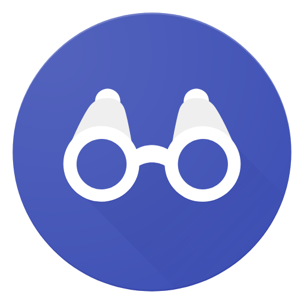

# 
Informe del Trabajo Final

    </img> 
    <strong>Universidad Peruana de Ciencias Aplicadas</strong> 
    <strong>Ingeniería de Software</strong> 
    <strong>1ASI0728 - Arquitecturas de Software Emergentes - 7295</strong> 
    <strong>Profesor: Royer Edelwer Rojas Malasquez</strong> 
     INFORME FINAL

#### Startup: **Nombre**

#### Product: **Nombre**

## Team  Members:

|               Member                |    Code    |
| :---------------------------------: | :--------: |
| Rodriguez Vargas, Arian Martín  | U202212096 |
|   | U202|
|   | U202 |
|   | U202|

# Registro de Versiones del Informe

---

# Project Report Collaboration Insights

En esta sección, registraremos los cambios y logros que se completaron en cada entrega del reporte.

# Contenido

- [Registro de Versiones del Informe](#registro-de-versiones-del-informe)
- [Project Report Collaboration Insights](#project-report-collaboration-insights)
- [Capítulo I: Introducción](#capítulo-i-introducción)
   * [1.1. Startup Profile](#11-startup-profile)
      + [1.1.1. Descripción de la Startup](#111-descripción-de-la-startup)
      + [1.1.2. Perfiles de integrantes del equipo](#112-perfiles-de-integrantes-del-equipo)
   * [1.2. Solution Profile](#12-solution-profile)
      + [1.2.1. Antecedentes y problemática](#121-antecedentes-y-problemática)
      + [1.2.2. Lean UX Process](#122-lean-ux-process)
         - [1.2.2.1. Lean UX Problem Statements](#1221-lean-ux-problem-statements)
         - [1.2.2.2. Lean UX Assumptions](#1222-lean-ux-assumptions)
         - [1.2.2.3. Lean UX Hypothesis Statements.](#1223-lean-ux-hypothesis-statements)
         - [1.2.2.4. Lean UX Canvas](#1224-lean-ux-canvas)
   * [1.3. Segmentos objetivo](#13-segmentos-objetivo)
- [Capítulo II: Requirements Elicitation & Analysis](#capítulo-ii-requirements-elicitation-analysis)
   * [2.1. Competidores](#21-competidores)
      + [2.1.1. Análisis competitivo](#211-análisis-competitivo)
      + [2.1.2. Estrategias y tácticas frente a competidores](#212-estrategias-y-tácticas-frente-a-competidores)
   * [2.2. Entrevistas](#22-entrevistas)
      + [2.2.1. Diseño de entrevistas](#221-diseño-de-entrevistas)
      + [2.2.2. Registro de entrevistas](#222-registro-de-entrevistas)
      + [2.2.3. Análisis de entrevistas](#223-análisis-de-entrevistas)
   * [2.3. Needfinding](#23-needfinding)
      + [2.3.1. User Personas](#231-user-personas)
      + [2.3.2. User Task Matrix](#232-user-task-matrix)
      + [2.3.3. User Journey Mapping](#233-user-journey-mapping)
      + [2.3.4. Empathy Mapping](#234-empathy-mapping)
      + [2.3.5. As-is Scenario Mapping](#235-as-is-scenario-mapping)
   * [2.4. Ubiquitous Language](#24-ubiquitous-language)
- [Capítulo III: Requirements Specification](#capítulo-iii-requirements-specification)
   * [3.1. To-Be Scenario Mapping](#31-to-be-scenario-mapping)
   * [3.2. User Stories](#32-user-stories)
   * [3.3. Impact Mapping](#33-impact-mapping)
   * [3.4. Product Backlog](#34-product-backlog)
- [Capítulo IV: Strategic-Level Domain-Driven Design](#capítulo-iv-strategic-level-domain-driven-design)
   * [4.1. Strategic-Level Attribute-Driven Design](#41-strategic-level-attribute-driven-design)
      + [4.1.1. Design Purpose](#411-design-purpose)

# Student Outcome
En Ingeniería de Software, el logro de curso contribuye a alcanzar el:

ABET – EAC - Student Outcome 3: Capacidad de comunicarse efectivamente con un rango de audiencias.
En el siguiente cuadro se describe las acciones realizadas y enunciados de
conclusiones por parte del grupo, que permiten sustentar el haber alcanzado el logro
del ABET – EAC - Student Outcome 3.

<table>
  <tr>
    <th>Criterio Especifico</th>
    <th>Acciones Realizadas</th>
    <th>Conclusiones</th>
  </tr>
  <tr>
    <td>Trabaja en equipo para proporcionar liderazgo en forma conjunta</td>
    <td></td>
        <td></td>

  </tr>

  <tr>
    <td>Crea un entorno colaborativo e inclusivo, establece metas, planifica tareas y cumple objetivos.</td>
      <td></td>
    <td></td>

  </tr>
</table>

# Capítulo I: Introducción
## 1.1. Startup Profile
### 1.1.1. Descripción de la Startup
### 1.1.2. Perfiles de integrantes del equipo

## 1.2. Solution Profile
### 1.2.1 Antecedentes y problemática
### 1.2.2 Lean UX Process.
#### 1.2.2.1. Lean UX Problem Statements.
#### 1.2.2.2. Lean UX Assumptions.
#### 1.2.2.3. Lean UX Hypothesis Statements.
#### 1.2.2.4. Lean UX Canvas.

## 1.3. Segmentos objetivo.

# Capítulo II: Requirements Elicitation & Analysis
## 2.1. Competidores.

<table> <thead> 
    <tr> <th>Nombre del Competidor</th> <th>Descripción</th> </tr> </thead> <tbody> <tr> <td rowspan="2" align="center">   Be My Eyes </td> <td>Be My Eyes conecta a personas ciegas o con baja visión con voluntarios a través de videollamadas en tiempo real. También cuenta con la función AI “Be My AI” para describir imágenes automáticamente mediante inteligencia artificial.</td> </tr> <tr> <td>Página web: <a href="https://www.bemyeyes.com/" target="_blank">https://www.bemyeyes.com/</a></td> </tr> <tr> <td rowspan="2" align="center">   Envision AI </td> <td>Envision AI es una app basada en inteligencia artificial que convierte texto y objetos capturados por la cámara del móvil en descripciones habladas. Reconoce texto en más de 60 idiomas y permite interacción por voz.</td> </tr> <tr> <td>Página web: <a href="https://www.letsenvision.com/" target="_blank">https://www.letsenvision.com/</a></td> </tr> 
    <tr> <td rowspan="2" align="center">   Lookout by Google</td> <td>Lookout es una app diseñada por Google para personas con discapacidad visual. Utiliza IA y la cámara del dispositivo para leer texto, identificar objetos, detectar monedas y proporcionar descripciones audibles del entorno.</td> </tr> <tr> <td>Página web: <a href="https://play.google.com/store/apps/details?id=com.google.android.apps.accessibility.reveal&hl=es_PE" target="_blank"> Disponible en Google Play (app Lookout by Google)</a></td> </tr> </tbody> </table>

### 2.1.1. Análisis competitivo.

<table style="width: 100%;">
  <tr>
    <th colspan="6" style="padding: 8px; text-align: center;"> Competitive Analysis Landscape</th>
  </tr>
  <tr>
    <td>¿Por qué llevar a cabo este análisis?</td>
    <td colspan="5">Este análisis permite identificar fortalezas, debilidades, oportunidades y amenazas de HomeSense frente a competidores establecidos, con el fin de diferenciar a VisualGuide, definir su propuesta de valor única y diseñar estrategias de crecimiento sostenibles.</td>
</td>
  </tr>
  <tr>
    <td colspan="2"></td>
  <td align="center"> </td>
  <td align="center"> </td>
  <td align="center"> </td>
  <td align="center"> </td>
  </tr>
<tr>
  <td rowspan="2" align="center">Perfil</td>
  <td align="center">Overview</td>
    <td>Conecta a personas ciegas con voluntarios o IA para asistencia visual en tiempo real.</td>
    <td>Convierte texto y objetos en descripciones habladas con IA.</td>
    <td>App de Google que identifica objetos, lee texto, detecta billetes y describe entornos.</td>
    <td>Asistente visual para el hogar: mapeo del entorno y guía segura en tiempo real.</td>
  </tr>
<tr>
  <td>Ventaja competitiva ¿Qué valor ofrece a los clientes?</td>
    <td>Gran comunidad global de voluntarios + soporte IA gratuito.</td>
    <td>OCR en más de 60 idiomas e interacción por voz.</td>
    <td>Respaldo de Google, confiabilidad y gratuidad.</td>
    <td>Enfoque exclusivo en seguridad doméstica, personalización y autonomía.</td>
  </tr>
 <tr>
  <td rowspan="2" align="center">Perfil de Marketing</td>
  <td>Mercado objetivo</td>
    <td>Personas con discapacidad visual que requieren ayuda inmediata en todo el mundo.</td>
    <td>Usuarios con discapacidad visual que necesitan leer texto o identificar objetos en múltiples contextos.</td>
    <td>Usuarios ciegos o con baja visión que utilizan Android en entornos cotidianos.</td>
    <td>Personas no videntes en América Latina que buscan independencia y seguridad dentro del hogar.</td>
  </tr>
<tr>
  <td>Estrategias de marketing</td>
    <td>Comunidad global + alianzas con ONGs.</td>
    <td>Promoción en comunidades inclusivas; enfoque multilingüe.</td>
    <td>Distribución masiva vía Google Play.</td>
    <td>Alianzas locales con asociaciones, campañas inclusivas en LATAM.</td>
  </tr>

<tr>
  <td rowspan="3" align="center">Perfil del Producto</td>
  <td>Productos & Servicios</td>
    <td>Videollamadas con voluntarios y soporte IA (Be My AI).</td>
    <td>Lectura de texto, reconocimiento de objetos y escenas.</td>
    <td>Lectura de texto, identificación de objetos, reconocimiento de billetes.</td>
    <td>Asistente de guía en el hogar con mapeo y navegación segura.</td>
  </tr>
<tr>
  <td>Precios & Costos</td>
    <td>Gratuito.</td>
    <td>Freemium: funciones básicas gratis, versión premium de pago.</td>
    <td>Gratuito.</td>
    <td>Freemium: acceso básico gratis, premium con funciones avanzadas (mapas personalizados, alertas).</td>
  </tr>
<tr>
  <td>Canales de distribución (Web y/o Móvil)</td>
    <td>App móvil (iOS/Android).</td>
    <td>App móvil (iOS/Android).</td>
    <td>App móvil (Android).</td>
    <td>App móvil (iOS/Android) + integración IoT en el hogar.</td>
  </tr>

<tr>
  <td rowspan="4" align="center">Análisis SWOT</td>
  <td>Fortalezas</td>
    <td>Gran base de usuarios y comunidad activa.</td>
    <td>OCR potente, multilingüe y versátil.</td>
    <td>Respaldo de Google, alta confiabilidad.</td>
    <td>Propuesta diferenciada enfocada en el hogar; seguridad y personalización.</td>
  </tr>
<tr>
  <td>Debilidades</td>
    <td>Dependencia de voluntarios; requiere internet estable.</td>
    <td>Suscripción de pago limita accesibilidad.</td>
    <td>Solo Android; enfoque genérico.</td>
    <td>Baja visibilidad inicial de marca como startup emergente.</td>
  </tr>
<tr>
  <td>Oportunidades</td>
    <td>Expandir funciones de IA.</td>
    <td>Alianzas con wearables y dispositivos accesibles.</td>
    <td>Mayor integración con ecosistema Google.</td>
    <td>Alta necesidad en LATAM; integración con hogares inteligentes.</td>
  </tr>
<tr>
  <td>Amenazas</td>
    <td>Competencia con soluciones IA más avanzadas.</td>
    <td>Riesgo por presencia de Google y Be My Eyes.</td>
    <td>Competidores especializados con mayor personalización.</td>
    <td>Entrada de grandes empresas en accesibilidad doméstica.</td>
  </tr>
<table>

### 2.1.2. Estrategias y tácticas frente a competidores.

**Estrategias:**

- **Diferenciación por enfoque en el hogar:** Mientras los competidores se centran en espacios públicos o funciones generales de accesibilidad, VisualGuide se especializa en seguridad y autonomía dentro del hogar, ofreciendo mapeo personalizado y navegación segura.
- **Segmentación regional en LATAM:** Enfocarse en un mercado poco atendido por gigantes como Google y Envision, adaptando las soluciones a las necesidades reales y específicas de los hogares en América Latina (precio accesible, fácil instalación y soporte local).
- **Propuesta de valor inclusiva y escalable:** Ofrecer un modelo freemium que garantice accesibilidad básica gratuita, con funciones premium adaptadas a necesidades avanzadas, asegurando inclusión y sostenibilidad del negocio.
- **Innovación constante con feedback de usuarios:** Mantener un ciclo de mejoras basadas en la retroalimentación directa de usuarios no videntes y sus familias, generando una solución más empática y adaptada que la de grandes corporaciones.

**Tácticas:**

- **Pruebas piloto en hogares de confianza:** Implementar VisualGuide en casas de familiares o conocidos con discapacidad visual para recoger feedback real, documentar casos de éxito y generar testimonios iniciales.
- **Campañas educativas en redes sociales propias:** Usar TikTok, Instagram y Facebook con videos cortos y testimonios que muestren cómo VisualGuide resuelve problemas cotidianos, diferenciándose de apps genéricas.
- **Convenios con universidades y ONGs locales:** Contactar a la UPC, PUCP u ONGs pequeñas que trabajen con personas con discapacidad para validar el producto y sumar usuarios iniciales sin grandes costos.
- **Integración básica con dispositivos IoT accesibles:** Conectar VisualGuide con dispositivos económicos como Alexa o Google Home (que ya existen en muchos hogares) para demostrar su valor agregado frente a competidores.

## 2.2. Entrevistas.
### 2.2.1. Diseño de entrevistas.
### 2.2.2. Registro de entrevistas.
### 2.2.3. Análisis de entrevistas.

## 2.3. Needfinding.
### 2.3.1. User Personas.
### 2.3.2. User Task Matrix.
### 2.3.3. Empathy Mapping.
### 2.3.4. As-is Scenario Mapping.

## 2.4. Ubiquitous Language.

# Capítulo III: Requirements Specification
## 3.1. To-Be Scenario Mapping.
## 3.2. User Stories.
## 3.3. Impact Mapping.
## 3.4. Product Backlog.

# Capítulo IV: Strategic-Level Software Design.
## 4.1. Strategic-Level Attribute-Driven Design.
### 4.1.1. Design Purpose.
### 4.1.2. Attribute-Driven Design Inputs.
#### 4.1.2.1. Primary Functionality (Primary User Stories).
#### 4.1.2.2. Quality attribute Scenarios.
#### 4.1.2.3. Constraints.
### 4.1.3. Architectural Drivers Backlog.
### 4.1.4. Architectural Design Decisions.
### 4.1.5. Quality Attribute Scenario Refinements.

## 4.2. Strategic-Level Domain-Driven Design.
### 4.2.1. EventStorming.
### 4.2.2. Candidate Context Discovery.
### 4.2.3. Domain Message Flows Modeling.
### 4.2.4. Bounded Context Canvases.
### 4.2.5. Context Mapping.

## 4.3. Software Architecture.
### 4.3.1. Software Architecture System Landscape Diagram.
### 4.3.1. Software Architecture Context Level Diagrams.
### 4.3.2. Software Architecture Container Level Diagrams.
### 4.3.3. Software Architecture Deployment Diagrams.
