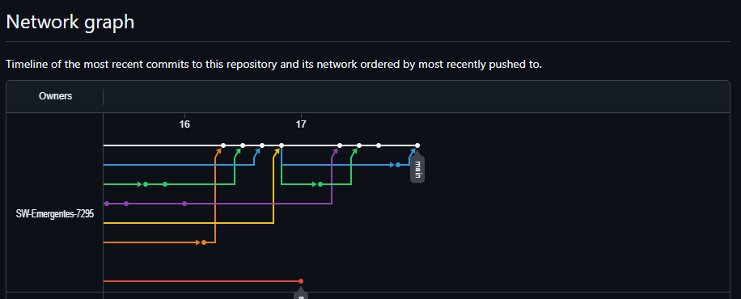
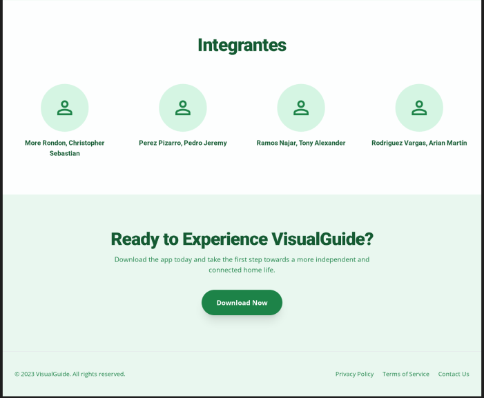

# <center>Informe del Trabajo TB2</center>

<p align="center">
    </img><br>
    <strong>Universidad Peruana de Ciencias Aplicadas</strong><br>
    <strong>Ingeniería de Software</strong><br>
    <strong>1ASI0728 - Arquitecturas de Software Emergentes - 7295</strong><br>
    <strong>Profesor: Royer Edelwer Rojas Malasquez</strong><br>
    <br>INFORME TB2
</p>

<center>

#### Startup: **HomeSense**
#### Product: **VisualGuide**

</center>

## Team  Members:

<div align="center">

|               Member                |    Code    |
| :---------------------------------: | :--------: |
| More Rondon, Christopher Sebastian  | U202212199 |
| Perez Pizarro, Pedro Jeremy  | U202022237 |
| Ramos Najar, Tony Alexander  | U20211A153 |
| Rodriguez Vargas, Arian Martín  | U202212096 |


</div>

<div style="page-break-after: always;"></div>

## Registro de Versiones del Informe

<table>
  <thead>
    <tr>
      <th>Versión</th>
      <th>Fecha</th>
      <th>Autor</th>
      <th>Descripción de modificación</th>
    </tr>
  </thead>
  <tbody>
    <tr>
      <td rowspan="4">V1</td>
      <td>20/09/2025</td>
      <td>Ramos Najar, Tony Alexander</td>
      <td>
        <ul>
          <li>Startup Profile</li>
          <li>Solution Profile</li>
          <li>Antecedentes y problemática</li>
          <li>Lean UX Process</li>
          <li>Segmentos objetivo</li>
          <li>Competidores</li>
          <li>EventStorming</li>
          <li>User Stories</li>
        </ul>
      </td>
    </tr>
    <tr>
      <td>20/09/2025</td>
      <td>More Rondon, Christopher Sebastian</td>
      <td>
        <ul>
          <li>To-Be Scenario Mapping</li>
          <li>Impact Mapping</li>
          <li>Product Backlog</li>
          <li>Ubiquitous Language</li>
          <li>NeedFinding</li>
          <li>EventStorming</li>
          <li>User Stories</li>
        </ul>
      </td>
    </tr>
    <tr>
      <td>20/09/2025</td>
      <td>Perez Pizarro, Pedro Jeremy</td>
      <td>
        <ul>
          <li>Strategic-Level Attribute-Driven Design</li>
          <li>Design Purpose</li>
          <li>Attribute-Driven Design Inputs</li>
          <li>Architectural Drivers Backlog</li>
          <li>Architectural Design Decisions</li>
          <li>Quality Attribute Scenario Refinements</li>
          <li>EventStorming</li>
          <li>User Stories</li>
        </ul>
      </td>
    </tr>
    <tr>
      <td>20/09/2025</td>
      <td>Arian Martín Rodriguez Vargas</td>
      <td>
        <ul>
          <li>Context Mapping</li>
          <li>Software Architecture System Landscape Diagram</li>
          <li>Software Architecture Context Level Diagrams</li>
          <li>Software Architecture Container Diagrams</li>
          <li>Software Architecture Deployment Diagrams</li>
          <li>EventStorming</li>
          <li>User Stories</li>
        </ul>
      </td>
    </tr>
    <tr>
      <td rowspan="4">V2</td>
      <td>05/10/2025</td>
      <td>Ramos Najar, Tony Alexander</td>
      <td>
        <ul>
          <li>Bounded Context Design: IAM Bounded Context</li>
          <li>Style Guidelines</li>
          <li>Web, Mobile & Devices Style Guidelines</li>
          <li>Information Architecture</li>
        </ul>
      </td>
    </tr>
    <tr>
      <td>05/10/2025</td>
      <td>More Rondon, Christopher Sebastian</td>
      <td>
        <ul>
          <li>Bounded Context Design: Home Configuration Bounded Context</li>
          <li>Labeling Systems</li>
          <li>Searching Systems</li>
          <li>SEO Tags and Meta Tags</li>
          <li>Navigation Systems</li>
        </ul>
      </td>
    </tr>
    <tr>
      <td>05/10/2025</td>
      <td>Perez Pizarro, Pedro Jeremy</td>
      <td>
        <ul>
          <li>Bounded Context Design: Notifications Bounded Context</li>
          <li>Landing Page UI Design</li>
          <li>Landing Page Wireframe</li>
          <li>Landing Page Mock-up</li>
        </ul>
      </td>
    </tr>
    <tr>
      <td>05/10/2025</td>
      <td>Arian Martín Rodriguez Vargas</td>
      <td>
        <ul>
          <li>Bounded Context Design: AI Recognition Bounded Context</li>
          <li>Applications UX/UI Design</li>
          <li>Applications Wireframes</li>
          <li>Applications Wireflow Diagrams</li>
        </ul>
      </td>
    </tr>
    <tr>
      <td rowspan="4">V3</td>
      <td>15/11/2025</td>
      <td>More Rondon, Christopher Sebastian</td>
      <td>
        <ul>
          <li>Desarrollo Aplicación Móvil y Web Services</li>
          <li>Testing Suite Evidence for Sprint Review</li>
          <li>Execution Evidence for Sprint Review</li>
          <li>Registro de entrevista</li>
        </ul>
      </td>
    </tr>
    <tr>
      <td>15/11/2025</td>
      <td>Ramos Najar, Tony Alexander</td>
      <td>
        <ul>
          <li>Desarrollo Aplicación Móvil y Web Services</li>
          <li>Sprint 1</li>
          <li>Sprint Planning y Backlog 1</li>
          <li>Development Evidence for Sprint Review</li>
          <li>Registro de entrevista</li>
        </ul>
      </td>
    </tr>
    <tr>
      <td>15/11/2025</td>
      <td>Perez Pizarro, Pedro Jeremy</td>
      <td>
        <ul>
          <li>Desarrollo Aplicación Móvil y Web Services</li>
          <li>Software Configuration Management</li>
          <li>Software Development Environment Configuration</li>
          <li>Software Code Management</li>
          <li>Registro de entrevista</li>
        </ul>
      </td>
    </tr>
    <tr>
      <td>15/11/2025</td>
      <td>Arian Martín Rodriguez Vargas</td>
      <td>
        <ul>
          <li>Desarrollo Aplicación Móvil y Web Services</li>
          <li>Services Documentation</li>
          <li>Evidence for Sprint Review</li>
          <li>Software Deployment Evidence</li>
          <li>Team Collaborations Insights</li>
          <li>Registro de entrevista</li>
          <li>Video About the Product</li>
          <li>Mockups y Prototyping</li>
        </ul>
      </td>
    </tr>
  </tbody>
</table>


# Project Report Collaboration Insights

En esta sección, registraremos los cambios y logros que se completaron en cada entrega del reporte.

**TB1**
La entrega TB1 finalizó con éxito y están documentadas en el siguiente repositorio de Github perteneciente a la organización del equipo: https://github.com/SW-Emergentes-7295/project-report Durante el desarrollo del informe se tuvieron en cuenta los siguientes aspectos:

- Se definió la startup y el producto a desarrollar.
- Se establecieron los segmentos objetivo.
- Se aplicó el proceso de Lean UX para definir problem statements, assumptions e hipótesis.
- Se realizó un análisis competitivo de los principales competidores en el mercado.
- Se diseñaron entrevistas semiestructuradas para recolectar datos cualitativos.
- Se llevaron a cabo entrevistas con personas no videntes y sus cuidadores.
- Se crearon user personas para representar a los segmentos objetivo.
- Se desarrollaron user task matrix, empathy maps y as-is scenario maps para comprender mejor a los usuarios.
- Mediante el eventstorming se definió el ubiquitous language del dominio.
- Se establecieron las primeras versiones de la arquitectura del sistema.
- Se documentaron todas las actividades y hallazgos en el repositorio de Github.


Imagen 1: Gráfico general de commits y contribuciones hechas por cada miembros del equipo de VisualGuide. Incluye tambien los pull requests activos y aceptados. 




<br><br>

**TP**
La entrega TP finalizó con éxito y están documentadas en el siguiente repositorio de Github perteneciente a la organización del equipo: https://github.com/SW-Emergentes-7295/project-report Durante el desarrollo del informe se tuvieron en cuenta los siguientes aspectos:

- Se definieron los bounded contexts del dominio.
- Se diseñaron los lineamientos de estilo para la aplicación móvil y landing page
- Se desarrollaron wireframes y mockups para la landing page y aplicación móvil.
- Se crearon wireflow diagrams para la navegación de la aplicación móvil.
- Se documentaron todas las actividades y hallazgos en el repositorio de Github.

Imagen 2: Gráfico general de commits y contribuciones hechas por cada miembros del equipo de VisualGuide. Incluye tambien los pull requests activos y aceptados.


<br>

**TB2**
La entrega TB2 finalizó con éxito y están documentadas en el siguiente repositorio de Github perteneciente a la organización del equipo: https://github.com/SW-Emergentes-7295/project-report Durante el desarrollo del informe se tuvieron en cuenta los siguientes aspectos:

- Se definieron las actividades de configuración del entorno de desarrollo y despliegue.
- Se establecieron las convenciones de estilo para el código fuente.
- Se documentaron las actividades de implementación del producto durante el sprint 1.
- Se diseñaron y registraron las entrevistas de validación con usuarios.
- Se realizaron evaluaciones heurísticas de la solución implementada.
- Se documentaron todas las actividades y hallazgos en el repositorio de Github.
Imagen 3: Gráfico general de commits y contribuciones hechas por cada miembros del equipo de VisualGuide. Incluye tambien los pull requests activos y aceptados.


# Contenido

- [Registro de Versiones del Informe](#registro-de-versiones-del-informe)
- [Project Report Collaboration Insights](#project-report-collaboration-insights)
- [Capítulo I: Introducción](#capítulo-i-introducción)
   * [1.1. Startup Profile](#11-startup-profile)
      + [1.1.1. Descripción de la Startup](#111-descripción-de-la-startup)
      + [1.1.2. Perfiles de integrantes del equipo](#112-perfiles-de-integrantes-del-equipo)
   * [1.2. Solution Profile](#12-solution-profile)
      + [1.2.1. Antecedentes y problemática](#121-antecedentes-y-problemática)
      + [1.2.2. Lean UX Process](#122-lean-ux-process)
         - [1.2.2.1. Lean UX Problem Statements](#1221-lean-ux-problem-statements)
         - [1.2.2.2. Lean UX Assumptions](#1222-lean-ux-assumptions)
         - [1.2.2.3. Lean UX Hypothesis Statements.](#1223-lean-ux-hypothesis-statements)
         - [1.2.2.4. Lean UX Canvas](#1224-lean-ux-canvas)
   * [1.3. Segmentos objetivo](#13-segmentos-objetivo)
- [Capítulo II: Requirements Elicitation & Analysis](#capítulo-ii-requirements-elicitation-analysis)
   * [2.1. Competidores](#21-competidores)
      + [2.1.1. Análisis competitivo](#211-análisis-competitivo)
      + [2.1.2. Estrategias y tácticas frente a competidores](#212-estrategias-y-tácticas-frente-a-competidores)
   * [2.2. Entrevistas](#22-entrevistas)
      + [2.2.1. Diseño de entrevistas](#221-diseño-de-entrevistas)
      + [2.2.2. Registro de entrevistas](#222-registro-de-entrevistas)
      + [2.2.3. Análisis de entrevistas](#223-análisis-de-entrevistas)
   * [2.3. Needfinding](#23-needfinding)
      + [2.3.1. User Personas](#231-user-personas)
      + [2.3.2. User Task Matrix](#232-user-task-matrix)
      + [2.3.3. User Journey Mapping](#233-user-journey-mapping)
      + [2.3.4. Empathy Mapping](#234-empathy-mapping)
      + [2.3.5. As-is Scenario Mapping](#235-as-is-scenario-mapping)
   * [2.4. Ubiquitous Language](#24-ubiquitous-language)
- [Capítulo III: Requirements Specification](#capítulo-iii-requirements-specification)
   * [3.1. To-Be Scenario Mapping](#31-to-be-scenario-mapping)
   * [3.2. User Stories](#32-user-stories)
   * [3.3. Impact Mapping](#33-impact-mapping)
   * [3.4. Product Backlog](#34-product-backlog)
- [Capítulo IV: Strategic-Level Domain-Driven Design](#capítulo-iv-strategic-level-domain-driven-design)
   * [4.1. Strategic-Level Attribute-Driven Design](#41-strategic-level-attribute-driven-design)
      + [4.1.1. Design Purpose](#411-design-purpose)
      + [4.1.2. Attribute-Driven Design Inputs](#412-attribute-driven-design-inputs)
         - [4.1.2.1. Primary Functionality (Primary User Stories)](#4121-primary-functionality-primary-user-stories)
         - [4.1.2.2. Quality attribute Scenarios](#4122-quality-attribute-scenarios)
         - [4.1.2.3. Constraints](#4123-constraints)
      + [4.1.3. Architectural Drivers Backlog](#413-architectural-drivers-backlog)
      + [4.1.4. Architectural Design Decisions](#414-architectural-design-decisions)
      + [4.1.5. Quality Attribute Scenario Refinements](#415-quality-attribute-scenario-refinements)
   * [4.2. Strategic-Level Domain-Driven Design](#42-strategic-level-domain-driven-design)
      + [4.2.1. EventStorming](#421-eventstorming)
      + [4.2.2. Candidate Context Discovery](#422-candidate-context-discovery)
      + [4.2.3. Domain Message Flows Modeling](#423-domain-message-flows-modeling)
      + [4.2.4. Bounded Context Canvases](#424-bounded-context-canvas)
      + [4.2.5. Context Mapping](#425-context-mapping)
   * [4.3. Software Architecture](#43-software-architecture)
      + [4.3.1. Software Architecture System Landscape Diagram](#431-software-architecture-system-landscape-diagram)
      + [4.3.2. Software Architecture Context Level Diagrams](#432-software-architecture-context-level-diagrams)
      + [4.3.3. Software Architecture Container Level Diagrams](#433-software-architecture-container-level-diagrams)
      + [4.3.4. Software Architecture Deployment Diagrams](#434-software-architecture-deployment-diagrams)
- [Capítulo V: Tactical-Level Software Design](#capítulo-v-tactical-level-software-design)
   * [5.1. Bounded Context: IAM Bounded Context](#51-bounded-context-iam-bounded-context)
   * [5.2. Bounded Context: Home Configuration Bounded Context](#52-bounded-context-home-configuration-bounded-context)
    * [5.3. Bounded Context: Notifications Bounded Context](#53-bounded-context-notifications-bounded-context)
    * [5.4. Bounded Context: AI Recognition Bounded Context](#54-bounded-context-ai-recognition-bounded-context)
- [Capítulo VI: Solution UX Design](#capítulo-vi-solution-ux-design)
   * [6.1. Style Guidelines](#61-style-guidelines)
      + [6.1.1. General Style Guidelines](#611-general-style-guidelines)
      + [6.1.2. Web, Mobile & Devices Style Guidelines](#612-web-mobile--devices-style-guidelines)
    * [6.2. Information Architecture](#62-information-architecture)
      + [6.2.1. Labeling Systems](#621-labeling-systems)
      + [6.2.2. Searching Systems](#622-searching-systems)
      + [6.2.3. SEO Tags and Meta Tags](#623-seo-tags-and-meta-tags)
      + [6.2.4. Navigation Systems](#624-navigation-systems)
    * [6.3. Landing Page UI Design](#63-landing-page-ui-design)
      + [6.3.1. Landing Page Wireframe](#631-landing-page-wireframe)
      + [6.3.2. Landing Page Mock-up](#632-landing-page-mock-up)
    * [6.4. Applications UX/UI Design](#64-applications-uxui-design)
      + [6.4.1. Applications Wireframes](#641-applications-wireframes)
      + [6.4.2. Applications Wireflow Diagrams](#642-applications-wireflow-diagrams)  
      + [6.4.3. Applications Mock-ups.](#643-applications-mock-ups)
      + [6.4.4. Applications User Flow Diagrams.](#644-applications-user-flow-diagrams)
    * [6.5. Applications Prototyping.](#65-applications-prototyping)
- [Capítulo VII: Product Implementation, Validation & Deployment](#capítulo-vii-product-implementation-validation--deployment)
    * [7.1. Software Configuration Management.](#71-software-configuration-management)
      + [7.1.1. Software Development Environment Configuration.](#711-software-development-environment-configuration)
      + [7.1.2. Source Code Management.](#712-source-code-management)
      + [7.1.3. Source Code Style Guide & Conventions.](#713-source-code-style-guide--conventions)
      + [7.1.4. Software Deployment Configuration.](#714-software-deployment-configuration)
    * [7.2. Solution Implementation.](#72-solution-implementation)
      + [7.2.1. Sprint 1](#721-sprint-1)
         - [7.2.1.1. Sprint Planning 1.](#7211-sprint-planning-1)
         - [7.2.1.2. Sprint Backlog 1.](#7212-sprint-backlog-1)
         - [7.2.1.3. Development Evidence for Sprint Review.](#7213-development-evidence-for-sprint-review)
         - [7.2.1.4. Testing Suite Evidence for Sprint Review.](#7214-testing-suite-evidence-for-sprint-review)
         - [7.2.1.5. Execution Evidence for Sprint Review.](#7215-execution-evidence-for-sprint-review)
         - [7.2.1.6. Services Documentation Evidence for Sprint Review.](#7216-services-documentation-evidence-for-sprint-review)
         - [7.2.1.7. Software Deployment Evidence for Sprint Review.](#7217-software-deployment-evidence-for-sprint-review)
         - [7.2.1.8. Team Collaboration Insights during Sprint.](#7218-team-collaboration-insights-during-sprint)
    * [7.3. Validation Interviews.](#73-validation-interviews)
      + [7.3.1. Diseño de Entrevistas.](#731-diseño-de-entrevistas)
      + [7.3.2. Registro de Entrevistas.](#732-registro-de-entrevistas)
      + [7.3.3. Evaluaciones según heurísticas.](#733-evaluaciones-según-heurísticas)
- [Conclusiones](#conclusiones)
- [Referencias](#referencias)


# Student Outcome
En Ingeniería de Software, el logro de curso contribuye a alcanzar el:

ABET – EAC - Student Outcome 3: Capacidad de comunicarse efectivamente con un rango de audiencias.
En el siguiente cuadro se describe las acciones realizadas y enunciados de
conclusiones por parte del grupo, que permiten sustentar el haber alcanzado el logro
del ABET – EAC - Student Outcome 3.

<table border="1" cellspacing="0" cellpadding="8">
  <thead>
    <tr>
      <th>Criterio Específico</th>
      <th>Acciones Realizadas</th>
      <th>Conclusiones</th>
    </tr>
  </thead>
  <tbody>
    <tr>
      <td>Comunica oralmente sus ideas y/o resultados con objetividad a público de diferentes especialidades y niveles jerárquicos, en el marco del desarrollo de un proyecto en ingeniería.</td>
      <td>
        <p><b>TB1 - More Rondon, Christopher Sebastian:</b> Expuse con claridad conceptos técnicos y esto me ayudará a ganar confianza en futuras presentaciones profesionales.</p>
        <p><b>TB1 - Perez Pizarro, Pedro Jeremy:</b> Compartí ideas con ejemplos comprensibles y esto me permitirá desenvolverme mejor frente a audiencias diversas.</p>
        <p><b>TB1 - Ramos Najar, Tony Alexander:</b> Participé en discusiones transmitiendo resultados de manera precisa y esto reforzará mi comunicación en el ámbito laboral.</p>
        <p><b>TB1 - Rodriguez Vargas, Arian Martín:</b> Lideré la exposición de hallazgos y con ello perfeccioné mi capacidad de persuadir en entornos de ingeniería.</p>
        <p><b>TP - More Rondon, Christopher Sebastian:</b> Presenté de manera clara los avances técnicos del proyecto, reforzando mi habilidad de explicar conceptos a públicos con distintos niveles de conocimiento.</p>
        <p><b>TP - Perez Pizarro, Pedro Jeremy:</b> Expliqué resultados usando ejemplos prácticos, lo que me permitió transmitir confianza y mejorar mi capacidad de comunicación oral en ingeniería.</p>
        <p><b>TP - Ramos Najar, Tony Alexander:</b> Defendí argumentos técnicos con fundamentos sólidos, desarrollando competencias para comunicarme con mayor seguridad en contextos profesionales.</p>
        <p><b>TP - Rodriguez Vargas, Arian Martín:</b> Lideré parte de la exposición final del trabajo, fortaleciendo mi habilidad de síntesis y persuasión en entornos académicos y de ingeniería.</p>
        <p><b>TB2 - More Rondon, Christopher Sebastian:</b> Guié una parte de la presentación con mayor precisión técnica, demostrando soltura al responder preguntas especializadas del público.</p>
        <p><b>TB2 - Perez Pizarro, Pedro Jeremy:</b> Expuse resultados con un discurso más estructurado, fortaleciendo mi habilidad para comunicar ideas complejas con claridad y seguridad.</p>
        <p><b>TB2 - Ramos Najar, Tony Alexander:</b> Aporté explicaciones técnicas detalladas durante la exposición, aumentando mi confianza para comunicar avances de ingeniería a públicos diversos.</p>
        <p><b>TB2 - Rodriguez Vargas, Arian Martín:</b> Coordiné la narrativa general de la presentación, reforzando mi liderazgo comunicacional y mi capacidad de dirigir exposiciones técnicas.</p>
      </td>
      <td>
        <p><b>TB1:</b> Como equipo demostramos nuestra capacidad de comunicar oralmente ideas y resultados de manera objetiva, alcanzando un nivel de claridad y efectividad aplicable en nuestra futura carrera profesional.</p>
        <p><b>TP:</b> Como equipo demostramos un progreso significativo en la comunicación oral, transmitiendo resultados de manera clara y profesional, lo que evidencia nuestra preparación para presentaciones en el ámbito laboral.</p>
        <p><b>TB2:</b> Como equipo fortalecimos aún más nuestra comunicación oral, demostrando mayor dominio técnico, cohesión y claridad, lo que evidencia nuestro crecimiento continuo en la presentación de proyectos de ingeniería ante diferentes públicos.</p>
      </td>
    </tr>
    <tr>
      <td>Comunica en forma escrita ideas y/o resultados con objetividad a público de diferentes especialidades y niveles jerárquicos, en el marco del desarrollo de un proyecto en ingeniería.</td>
      <td>
        <p><b>TB1 - More Rondon, Christopher Sebastian:</b> Redacté reportes técnicos concisos y esto fortalecerá mi competencia para elaborar documentación profesional.</p>
        <p><b>TB1 - Perez Pizarro, Pedro Jeremy:</b> Elaboré resúmenes claros y estructurados y esto mejorará mi comunicación escrita hacia distintos públicos.</p>
        <p><b>TB1 - Ramos Najar, Tony Alexander:</b> Contribuí con informes analíticos bien organizados y esto me permitirá aplicar una mejor documentación en mi vida académica y laboral.</p>
        <p><b>TB1 - Rodriguez Vargas, Arian Martín:</b> Preparé documentos con lenguaje técnico adaptado y esto me ayudará a desarrollar competencias para la escritura en proyectos de ingeniería.</p>
        <p><b>TP - More Rondon, Christopher Sebastian:</b> Redacté informes técnicos estructurados, reforzando mi capacidad de documentación formal en proyectos de ingeniería.</p>
        <p><b>TP - Perez Pizarro, Pedro Jeremy:</b> Elaboré resúmenes ejecutivos claros, fortaleciendo mi habilidad de transmitir información relevante de forma concisa a distintos públicos.</p>
        <p><b>TP - Ramos Najar, Tony Alexander:</b> Contribuí con análisis escritos bien fundamentados, lo que mejorará mi desempeño en la elaboración de documentación profesional.</p>
        <p><b>TP - Rodriguez Vargas, Arian Martín:</b> Desarrollé reportes con terminología técnica adecuada, reforzando mi competencia en redacción académica y profesional.</p>
        <p><b>TB2 - More Rondon, Christopher Sebastian:</b> Redacté documentación con mayor profundidad técnica, fortaleciendo mi capacidad para elaborar informes formales y detallados.</p>
        <p><b>TB2 - Perez Pizarro, Pedro Jeremy:</b> Elaboré textos con un enfoque más analítico, mejorando mi habilidad para dirigir informes a públicos con conocimientos especializados.</p>
        <p><b>TB2 - Ramos Najar, Tony Alexander:</b> Aporté secciones clave del informe integrando datos y conclusiones de manera coherente, reforzando mi habilidad de análisis escrito.</p>
        <p><b>TB2 - Rodriguez Vargas, Arian Martín:</b> Organicé y consolidé la versión final del documento, demostrando capacidad para producir reportes técnicos completos y de alta calidad.</p>
      </td>
      <td>
        <p><b>TB1:</b> Como equipo alcanzamos una comunicación escrita objetiva y clara, adaptada a diversos niveles jerárquicos y especialidades, consolidando una competencia esencial en nuestra formación y ejercicio profesional.</p>
        <p><b>TP:</b> Como equipo consolidamos una comunicación escrita clara y adaptada a diferentes audiencias, lo que demuestra nuestra preparación para la generación de documentación técnica en el ejercicio profesional.</p>
        <p><b>TB2:</b> Como equipo mejoramos notablemente la calidad de nuestra comunicación escrita, elaborando documentos más completos, estructurados y alineados con estándares profesionales en ingeniería.</p>
      </td>
    </tr>
  </tbody>
</table>


# Capítulo I: Introducción
## 1.1. Startup Profile

A continuación, presentamos la startup <strong>“HomeSense”</strong>, dedicada a desarrollar soluciones tecnológicas de asistencia para personas con discapacidad visual, así como el equipo de desarrollo del producto, software presentado anteriormente, <strong>“VisualGuide”</strong>.

### 1.1.1. Descripción de la Startup

<p> 
      <strong>HomeSense</strong> es una startup tecnológica enfocada en crear soluciones inteligentes para mejorar la autonomía y seguridad de personas no videntes dentro del hogar. Nuestra misión es proporcionar herramientas que permitan a los usuarios interactuar con su entorno de manera segura y eficiente mediante el uso       de tecnologías avanzadas de inteligencia artificial. 
    </p> 
    <p> 
      El primer producto de HomeSense es <strong>"VisualGuide"</strong>, una aplicación móvil que funciona como un asistente visual inteligente para personas no videntes. La aplicación interpreta el entorno del hogar mediante IA, reconoce objetos, muebles, electrodomésticos, personas, textos y colores, y guía al usuario           en tiempo real según sus necesidades específicas. Para garantizar seguridad, la aplicación opera sobre un mapeo previo del hogar, realizado mediante fotografías y escaneos en un ambiente controlado, evitando riesgos asociados al uso en espacios públicos. 
    </p> 
      <h4><strong>Misión</strong></h4> 
      <p> Facilitar la autonomía y seguridad de personas no videntes dentro del hogar mediante soluciones inteligentes basadas en inteligencia artificial, que interpreten su entorno y guíen sus movimientos de forma precisa y confiable.
    </p>
      <h4><strong>Visión</strong></h4>
      <p> Ser líderes en América Latina en soluciones tecnológicas de asistencia para personas con discapacidad visual, ofreciendo productos innovadores que promuevan la independencia y seguridad dentro del hogar.
    </p>

### 1.1.2. Perfiles de integrantes del equipo


## 1.2. Solution Profile
### 1.2.1 Antecedentes y problemática

<div>
<h3>Antecedente</h3>
  <p>
    Hoy en día, las personas con discapacidad visual tienen muchos retos para moverse con seguridad y autonomía dentro de su propia casa. Aunque existen algunas herramientas de ayuda, muchas requieren contacto directo con el entorno o no están diseñadas para reconocer los detalles específicos de un hogar. Esto limita la independencia de los usuarios y aumenta el riesgo de accidentes domésticos.
  </p>

<h3>Problemática – Enfoque con las 5W + 2H</h3>
<ul>
    <li><strong>What?</strong> Las personas no videntes tienen problemas para reconocer y desplazarse dentro de su hogar de manera segura, lo que afecta su autonomía diaria.</li>   
    <li><strong>Why?</strong> Porque no cuentan con un asistente inteligente capaz de interpretar el entorno, identificar muebles, electrodomésticos, objetos o personas, y guiarlos de forma clara y en tiempo real según sus necesidades.</li> 
    <li><strong>Who?</strong> Personas con discapacidad visual que desean tener más independencia y sentirse seguras dentro de su casa.</li>
    <li><strong>When?</strong> En su vida cotidiana, al moverse entre habitaciones, usar electrodomésticos, o identificar personas y objetos en su hogar.</li>
    <li><strong>Where?</strong> Dentro del hogar, especialmente en casas con espacios complejos o muebles que puedan representar algún riesgo.</li>  
    <li><strong>How?</strong> Actualmente dependen de bastones, ayuda de otras personas o aplicaciones básicas que no ofrecen orientación contextualizada ni reconocimiento completo del entorno.</li>    
    <li><strong>How Much?</strong> La falta de herramientas adecuadas genera dependencia, riesgo de accidentes, estrés y sensación de inseguridad, afectando directamente su calidad de vida y la tranquilidad de sus familias.</li>
</ul>

</div>

### 1.2.2 Lean UX Process.
#### 1.2.2.1. Lean UX Problem Statements.

**Domain:**  
Asistencia para personas no videntes dentro del hogar, proporcionando autonomía y seguridad mediante tecnología de reconocimiento del entorno.  

**Customer Segments:**  
- Personas no videntes que desean moverse con independencia dentro de su hogar.  
- Familias y cuidadores que buscan seguridad y tranquilidad para sus seres queridos no videntes.  

**Pain Points:**  
- Dificultad para desplazarse de forma segura y autónoma dentro del hogar.  
- Dependencia de terceros para realizar tareas cotidianas.  
- Riesgo de accidentes domésticos debido a obstáculos o falta de orientación.  
- Las soluciones existentes no ofrecen reconocimiento contextualizado del entorno.  

**Gap:**  
Actualmente no existen muchas aplicaciones funcionales que combinen mapeo previo del hogar, reconocimiento de objetos y muebles, y guía en tiempo real adaptada a personas no videntes.  

**Visión / Strategy:**  
Proveer una solución basada en inteligencia artificial que permita a las personas no videntes moverse con seguridad y autonomía dentro de su hogar, reduciendo riesgos y dependencia de terceros.  

**Initial Segment:**  
Personas no videntes con acceso a smartphones y hogares con espacios complejos que requieren asistencia para navegar de manera segura.  

**Problem Statements:**  
1. Las personas no videntes necesitan moverse dentro de su hogar con seguridad, pero las herramientas actuales no reconocen objetos ni guían de manera contextualizada.  
2. Los cuidadores buscan tranquilidad y control, pero no tienen manera de supervisar de forma segura la movilidad de sus familiares dentro del hogar.  

---

#### 1.2.2.2. Lean UX Assumptions.

**Supuestos de negocio**  
- Las personas con discapacidad visual buscan soluciones que les permitan mayor autonomía y seguridad en su hogar.  
- Una aplicación móvil con inteligencia artificial que mapee previamente el hogar y reconozca objetos, muebles, electrodomésticos y personas puede satisfacer esta necesidad.  
- Los usuarios estarán dispuestos a interactuar mediante indicaciones de voz y recibir feedback en tiempo real.  
- El entrenamiento de la IA en un entorno controlado permitirá minimizar errores y garantizar precisión en el reconocimiento de objetos y espacios.  
- La mayoría de los usuarios valorará la confiabilidad, facilidad de uso y la capacidad de la aplicación de integrarse con otros dispositivos domésticos, si los tuviera.  

**Supuestos de usuario**  
- Los usuarios desean moverse con seguridad y sin depender de terceros dentro de su hogar.  
- Valoran la privacidad y la protección de sus datos personales.   
- Esperan que la aplicación sea fácil de usar, intuitiva y que proporcione opciones claras para recibir orientación y feedback.  
- Desean alternativas de acceso seguro ante posibles fallos, como indicaciones redundantes o modos de ayuda remota.  

---

#### 1.2.2.3. Lean UX Hypothesis Statements.

1. **Hipótesis de seguridad y autonomía:**  
Si desarrollamos una aplicación que mapee previamente el hogar y use IA para reconocer objetos, muebles y personas, entonces los usuarios podrán moverse con mayor seguridad y autonomía.  

2. **Hipótesis de interacción:**  
Si la aplicación proporciona indicaciones de voz claras y feedback en tiempo real, los usuarios podrán interactuar con su entorno de manera confiable y sin depender de terceros.  

3. **Hipótesis de confianza y respaldo:**  
Si la aplicación ofrece reconocimiento preciso del entorno y alternativas ante fallos, los usuarios se sentirán más seguros y confiados, mejorando su calidad de vida.  

4. **Hipótesis de privacidad:**  
Si aseguramos la seguridad y privacidad de los datos mediante encriptación y auditorías, los usuarios confiarán en la tecnología y la adoptarán de forma sostenida.  

5. **Hipótesis de integración domótica:**  
Si la aplicación se integra con otros dispositivos inteligentes del hogar, los usuarios podrán optimizar la seguridad y comodidad, obteniendo una experiencia más completa y satisfactoria.  

---

#### 1.2.2.4. Lean UX Canvas.


## 1.3. Segmentos objetivo.

<section id="segmentos-usuarios">

  <article>
    <h4>Personas No Videntes</h4>
    <p>
Este segmento está compuesto por individuos con discapacidad visual que desean moverse con seguridad y autonomía dentro de su hogar. Buscan soluciones que les permitan reconocer objetos, muebles, electrodomésticos y personas, y recibir guía en tiempo real para evitar riesgos y accidentes domésticos.
    </p>
    <h4>Características clave:</h4>
    <ul>
      <li> Necesidad de mayor autonomía dentro del hogar.</li>
      <li> Preocupación por la seguridad y la reducción de accidentes.</li>
      <li> Interés en soluciones tecnológicas intuitivas y confiables.</li>
      <li> Usan smartphones o dispositivos que les permitan interactuar con aplicaciones de asistencia.</li>
    </ul>
  </article>

  <article>
    <h4>Familias y Cuidadores</h4>
    <p>
Este segmento incluye a familiares o cuidadores de personas no videntes que desean garantizar la seguridad de sus seres queridos dentro del hogar. Buscan soluciones que les permitan supervisar y apoyar de manera indirecta, sin invadir la independencia del usuario.
    </p>
    <h4>Características clave:</h4>
    <ul>
      <li> Necesidad de tranquilidad y control del usuario sobre la seguridad del hogar.</li>
      <li> Valoran herramientas que ayuden a prevenir accidentes o incidentes domésticos.</li>
      <li> Buscan soluciones confiables, fáciles de usar y que no interfieran con la autonomía del usuario principal.</li>
      <li> Interés en sistemas que ofrezcan notificaciones o feedback sobre la actividad dentro del hogar.</li>
    </ul>
  </article>
</section>

# Capítulo II: Requirements Elicitation & Analysis
## 2.1. Competidores.

<table> <thead> 
    <tr> <th>Nombre del Competidor</th> <th>Descripción</th> </tr> </thead> <tbody> <tr> <td rowspan="2" align="center">  <br>Be My Eyes </td> <td>Be My Eyes conecta a personas ciegas o con baja visión con voluntarios a través de videollamadas en tiempo real. También cuenta con la función AI “Be My AI” para describir imágenes automáticamente mediante inteligencia artificial.</td> </tr> <tr> <td>Página web: <a href="https://www.bemyeyes.com/" target="_blank">https://www.bemyeyes.com/</a></td> </tr> <tr> <td rowspan="2" align="center">  <br>Envision AI </td> <td>Envision AI es una app basada en inteligencia artificial que convierte texto y objetos capturados por la cámara del móvil en descripciones habladas. Reconoce texto en más de 60 idiomas y permite interacción por voz.</td> </tr> <tr> <td>Página web: <a href="https://www.letsenvision.com/" target="_blank">https://www.letsenvision.com/</a></td> </tr> 
    <tr> <td rowspan="2" align="center">  <br>Lookout by Google</td> <td>Lookout es una app diseñada por Google para personas con discapacidad visual. Utiliza IA y la cámara del dispositivo para leer texto, identificar objetos, detectar monedas y proporcionar descripciones audibles del entorno.</td> </tr> <tr> <td>Página web: <a href="https://play.google.com/store/apps/details?id=com.google.android.apps.accessibility.reveal&hl=es_PE" target="_blank"> Disponible en Google Play (app Lookout by Google)</a></td> </tr> </tbody> </table>

### 2.1.1. Análisis competitivo.


<table style="width: 100%;">
  <tr>
    <th colspan="6" style="padding: 8px; text-align: center;"> Competitive Analysis Landscape</th>
  </tr>
  <tr>
    <td>¿Por qué llevar a cabo este análisis?</td>
    <td colspan="5">Este análisis permite identificar fortalezas, debilidades, oportunidades y amenazas de HomeSense frente a competidores establecidos, con el fin de diferenciar a VisualGuide, definir su propuesta de valor única y diseñar estrategias de crecimiento sostenibles.</td>
</td>
  </tr>
  <tr>
    <td colspan="2"></td>
  <td align="center"><br></td>
  <td align="center"><br></td>
  <td align="center"><br></td>
  <td align="center"><br></td>
  </tr>
<tr>
  <td rowspan="2" align="center">Perfil</td>
  <td align="center">Overview</td>
    <td>Conecta a personas ciegas con voluntarios o IA para asistencia visual en tiempo real.</td>
    <td>Convierte texto y objetos en descripciones habladas con IA.</td>
    <td>App de Google que identifica objetos, lee texto, detecta billetes y describe entornos.</td>
    <td>Asistente visual para el hogar: mapeo del entorno y guía segura en tiempo real.</td>
  </tr>
<tr>
  <td>Ventaja competitiva<br>¿Qué valor ofrece a los clientes?</td>
    <td>Gran comunidad global de voluntarios + soporte IA gratuito.</td>
    <td>OCR en más de 60 idiomas e interacción por voz.</td>
    <td>Respaldo de Google, confiabilidad y gratuidad.</td>
    <td>Enfoque exclusivo en seguridad doméstica, personalización y autonomía.</td>
  </tr>
 <tr>
  <td rowspan="2" align="center">Perfil de Marketing</td>
  <td>Mercado objetivo</td>
    <td>Personas con discapacidad visual que requieren ayuda inmediata en todo el mundo.</td>
    <td>Usuarios con discapacidad visual que necesitan leer texto o identificar objetos en múltiples contextos.</td>
    <td>Usuarios ciegos o con baja visión que utilizan Android en entornos cotidianos.</td>
    <td>Personas no videntes en América Latina que buscan independencia y seguridad dentro del hogar.</td>
  </tr>
<tr>
  <td>Estrategias de marketing</td>
    <td>Comunidad global + alianzas con ONGs.</td>
    <td>Promoción en comunidades inclusivas; enfoque multilingüe.</td>
    <td>Distribución masiva vía Google Play.</td>
    <td>Alianzas locales con asociaciones, campañas inclusivas en LATAM.</td>
  </tr>

<tr>
  <td rowspan="3" align="center">Perfil del Producto</td>
  <td>Productos & Servicios</td>
    <td>Videollamadas con voluntarios y soporte IA (Be My AI).</td>
    <td>Lectura de texto, reconocimiento de objetos y escenas.</td>
    <td>Lectura de texto, identificación de objetos, reconocimiento de billetes.</td>
    <td>Asistente de guía en el hogar con mapeo y navegación segura.</td>
  </tr>
<tr>
  <td>Precios & Costos</td>
    <td>Gratuito.</td>
    <td>Freemium: funciones básicas gratis, versión premium de pago.</td>
    <td>Gratuito.</td>
    <td>Freemium: acceso básico gratis, premium con funciones avanzadas (mapas personalizados, alertas).</td>
  </tr>
<tr>
  <td>Canales de distribución (Web y/o Móvil)</td>
    <td>App móvil (iOS/Android).</td>
    <td>App móvil (iOS/Android).</td>
    <td>App móvil (Android).</td>
    <td>App móvil (iOS/Android) + integración IoT en el hogar.</td>
  </tr>

<tr>
  <td rowspan="4" align="center">Análisis SWOT</td>
  <td>Fortalezas</td>
    <td>Gran base de usuarios y comunidad activa.</td>
    <td>OCR potente, multilingüe y versátil.</td>
    <td>Respaldo de Google, alta confiabilidad.</td>
    <td>Propuesta diferenciada enfocada en el hogar; seguridad y personalización.</td>
  </tr>
<tr>
  <td>Debilidades</td>
    <td>Dependencia de voluntarios; requiere internet estable.</td>
    <td>Suscripción de pago limita accesibilidad.</td>
    <td>Solo Android; enfoque genérico.</td>
    <td>Baja visibilidad inicial de marca como startup emergente.</td>
  </tr>
<tr>
  <td>Oportunidades</td>
    <td>Expandir funciones de IA.</td>
    <td>Alianzas con wearables y dispositivos accesibles.</td>
    <td>Mayor integración con ecosistema Google.</td>
    <td>Alta necesidad en LATAM; integración con hogares inteligentes.</td>
  </tr>
<tr>
  <td>Amenazas</td>
    <td>Competencia con soluciones IA más avanzadas.</td>
    <td>Riesgo por presencia de Google y Be My Eyes.</td>
    <td>Competidores especializados con mayor personalización.</td>
    <td>Entrada de grandes empresas en accesibilidad doméstica.</td>
  </tr>
<table>


### 2.1.2. Estrategias y tácticas frente a competidores.

**Estrategias:**

- **Diferenciación por enfoque en el hogar:** Mientras los competidores se centran en espacios públicos o funciones generales de accesibilidad, VisualGuide se especializa en seguridad y autonomía dentro del hogar, ofreciendo mapeo personalizado y navegación segura.
- **Segmentación regional en LATAM:** Enfocarse en un mercado poco atendido por gigantes como Google y Envision, adaptando las soluciones a las necesidades reales y específicas de los hogares en América Latina (precio accesible, fácil instalación y soporte local).
- **Propuesta de valor inclusiva y escalable:** Ofrecer un modelo freemium que garantice accesibilidad básica gratuita, con funciones premium adaptadas a necesidades avanzadas, asegurando inclusión y sostenibilidad del negocio.
- **Innovación constante con feedback de usuarios:** Mantener un ciclo de mejoras basadas en la retroalimentación directa de usuarios no videntes y sus familias, generando una solución más empática y adaptada que la de grandes corporaciones.

**Tácticas:**

- **Pruebas piloto en hogares de confianza:** Implementar VisualGuide en casas de familiares o conocidos con discapacidad visual para recoger feedback real, documentar casos de éxito y generar testimonios iniciales.
- **Campañas educativas en redes sociales propias:** Usar TikTok, Instagram y Facebook con videos cortos y testimonios que muestren cómo VisualGuide resuelve problemas cotidianos, diferenciándose de apps genéricas.
- **Convenios con universidades y ONGs locales:** Contactar a la UPC, PUCP u ONGs pequeñas que trabajen con personas con discapacidad para validar el producto y sumar usuarios iniciales sin grandes costos.
- **Integración básica con dispositivos IoT accesibles:** Conectar VisualGuide con dispositivos económicos como Alexa o Google Home (que ya existen en muchos hogares) para demostrar su valor agregado frente a competidores.


## 2.2. Entrevistas.
### 2.2.1. Diseño de entrevistas.
Para la recolección de datos cualitativos, se diseñaron entrevistas semiestructuradas dirigidas a personas no videntes y sus cuidadores. Las entrevistas se enfocaron en comprender las necesidades, desafíos y expectativas de los usuarios en relación con la movilidad dentro del hogar y el uso de tecnologías de asistencia. Se elaboraron preguntas abiertas para fomentar la expresión libre y detallada de experiencias personales, así como preguntas específicas para obtener información sobre el uso actual de herramientas tecnológicas y las características deseadas en una solución ideal.

**Segmento objetivo 1**: Personas no videntes.
##### Preguntas básicas
1. ¿Cuál es su nombre?
2. ¿Dónde reside actualmente? (ciudad/distrito)
3. ¿Cuál es su edad?
4. ¿Desde cuándo es no vidente? (nacimiento o adquirido, y desde qué año)
5. ¿Vive solo/a o con familiares?

##### Preguntas principales

1. ¿Qué actividades dentro de su hogar le resultan más complicadas o riesgosas actualmente?
2. ¿Cómo suele identificar y ubicar objetos o muebles dentro de su casa?
3. ¿Qué nivel de confianza siente con las soluciones tecnológicas que usa hoy en día?
4. ¿En qué situaciones del hogar cree que una aplicación como VisualGuide podría ayudarle más?
5. ¿Cuáles son sus principales preocupaciones en cuanto a su seguridad dentro del hogar?
6. ¿Qué características considera indispensables en una aplicación de asistencia visual?
7. ¿Le resultaría cómodo realizar un mapeo previo de su hogar con ayuda de un familiar o tercero?
8. ¿Prefiere recibir la guía en formato de audio, vibración u otro medio? ¿Por qué?
9. ¿Qué tanto valora la privacidad de su información y del mapeo de su hogar?
10. ¿Qué barreras ha tenido al usar otras tecnologías o aplicaciones de accesibilidad?
11. ¿Qué situaciones le generan más independencia actualmente y cómo cree que se podrían mejorar?
12. ¿Le gustaría que la aplicación también reconociera personas cercanas o solo objetos?
13. ¿Cuánto tiempo estaría dispuesto a invertir en aprender a usar una nueva aplicación?
14. ¿Qué emociones le genera la idea de contar con un asistente visual inteligente en casa?
15. ¿Qué expectativas tendría del soporte técnico o acompañamiento de la aplicación?

**Segmento objetivo 2**: Familiares o cuidadores de personas no videntes.
##### Preguntas básicas

1. ¿Cuál es su nombre?
2. ¿Dónde reside actualmente? (ciudad/distrito)
3. ¿Cuál es su edad?
4. ¿Quién es la persona no vidente en su familia? (ejemplo: hijo/a, padre/madre, hermano/a)
5. ¿Convive actualmente con su familiar no vidente?

##### Preguntas principales

1. ¿Qué situaciones en el hogar le generan más preocupación respecto a la seguridad de su familiar no vidente?
2. ¿Qué medidas actuales utiliza para ayudarle a desenvolverse de forma independiente?
3. ¿Qué tan cómodo/a se siente con el uso de tecnología como apoyo en la vida diaria de su familiar?
4. ¿Qué expectativas tendría de una aplicación como VisualGuide en términos de seguridad?
5. ¿Cuáles cree que serían los principales beneficios para su familiar al usar esta solución?
6. ¿Qué nivel de supervisión o acompañamiento cree que sería necesario al usar la aplicación?
7. ¿Cómo se sentiría respecto al mapeo digital del hogar? ¿Le genera confianza o preocupación?
8. ¿Qué importancia le da a que la aplicación mantenga la privacidad de los datos del hogar?
9. ¿Qué dificultades cree que su familiar podría tener al usar la aplicación?
10. ¿Le gustaría recibir notificaciones o alertas sobre el uso de la app para monitorear la seguridad?
11. ¿Qué tipo de soporte técnico esperaría como familiar (ej. capacitación, tutoriales, soporte remoto)?
12. ¿Qué situaciones específicas cree que deberían priorizarse en la asistencia (ej. evitar tropiezos, ubicar electrodomésticos, leer etiquetas)?
13. ¿Qué tanto valora que su familiar gane autonomía frente a depender de su ayuda constante?
14. ¿Cómo describiría el balance ideal entre autonomía y supervisión para su ser querido?
15. ¿Qué mejoras o funciones adicionales le gustaría ver en una aplicación como esta?

### 2.2.2. Registro de entrevistas.
Las entrevistas han sido consolidadas en un solo video registrado en la sección de Anexos, donde se pueden observar las respuestas y reacciones de los entrevistados. A continuación, se presenta un resumen de las entrevistas individualmente realizadas a cada segmento objetivo.

**Entrevista 1: Persona no vidente - Juan Navarro**
- Nombre: Juan José Navarro Chacón
- Edad: 21 años
- Residencia: Los Olivos, Lima, Perú


**URL de la entrevista:** [Link respaldo](https://upcedupe-my.sharepoint.com/:v:/g/personal/u202212096_upc_edu_pe/EUkUOJYAenZMuMLNbVqi9TkB_OKfUZbk8xSJrsSqIxoLgA?nav=eyJyZWZlcnJhbEluZm8iOnsicmVmZXJyYWxBcHAiOiJPbmVEcml2ZUZvckJ1c2luZXNzIiwicmVmZXJyYWxBcHBQbGF0Zm9ybSI6IldlYiIsInJlZmVycmFsTW9kZSI6InZpZXciLCJyZWZlcnJhbFZpZXciOiJNeUZpbGVzTGlua0NvcHkifX0&e=rcWFyN) | https://acortar.link/YxDD6M

**Resumen de la entrevista:**
Juan Navarro, de 21 años, es una persona no vidente y reside en Los Olivos, Lima. Tenía muchas dificultades al inicio como persona no vidente pero luego se aocstumbró a muchas actividades diarias pero no de forma efectiva. Juan mencionó que sus principales problemas son al momento de buscar objetos específicos dentro de su hogar y moverse entre él. Actualmente, se ayuda de sus familiares para diversas acciones pero no le gusta incomodarlos todo el tiempo.

Mencionó que una aplicación como VisualGuide podría ser muy beneficiosa, ya que le permitiría buscar objetos o ubicarse dentro de su hogar de una manera más independiente. Juan también expresó mucho interés en un asistente inteligente con voz para su propia hogar.

**Entrevista 2: Persona no vidente**
- Nombre: Sandy Baez
- Edad: 26 años
- Residencia: Lima, Ate - Perú
- Desde cuándo es no vidente: Perdió la visión a los 20 años
- Vive con familiares


**Resumen de la entrevista:**
Sandy, una joven de 26 años residente en Ate–Lima que perdió la visión moderadamente a los 20 años, vive con su madre y hermana y enfrenta mayores riesgos en la cocina y al desplazarse cuando cambian los muebles. Actualmente se apoya en memoria, tacto y algunas apps poco confiables. Considera indispensable que una aplicación de asistencia visual reconozca objetos y personas con precisión, brinde instrucciones claras por audio, funcione sin internet y garantice la privacidad del mapeo de su hogar. Está dispuesta a invertir tiempo inicial en aprender y realizar un mapeo con ayuda de su hermana. Para ella, contar con un asistente visual inteligente significaría más independencia, seguridad y tranquilidad en su día a día.

**URL de la entrevista:** [Link respaldo](https://upcedupe-my.sharepoint.com/:v:/g/personal/u202212096_upc_edu_pe/ESCJzFoqWJ9Anblw-RigMZoBnGz-uwCmr_k2oBi2pdl35A?nav=eyJyZWZlcnJhbEluZm8iOnsicmVmZXJyYWxBcHAiOiJPbmVEcml2ZUZvckJ1c2luZXNzIiwicmVmZXJyYWxBcHBQbGF0Zm9ybSI6IldlYiIsInJlZmVycmFsTW9kZSI6InZpZXciLCJyZWZlcnJhbFZpZXciOiJNeUZpbGVzTGlua0NvcHkifX0&e=1LVPBL) | https://acortar.link/eY4DCv


**Segmento objetivo 2: Familiares o cuidadores de personas no videntes**

**Entrevista 1: Familiar de persona no vidente - Carlos Chavez**
- Nombre: Carlos Sebastián Chavez Morales
- Edad: 21 años
- Residencia: La Perla, Callao, Perú
- Familiar no vidente: Primo
- Convive con su familiar no vidente: No, pero lo visita frecuentemente.


**URL de la entrevista:** [Link respaldo](https://upcedupe-my.sharepoint.com/:v:/g/personal/u202212096_upc_edu_pe/EY8HPTTWkNJJkxkdtcHoESYBN4DXqP7WpJ3efasJElzn2A?nav=eyJyZWZlcnJhbEluZm8iOnsicmVmZXJyYWxBcHAiOiJPbmVEcml2ZUZvckJ1c2luZXNzIiwicmVmZXJyYWxBcHBQbGF0Zm9ybSI6IldlYiIsInJlZmVycmFsTW9kZSI6InZpZXciLCJyZWZlcnJhbFZpZXciOiJNeUZpbGVzTGlua0NvcHkifX0&e=gsrUw1) | https://acortar.link/NdqFg5

**Resumen de la entrevista:**
Carlos Chávez, de 21 años, es primo de una persona no vidente y reside en La Perla, Callao. Aunque no convive con su primo, lo visita frecuentemente y se preocupa por su seguridad dentro del hogar. Carlos mencionó que las principales preocupaciones incluyen la posibilidad de accidentes domésticos y la dependencia constante de ayuda para moverse y realizar tareas básicas. Actualmente, su familia utiliza un bastón y la ayuda de otros familiares para asistir a su primo.

Mencionó que una aplicación como VisualGuide podría ser muy beneficiosa, ya que permitiría a su primo ganar más autonomía y reducir la necesidad de supervisión constante. Carlos también expresó interés en recibir notificaciones sobre el uso de la aplicación para monitorear la seguridad de su primo.

**Entrevista 2: Familiar de persona no vidente - Harold Elias**
- Nombre: Harold Elias
- Edad: 21 años
- Residencia: Los Olivos, Perú
- Familiar no vidente: Primo
- Convive con su familiar no vidente: Si


**URL de la entrevista:** [Link respaldo](https://upcedupe-my.sharepoint.com/:v:/g/personal/u202212096_upc_edu_pe/ETT9PkcwKnZBjmtzMwPcNioBWWCx1Coca_L_xTSO8Axl9A?nav=eyJyZWZlcnJhbEluZm8iOnsicmVmZXJyYWxBcHAiOiJPbmVEcml2ZUZvckJ1c2luZXNzIiwicmVmZXJyYWxBcHBQbGF0Zm9ybSI6IldlYiIsInJlZmVycmFsTW9kZSI6InZpZXciLCJyZWZlcnJhbFZpZXciOiJNeUZpbGVzTGlua0NvcHkifX0&e=7eXTOj) | https://acortar.link/f54FtC

**Resumen de la entrevista:**
Harol Elias de 21 años, expresó su deseo de poder usar la aplicación para darle más independencia a su primo, así como también expresó su actual preocupacio por la posibilidad de que se lastime. Si bien espera que la aplicación sea de ayuda, también cree que seguirá teniendo que ayudar a su primo en taeas más complejas como subir escaleras.

El entrevistado expresó no sentirse preocupado por el hecho de que se mapee su casa en la aplicación, sin embargo mencionó que no desea que esa información sea compartida con terceros, considerandola altamente sensible.

### 2.2.3. Análisis de entrevistas.

Para esta sección, el equipo elaboró un análisis detallado de las entrevistas realizadas a personas no videntes y sus familiares o cuidadores, a partir de un formulario creado en Google Forms y entrevistas grabadas en video.
**Formulario de encuesta**: [https://forms.gle/rkaVKpQX8PGiSA1W7](https://forms.gle/rkaVKpQX8PGiSA1W7)


Para esta pregunta, se observa que la mayoría de personas cuentan con alguna persona no vidente su entorno cercano, lo que indica una alta relevancia del problema en la sociedad.
<br><br>


En esta pregunta, se evidencia la relevancia de contar con herramientas de asistencia para personas no videntes, ya que la mayoría de encuestados considera que es muy importante.
<br><br>


En esta pregunta se observa cuáles son los mayores beneficios que los usuarios esperan de una aplicación como VisualGuide, destacando la seguridad y la autonomía.
<br><br>


En esta pregunta, se evidencia que la mayoría de usuarios tendrían una confianza moderada a alta en una aplicación como VisualGuide, lo que indica una buena disposición hacia la tecnología.
<br><br>


En esta pregunta, se observa que la mayoría de encuestados prefieren que la aplicación se utilice en un dispositivo móvil, lo que sugiere la importancia de la portabilidad y accesibilidad.
<br><br>


En esta pregunta, se evidencia la gran aprobación de la idea de VisualGuide, ya que la mayoría de encuestados considera que es una solución muy buena y la recomendarían pero con pruebas previas de seguridad.
<br><br>


## 2.3. Needfinding.
### 2.3.1. User Personas.

Los user personas son usados para definir los segmentos objetivos, asignando cualidades a cada uno de ellos y representandolos como personas

##### Personas no videntes:


##### Familias y cuidadores:


### 2.3.2. User Task Matrix.

El user task matrix muestra las acciones realizadas por los usuarios, junto con su importancia y frecuencia realizada

| Tarea           | Importancia No Videntes | Frecuencia No Videntes | Importancia Familiares y Cuidadores | Frecuencia Familiares y Cuidadores |
| :---------------------------------: | :--------: |:--------: |:--------: |:--------: |
| Moverse por su casa | alta | media | alta | alta |
| Hablar con sus familiares | alta | alta | alta | alta |
| Ayudar a otras personas en su dia a dias | alta | baja | alta | alta |
| Cocinar | alta | baja | alta | alta |
| Limpiar la casa | media | baja | alta | alta |
| Sacar la basura | alta | baja | alta | alta |


### 2.3.3. Empathy Mapping.
El empathy map esta diseñado para mostrar las opiniones de nuestros usuarios ante el problema

**Perosnas no videntes:**


**Familiares y cuidadores:**


### 2.3.4. As-is Scenario Mapping.

El As-Is map es usado para mostrar la situación actual del usuario, evidenciando sus problemas sin usar nuestra aplicación

**Perosnas no videntes:**


**Familiares y cuidadores:**


## 2.4. Ubiquitous Language.

**Source Data:** Datos almacenados por el modelo de object detection usado por la aplicación, sirven para definir el tipo de objeto.

**House Map:** Mapa del hogar del usuario, usado por la aplicación para recordar la distribución de la casa.

**Home path:** Camino trazado en el mapa, el cual el usuario deberá seguir para llegar a su destino.

**Home obstacle:** Obstáculo en el camino que puede provocar que el usuario se tropiece, la aplicación advierte cuando hay uno en el suelo.

**Object data:** Datos sobre los objetos detectados, usados por la aplicación para determinar la zona en la que se encuentra y si los objetos son peligrosos.

**Helpers:** Familiares o cuidadores inscritos para recibir notificaciones de su familiar cuando necesita ayuda.

**Help Notification:** Notificación enviada cuando el usuario no vidente necesita ayuda de una persona.

**Visual Model:** Modelo de inteligencia artificial centrado en la detección de objetos, usa la Source Data para clasificar objetos.

**Visual Voice:** Voz creada por inteligencia artificial para comunicarse con el usuario, puede personalizarse según sus necesidades.


# Capítulo III: Requirements Specification
## 3.1. To-Be Scenario Mapping.

El To-Be map es usado para mostrar la situación futura del usuario, evidenciando los cambios tras usar nuestra aplcación

**Perosnas no videntes:**


**Familiares y cuidadores:**


## 3.2. User Stories.
Redactamos las historias de usuario para el sistema de "VisualGuide", basándonos en las necesidades y expectativas de los usuarios no videntes y sus cuidadores. Estas historias reflejan las funcionalidades clave que el sistema debe ofrecer para mejorar la autonomía y seguridad dentro del hogar.

<!-- Tabla de épicas -->
<table>
   <thead>
      <tr>
         <th>Epic ID</th>
         <th>Título</th>
         <th>Descripción</th>
      </tr>
   </thead>
   <tbody>
      <tr>
         <td>EP01</td>
         <td>Reconocimiento de objetos y muebles</td>
         <td>Implementar un sistema de reconocimiento de objetos y muebles en la aplicación para ayudar a los usuarios no videntes a identificar su entorno.</td>
      </tr>
      <tr>
         <td>EP02</td>
         <td>Mapeo del hogar</td>
         <td>Desarrollar una funcionalidad que permita a los usuarios mapear su hogar mediante fotografías y escaneos en un entorno controlado.</td>
      </tr>
      <tr>
         <td>EP03</td>
         <td>Guía en tiempo real</td>
         <td>Crear un sistema de guía en tiempo real que proporcione indicaciones de voz claras y precisas para que los usuarios puedan moverse con seguridad dentro de su hogar.</td>
      </tr>
      <tr>
         <td>EP04</td>
         <td>Notificaciones a cuidadores</td>
         <td>Implementar una funcionalidad que permita a los cuidadores recibir notificaciones sobre la actividad del usuario no vidente para asegurar su seguridad.</td>
      </tr>
      <tr>
         <td>EP05</td>
         <td>Acceso a la información de la aplicación</td>
         <td>Desarrollar una funcionalidad que permita a los usuarios no videntes acceder a la información de la aplicación mediante comandos de voz.</td>
      </tr>
      <tr>
         <td>EP06</td>
         <td>Configuración de preferencias</td>
         <td>Crear una sección de configuración que permita a los usuarios no videntes personalizar sus preferencias en la aplicación.</td>
      </tr>
      <tr>
         <td>EP07</td>
         <td>Información de la empresa</td>
         <td>Proporcionar información relevante sobre la empresa a cargo del producto en la sección de HomeSense.</td>
      </tr>
      <tr>
         <td>EP08</td>
         <td>Asociación de usuario no vidente y familiar</td>
         <td>Desarrollar funcionalidad para, como familiar del usuario no vidente, ver alertas y detalles sobre el usuario.</td>
      </tr>
      <tr>
         <td>EP09</td>
         <td>Monitoreo y soporte</td>
         <td>Desarrollar logs, métricas y notificaciones de acuerdo a errores o bugs que pueda presentar el sistema.</td>
      </tr>
      <tr>
         <td>EP10</td>
         <td>Gestión de usuarios y perfiles</td>
         <td>Implementar un registro y gestión de usuarios de forma segura y sencilla.</td>
      </tr>
   </tbody>

<table border="1" cellspacing="0" cellpadding="5">
  <thead>
    <tr>
      <th>Epic / Story ID</th>
      <th>Título</th>
      <th>Descripción</th>
      <th>Criterios de Aceptación</th>
      <th>Relacionado con (Epic ID)</th>
    </tr>
  </thead>
  <tbody>
    <tr>
      <td>HU01</td>
      <td>Obtener información de la empresa</td>
      <td>Como visitante del sitio web, quiero obtener información adicional sobre la empresa a cargo del producto.</td>
      <td>
        <b>Given</b> el visitante se encuentra en la sección de HomeSense.<br/>
        <b>When</b> observa la información relevante sobre la empresa.<br/>
        <b>Then</b> se interesa en saber más sobre el producto.<br/>
        <b>Y</b> se redirecciona a la descarga directa de la aplicación móvil.
      </td>
      <td>EP07</td>
    </tr>
    <tr>
      <td>HU02</td>
      <td>Uso de la aplicación móvil</td>
      <td>Como usuario no vidente, quiero utilizar la aplicación móvil para recibir asistencia en la navegación dentro de mi hogar.</td>
      <td>
        <b>Given</b> el usuario ha descargado e instalado la aplicación móvil.<br/>
        <b>When</b> abre la aplicación y sigue las instrucciones para mapear su hogar.<br/>
        <b>Then</b> puede recibir indicaciones de voz en tiempo real para moverse de manera segura dentro de su casa.<br/><br/>
        <b>Given</b> el usuario está utilizando la aplicación dentro de su hogar.<br/>
        <b>When</b> la aplicación detecta objetos y muebles a través de la cámara.<br/>
        <b>Then</b> proporciona indicaciones de voz claras sobre la ubicación y características de los objetos cercanos.
      </td>
      <td>EP03</td>
    </tr>
    <tr>
      <td>HU03</td>
      <td>Mapeo del hogar</td>
      <td>Como usuario no vidente, quiero mapear mi hogar utilizando la aplicación para que pueda reconocer objetos y muebles.</td>
      <td>
        <b>Given</b> el usuario ha iniciado el proceso de mapeo en la aplicación.<br/>
        <b>When</b> sigue las instrucciones para capturar imágenes y escanear su entorno.<br/>
        <b>Then</b> la aplicación crea un mapa detallado de su hogar que puede utilizar para navegación futura.<br/><br/>
        <b>Given</b> el usuario ha descargado e instalado la aplicación móvil.<br/>
        <b>When</b> abre la aplicación y sigue las instrucciones para mapear su hogar.<br/>
        <b>Then</b> puede recibir indicaciones de voz en tiempo real para moverse de manera segura dentro de su casa.
      </td>
      <td>EP02</td>
    </tr>
    <tr>
      <td>HU04</td>
      <td>Reconocimiento de objetos y muebles</td>
      <td>Como usuario no vidente, quiero que la aplicación reconozca objetos y muebles en mi hogar para recibir indicaciones precisas.</td>
      <td>
        <b>Given</b> el usuario está utilizando la aplicación dentro de su hogar.<br/>
        <b>When</b> la aplicación detecta objetos y muebles a través de la cámara.<br/>
        <b>Then</b> proporciona indicaciones de voz claras sobre la ubicación y características de los objetos cercanos.<br/><br/>
        <b>Given</b> el usuario ha completado el mapeo de su hogar.<br/>
        <b>When</b> utiliza la aplicación para navegar.<br/>
        <b>Then</b> la aplicación reconoce objetos y muebles previamente mapeados y proporciona indicaciones precisas para evitar obstáculos y moverse con seguridad.
      </td>
      <td>EP01</td>
    </tr>
    <tr>
      <td>HU05</td>
      <td>Notificaciones a cuidadores</td>
      <td>Como cuidador, quiero recibir notificaciones sobre la actividad del usuario no vidente para asegurarme de su seguridad.</td>
      <td>
        <b>Given</b> el cuidador ha configurado las notificaciones en la aplicación.<br/>
        <b>When</b> el usuario realiza movimientos significativos o se encuentra en situaciones potencialmente peligrosas.<br/>
        <b>Then</b> el cuidador recibe alertas en tiempo real para tomar las acciones necesarias.<br/><br/>
        <b>Given</b> el cuidador ha configurado las notificaciones en la aplicación.<br/>
        <b>When</b> el usuario no vidente se mueve dentro de su hogar.<br/>
        <b>Then</b> el cuidador recibe notificaciones sobre la actividad del usuario para asegurar su seguridad.
      </td>
      <td>EP04</td>
    </tr>
    <tr>
      <td>HU06</td>
      <td>Acceso a la información de la aplicación</td>
      <td>Como usuario no vidente, quiero acceder a la información de la aplicación a través de comandos de voz para facilitar su uso.</td>
      <td>
        <b>Given</b> el usuario está utilizando la aplicación.<br/>
        <b>When</b> solicita información sobre una función específica mediante un comando de voz.<br/>
        <b>Then</b> la aplicación proporciona una respuesta clara y concisa a través de la síntesis de voz.
      </td>
      <td>EP05</td>
    </tr>
    <tr>
      <td>HU07</td>
      <td>Configuración de preferencias</td>
      <td>Como usuario no vidente, quiero configurar mis preferencias en la aplicación para personalizar mi experiencia.</td>
      <td>
        <b>Given</b> el usuario ha accedido a la sección de configuración en la aplicación.<br/>
        <b>When</b> ajusta las opciones de voz, notificaciones y otros parámetros según sus necesidades.<br/>
        <b>Then</b> la aplicación guarda las preferencias y las aplica durante su uso.
      </td>
      <td>EP06</td>
    </tr>
    <tr>
      <td>HU08</td>
      <td>Reconocimiento de voz</td>
      <td>Como usuario no vidente, quiero que la aplicación registre y reconozca mis comandos de voz para facilitar la interacción.</td>
      <td>
        <b>Given</b> el usuario está utilizando la aplicación.<br/>
        <b>When</b> el usuario configura sus comandos de voz personalizados.<br/>
        <b>Then</b> la aplicación reconoce y responde a estos comandos de manera efectiva durante su uso.<br/><br/>
        <b>Given</b> el usuario está utilizando la aplicación.<br/>
        <b>When</b> emite un comando de voz.<br/>
        <b>Then</b> la aplicación reconoce el comando y responde adecuadamente para facilitar la interacción.
      </td>
      <td>EP03</td>
    </tr>
    <tr>
      <td>HU09</td>
      <td>Reconocer objetos básicos</td>
      <td>Como usuario no vidente, quiero que la app me diga qué objeto tengo enfrente, para orientarme en mi casa.</td>
      <td>
        <b>Given</b> el usuario abre la cámara,<br/>
        <b>When</b> la IA detecta un objeto,<br/>
        <b>Then</b> la app anuncia por voz el nombre del objeto.<br/><br/>
        <b>Given</b> el objeto no se reconoce,<br/>
        <b>When</b> la IA no tiene certeza,<br/>
        <b>Then</b> la app indica “objeto no identificado”.
      </td>
      <td>EP01</td>
    </tr>
    <tr>
      <td>HU10</td>
      <td>Guardar mapa simple del hogar</td>
      <td>Como usuario no vidente, quiero que la app guarde un mapa sencillo de mi casa, para usarlo después en la navegación.</td>
      <td>
        <b>Given</b> el usuario inicia el mapeo,<br/>
        <b>When</b> recorre los espacios y toma fotos,<br/>
        <b>Then</b> la app guarda un mapa básico.<br/><br/>
        <b>Given</b> el usuario ya mapeó antes,<br/>
        <b>When</b> actualiza el mapeo,<br/>
        <b>Then</b> la app reemplaza el mapa antiguo por el nuevo.
      </td>
      <td>EP02</td>
    </tr>
    <tr>
      <td>HU11</td>
      <td>Guía con voz paso a paso</td>
      <td>Como usuario no vidente, quiero que la app me indique con voz hacia dónde moverme, para llegar a un lugar de mi casa.</td>
      <td>
        <b>Given</b> el usuario selecciona un destino,<br/>
        <b>When</b> inicia la navegación,<br/>
        <b>Then</b> la app da instrucciones de voz paso a paso.<br/><br/>
        <b>Given</b> el usuario se equivoca de camino,<br/>
        <b>When</b> la app detecta que salió de la ruta,<br/>
        <b>Then</b> recalcula y actualiza la guía.
      </td>
      <td>EP03</td>
    </tr>
    <tr>
      <td>HU12</td>
      <td>Notificación rápida al cuidador</td>
      <td>Como cuidador, quiero recibir una alerta si el usuario tiene un problema en casa, para poder ayudarlo rápido.</td>
      <td>
        <b>Given</b> el usuario está en casa,<br/>
        <b>When</b> la app detecta falta de movimiento,<br/>
        <b>Then</b> envía una notificación al cuidador.<br/><br/>
        <b>Given</b> la app detecta movimiento brusco,<br/>
        <b>When</b> interpreta posible caída,<br/>
        <b>Then</b> envía una alerta inmediata al cuidador.
      </td>
      <td>EP04</td>
    </tr>
    <tr>
      <td>HU13</td>
      <td>Historial de recorridos</td>
      <td>Como usuario no vidente, quiero que la aplicación guarde un historial de mis recorridos dentro del hogar, para poder revisar rutas frecuentes y optimizar mi movilidad.</td>
      <td>
        <b>Given</b> el usuario ha realizado recorridos guiados en la aplicación,<br/>
        <b>When</b> accede a la sección de historial,<br/>
        <b>Then</b> puede visualizar mediante síntesis de voz las rutas más utilizadas.<br/><br/>
        <b>Given</b> el usuario consulta una ruta del historial,<br/>
        <b>When</b> selecciona “repetir recorrido”,<br/>
        <b>Then</b> la aplicación activa la guía paso a paso de esa ruta específica.
      </td>
      <td>EP05</td>
    </tr>
    <tr>
      <td>HU14</td>
      <td>Ajustar velocidad de voz</td>
      <td>Como usuario no vidente, quiero cambiar la velocidad de la voz de la app, para que me sea más cómodo escucharla.</td>
      <td>
        <b>Given</b> el usuario entra a configuración,<br/>
        <b>When</b> ajusta la velocidad de voz,<br/>
        <b>Then</b> la app guarda la preferencia.<br/><br/>
        <b>Given</b> el usuario cambia entre velocidades rápidas y lentas,<br/>
        <b>When</b> confirma la opción,<br/>
        <b>Then</b> la app aplica el cambio inmediato en las siguientes instrucciones.
      </td>
      <td>EP06</td>
    </tr>
    <tr>
      <td>HU15</td>
      <td>Recordatorio de batería baja</td>
      <td>Como usuario no vidente, quiero que la aplicación me avise cuando la batería de mi dispositivo esté baja, para no quedarme sin asistencia inesperadamente.</td>
      <td>
        <b>Given</b> la batería del dispositivo baja al 20%,<br/>
        <b>When</b> el usuario está utilizando la aplicación,<br/>
        <b>Then</b> la app emite una alerta de voz indicando “batería baja, conecte el cargador”.<br/><br/>
        <b>Given</b> la batería llega al 10%,<br/>
        <b>When</b> la app sigue en uso,<br/>
        <b>Then</b> se activa un recordatorio de voz más insistente cada 2 minutos.
      </td>
      <td>EP06</td>
    </tr>
    <tr>
      <td>HU16</td>
      <td>Perfil de usuario básico</td>
      <td>Como usuario no vidente, quiero tener un perfil sencillo en la app con mi nombre y preferencias de voz, para que la aplicación recuerde mis configuraciones automáticamente.</td>
      <td>
        <b>Given</b> el usuario crea un perfil,<br/>
        <b>When</b> guarda su nombre y preferencias de voz,<br/>
        <b>Then</b> la app aplica esa configuración cada vez que inicia.<br/><br/>
        <b>Given</b> el usuario cambia de dispositivo,<br/>
        <b>When</b> inicia sesión con su perfil,<br/>
        <b>Then</b> la app carga las mismas configuraciones.
      </td>
      <td>EP06</td>
    </tr>
    <tr>
      <td>HU17</td>
      <td>Perfil de usuario básico</td>
      <td>Como usuario no vidente, quiero tener un perfil sencillo en la app con mi nombre y preferencias de voz, para que la aplicación recuerde mis configuraciones automáticamente.</td>
      <td>
        <b>Given</b> el usuario crea un perfil,<br/>
        <b>When</b> guarda su nombre y preferencias de voz,<br/>
        <b>Then</b> la app aplica esa configuración cada vez que inicia.<br/><br/>
        <b>Given</b> el usuario cambia de dispositivo,<br/>
        <b>When</b> inicia sesión con su perfil,<br/>
        <b>Then</b> la app carga las mismas configuraciones.
      </td>
      <td>EP06</td>
    </tr>
    <tr>
      <td>HU18</td>
      <td>Perfil de usuario básico</td>
      <td>Como usuario no vidente, quiero tener un perfil sencillo en la app con mi nombre y preferencias de voz, para que la aplicación recuerde mis configuraciones automáticamente.</td>
      <td>
        <b>Given</b> el usuario crea un perfil,<br/>
        <b>When</b> guarda su nombre y preferencias de voz,<br/>
        <b>Then</b> la app aplica esa configuración cada vez que inicia.<br/><br/>
        <b>Given</b> el usuario cambia de dispositivo,<br/>
        <b>When</b> inicia sesión con su perfil,<br/>
        <b>Then</b> la app carga las mismas configuraciones.
      </td>
      <td>EP06</td>
    </tr>
    <tr>
      <td>HU19</td>
      <td>Cambiar tipo de voz</td>
      <td>Como usuario no vidente, quiero contar con distintas voces, para poder elegir la que enteinda mejor.</td>
      <td>
        <b>Given</b> que el uusario esta configurando la aplicación,<br/>
        <b>When</b> el usuario pida cambiar el tipo de voz,<br/>
        <b>Then</b> la aplicación le mostrará posibles alternativas.<br/><br/>
        <b>Given</b> que el uusario esta configurando la aplicación,<br/>
        <b>When</b> el usuario elija un tipo de voz,<br/>
        <b>Then</b> la aplicación cambiará la voz usada al guiarlo.
      </td>
      <td>EP06</td>
    </tr>
    <tr>
      <td>HU20</td>
      <td>Reconocimiento de obstáculos</td>
      <td>Como usuario no vidente, quiero que la aplicación me advierta de objetos pequeños en el suelo, para evitar tropezarme</td>
      <td>
        <b>Given</b> que el usuario este siendo guiado por la aplicación,<br/>
        <b>When</b> halla un obstáculo en el suelo,<br/>
        <b>Then</b> la aplicación le advertirá que camine con cuidado
      </td>
      <td>EP01</td>
    </tr>
    <tr>
      <td>HU21</td>
      <td>Reconocimiento de escaleras</td>
      <td>Como usuario no vidente, quiero que la aplicación me advierta cuando me acerca a unas escalera, para evitar chocar con ellas</td>
      <td>
        <b>Given</b> que el usuario camina hacia unas escalera,<br/>
        <b>When</b> esté a menos de un metro,<br/>
        <b>Then</b> la aplicación le dirá que hay escaleras enfrente
      </td>
      <td>EP01</td>
    </tr>
    <tr>
      <td>HU22</td>
      <td>Reconocimiento del nivel del suelo</td>
      <td>Como usuario no vidente, quiero que la aplicación me avise ante desniveles, para evitar caerme</td>
      <td>
        <b>Given</b> el usuario camina cerca a un desnivel,<br/>
        <b>When</b> esté a menos de un metro de este,<br/>
        <b>Then</b> la aplicación advertirá que hay un desnivel
      </td>
      <td>EP02</td>
    </tr>
    <tr>
      <td>HU23</td>
      <td>Ajustar volúmen de voz</td>
      <td>Como usuario no vidente, quiero poder elegir distintos volumenes de voz, para poder seleccionar el que escuche mejor</td>
      <td>
        <b>Given</b> que el usuario esté configurando la aplicación,<br/>
        <b>When</b> pida cambiar el volumen,<br/>
        <b>Then</b> la aplicación le indicará si aumentar o subirlo.<br/><br/>
        <b>Given</b> que el usuario esté configurando la aplicación,<br/>
        <b>When</b> pida subir el volumen,<br/>
        <b>Then</b> la aplicación aumentará el volumen de la voz usada para guiarlo.
      </td>
      <td>EP06</td>
    </tr>
    <tr>
      <td>HU24</td>
      <td>Opiniones en la página</td>
      <td>Como visitante de la página web, quiero poder visualizar las opiniones de la aplicación, para saber que opinan los usuarios</td>
      <td>
        <b>Given</b> que el usuario esta en la página web,<br/>
        <b>When</b> avanze hasta la parte inferior,<br/>
        <b>Then</b> podrá ver cards con opiniones de usuario
      </td>
      <td>EP07</td>
    </tr>
    <tr>
      <td>HU25</td>
      <td>Guía en la página</td>
      <td>Como visitante de la página web, quiero poder visualizar una guía de la aplicación móvil, para poder explicarle a mi familiar como funciona</td>
      <td>
        <b>Given</b> que el usuario esta en la página web,<br/>
        <b>When</b> avanze hasta la sección de guía,<br/>
        <b>Then</b> podrá ver ejemplos de la aplicación
      </td>
      <td>EP05</td>
    </tr>
    <tr>
      <td>HU26</td>
      <td>Registro de logs</td>
      <td>Como backend, quiero registrar logs de cada interacción, para detectar fallos y mejorar el sistema.</td>
      <td>
        <b>Given</b> que la aplicación móvil interactúa con el asistente,<br/>
        <b>When</b> se realiza una solicitud (ej. búsqueda de objeto, guía de movimiento),<br/>
        <b>Then</b> el backend debe guardar un log con el detalle de la acción.
      </td>
      <td>EP09</td>
    </tr>
    <tr>
      <td>HU27</td>
      <td>Métricas de uso</td>
      <td>Como administrador, quiero ver métricas de uso del asistente (frecuencia, funciones más usadas), para identificar mejoras necesarias.</td>
      <td>
        <b>Given</b> que el sistema está en funcionamiento,<br/>
        <b>When</b> los usuarios realizan interacciones frecuentes,<br/>
        <b>Then</b> el backend debe generar métricas de uso (ej. cantidad de consultas, funciones más usadas).
      </td>
      <td>EP09</td>
    </tr>
    <tr>
      <td>HU28</td>
      <td>Manejo de errores críticos</td>
      <td>Como backend, quiero manejar notificaciones de errores críticos, para garantizar la estabilidad del servicio.</td>
      <td>
        <b>Given</b> que ocurre un fallo grave en el sistema,<br/>
        <b>When</b> el backend detecta el error,<br/>
        <b>Then</b> debe generar una alerta o notificación al administrador para tomar acción inmediata.
      </td>
      <td>EP09</td>
    </tr>
    <tr>
      <td>HU29</td>
      <td>Inicio de sesión</td>
      <td>Como usuario, quiero poder iniciar sesión de forma segura, para acceder a mis datos y configuraciones.</td>
      <td>
        <b>Given</b> que un usuario ya está registrado en el sistema,<br/>
        <b>When</b> ingresa sus credenciales correctamente,<br/>
        <b>Then</b> el backend valida sus datos y permite el acceso a su información personal.
      </td>
      <td>EP10</td>
    </tr>
    <tr>
      <td>HU30</td>
      <td>Actualización de preferencias</td>
      <td>Como usuario, quiero poder actualizar mis preferencias (ej. idioma, velocidad de voz), para personalizar mi experiencia.</td>
      <td>
        <b>Given</b> que un usuario ya está autenticado,<br/>
        <b>When</b> solicita cambiar configuraciones como idioma o velocidad de voz,<br/>
        <b>Then</b> el backend guarda y aplica esos cambios en su perfil.
      </td>
      <td>EP10</td>
    </tr>
    <tr>
      <td>HU31</td>
      <td>Gestión por administrador</td>
      <td>Como administrador, quiero poder gestionar usuarios (bloquear, desbloquear, soporte), para garantizar el correcto uso de la app.</td>
      <td>
        <b>Given</b> que un administrador necesita dar soporte,<br/>
        <b>When</b> accede a la información de usuarios desde el panel de gestión,<br/>
        <b>Then</b> el backend debe permitir ver, bloquear o desbloquear usuarios según sea necesario.
      </td>
      <td>EP10</td>
    </tr>
    <tr>
      <td>HU32</td>
      <td>Historial de objetos reconocidos</td>
      <td>Como persona relacionada con el usuario no vidente, quiero poder ver un historial de objetos buscados por el usuario, para poder tomar medidas futuras para la comodidad del usuario.</td>
      <td>
        <b>Given</b> que el usuario no vidente pida a la aplicación móvil buscar un objeto,<br/>
        <b>When</b> la aplicación móvil termine con dicha tarea,<br/>
        <b>Then</b> guardará detalles sobre el caso para revisiones futuras.
      </td>
      <td>EP08</td>
    </tr>
    <tr>
      <td>HU33</td>
      <td>Alertas de problemas con el usuario</td>
      <td>Como persona relacionada con el usuario, quiero poder recibir alerrtas de la aplicación móvil, para saber si el usuario tiene algún problema que no pueda solucionar con la aplicación.</td>
      <td>
        <b>Given</b> que el usuario no vidente tenga algún problema grave,<br/>
        <b>When</b> el aplicativo detecte que la situación es crítica,<br/>
        <b>Then</b> mandará una alerta a la persona relacionada con el usuario.
      </td>
      <td>EP08</td>
    </tr>
  </tbody>
</table>
    

## 3.3. Impact Mapping.

El Impact Map nos ayuda a visualizar como el usuario va a verse afectado por nuestra aplicación, descomponiendo el proceso hasta las historias de usuario que más lo afectan.

**No vidente:**


**Familiares o cuidadores:**


## 3.4. Product Backlog.

El produckt backlog es utilizado para reunir las funciones del sistema y darles story points para poder priorizar el desarrollo de estas.

| User Story ID  |                             Titulo                        | Story Points (1 / 2 / 3 / 5 / 8) | Sprint |
| :------------: | :-------------------------------------------------------: |:-------------------------------: |:------:|
| S1-HU01        | Obtener información de la empresa                         | 2                                | 1      |
| S1-HU02        | Uso de la aplicación móvil                                | 5                                | 1      |
| S1-HU05        | Notificaciones a cuidadores                               | 3                                | 1      |
| S1-HU06        | Acceso a la información de la aplicación                  | 2                                | 1      |
| S1-HU09        | Reconocer objetos básicos                                 | 5                                | 1      |
| S1-HU15        | Recordatorio de batería baja                              | 2                                | 1      |
| S1-HU16        | Perfil de usuario básico                                  | 2                                | 1      |
| S1-HU17        | Perfil de usuario básico                                  | 2                                | 1      |
| S1-HU18        | Perfil de usuario básico                                  | 2                                | 1      |
| S1-HU20        | Reconocimiento de obstáculos                              | 3                                | 1      |
| S1-HU21        | Reconocimiento de escaleras                               | 3                                | 1      |
| S1-HU22        | Reconocimiento del nivel del suelo                        | 5                                | 1      |
| S1-HU24        | Opiniones en la página                                    | 2                                | 1      |
| S1-HU25        | Guía en la página                                         | 3                                | 1      |
| S1-HU29        | Inicio de sesión                                          | 3                                | 1      |
| S1-HU33        | Alertas de problemas con el usuario                       | 3                                | 1      |
| S2-HU03        | Mapeo del hogar                                           | 5                                | 2      |
| S2-HU04        | Reconocimiento de objetos y muebles                       | 5                                | 2      |
| S2-HU07        | Configuración de preferencias                             | 2                                | 2      |
| S2-HU08        | Reconocimiento de voz                                     | 3                                | 2      |
| S2-HU10        | Guardar mapa simple del hogar                             | 3                                | 2      |
| S2-HU11        | Guía con voz paso a paso                                  | 5                                | 2      |
| S2-HU12        | Notificación rápida al cuidador                           | 3                                | 2      |
| S2-HU13        | Historial de recorridos                                   | 2                                | 2      |
| S2-HU14        | Ajustar velocidad de voz                                  | 2                                | 2      |
| S2-HU19        | Cambiar tipo de voz                                       | 3                                | 2      |
| S2-HU23        | Ajustar volúmen de voz                                    | 2                                | 2      |
| S2-HU26        | Registro de logs                                          | 3                                | 2      |
| S2-HU27        | Métricas de uso                                           | 3                                | 2      |
| S2-HU28        | Manejo de errores críticos                                | 2                                | 2      |
| S2-HU30        | Actualización de preferencias                             | 2                                | 2      |
| S2-HU31        | Gestión por administrador                                 | 2                                | 2      |
| S2-HU32        | Historial de objetos reconocidos                          | 3                                | 2      |

# Capítulo IV: Strategic-Level Software Design.
## 4.1. Strategic-Level Attribute-Driven Design.
En esta sección se presenta el proceso de Attribute-Driven Design (ADD) aplicado al proyecto de la aplicación móvil asistente visual inteligente para personas no videntes. El enfoque estratégico de ADD permite transformar los requisitos funcionales y no funcionales en decisiones arquitectónicas que guiarán el diseño del sistema.

El objetivo es evidenciar cómo los atributos de calidad más relevantes —como la seguridad física del usuario, privacidad, latencia de respuesta, precisión de la detección, robustez y mantenibilidad— influyen directamente en la arquitectura propuesta.
### 4.1.1. Design Purpose.
El propósito del proceso de diseño de la solución es garantizar que la arquitectura del sistema responda de forma efectiva a la problemática identificada: la necesidad de las personas no videntes de desenvolverse de manera segura y autónoma en su entorno doméstico.
La aplicación móvil se concibe como un asistente visual inteligente, capaz de interpretar el entorno del hogar mediante técnicas de inteligencia artificial y visión por computadora, reconociendo objetos, muebles, electrodomésticos, personas, textos y colores, para guiar al usuario en tiempo real.

El diseño estratégico busca:

- Satisfacer las necesidades de los segmentos objetivo (usuarios no videntes y sus cuidadores), priorizando la seguridad, privacidad y accesibilidad.
- Ofrecer valor al negocio al posicionarse como una solución innovadora de transformación digital orientada a la inclusión, con potencial de escalar hacia diferentes hogares y dispositivos móviles.
- Asegurar la viabilidad tecnológica mediante decisiones arquitectónicas que permitan baja latencia, procesamiento local de datos sensibles, actualizaciones seguras de modelos de IA y facilidad de mantenimiento.

De esta manera, el proceso de diseño no solo se enfoca en los requerimientos técnicos, sino también en la experiencia del usuario final y en la creación de una solución confiable, sostenible y alineada con los objetivos de accesibilidad e inclusión social.
A continuación, en la sección 4.1.2 Attribute-Driven Design Inputs, se presentan los insumos principales que guían el diseño estratégico, incluyendo la funcionalidad prioritaria, los escenarios de atributos de calidad y las restricciones del sistema.
### 4.1.2. Attribute-Driven Design Inputs.
El proceso de Attribute-Driven Design (ADD) requiere identificar de manera explícita los inputs fundamentales que orientan la arquitectura de la solución. Estos insumos permiten transformar los objetivos del proyecto y las necesidades del usuario en decisiones arquitectónicas claras y justificadas.

En el caso de la aplicación móvil asistente visual inteligente para personas no videntes, los inputs iniciales reflejan tanto la funcionalidad prioritaria del sistema, como los atributos de calidad críticos que deben garantizarse (seguridad, privacidad, latencia, precisión y robustez), además de las restricciones técnicas y contextuales que condicionan el diseño.

De este modo, la definición temprana y sistemática de los inputs asegura que la arquitectura resultante esté alineada con la problemática identificada, las expectativas de los usuarios y los objetivos del negocio.
#### 4.1.2.1. Primary Functionality (Primary User Stories).
En esta sección se especifican los Epics y User Stories que poseen mayor relevancia en términos de requisitos funcionales, dado que impactan de manera directa en las decisiones arquitectónicas de la solución. Estas funcionalidades constituyen la base del sistema, ya que aseguran que la aplicación cumpla con su propósito principal: asistir a personas no videntes en la navegación y comprensión de su entorno doméstico de forma segura y accesible.

| Epic / User Story ID | Título | Descripción | Criterios de Aceptación | Relacionado con (Epic ID) |
| -------------------- | ---------------------------------------- | ----------------------------------------------------------------------------------------------------------------------------- | ------------------------------------------------------------------------------------------------------------------------------------------------------------------------------------------------------------------------------------------------------------------------------------------------------------------------------------------------------------------------------------------------------------------------------------------------------- | ------------------------- |
| HU01                 | Obtener información de la empresa        | Como visitante del sitio web, quiero obtener información adicional sobre la empresa a cargo del producto.                     | **Given** el visitante se encuentra en la sección de HomeSense.<br>**When** observa la información relevante sobre la empresa.<br>**Then** se interesa en saber más sobre el producto.<br>**Y** se redirecciona a la descarga directa de la aplicación móvil.                                                                                                                                                                                           | EP07                      |
| HU02                 | Uso de la aplicación móvil               | Como usuario no vidente, quiero utilizar la aplicación móvil para recibir asistencia en la navegación dentro de mi hogar.     | **Given** el usuario ha descargado e instalado la aplicación móvil.<br>**When** abre la aplicación y sigue las instrucciones para mapear su hogar.<br>**Then** puede recibir indicaciones de voz en tiempo real para moverse de manera segura dentro de su casa.<br><br>**Given** el usuario está utilizando la aplicación dentro de su hogar.<br>**When** la aplicación detecta objetos y muebles.<br>**Then** proporciona indicaciones de voz claras. | EP03                      |
| HU03                 | Mapeo del hogar                          | Como usuario no vidente, quiero mapear mi hogar utilizando la aplicación para que pueda reconocer objetos y muebles.          | **Given** el usuario ha iniciado el proceso de mapeo.<br>**When** captura imágenes y escanea su entorno.<br>**Then** la aplicación crea un mapa detallado.<br><br>**Given** el usuario ha descargado la aplicación.<br>**When** realiza el mapeo.<br>**Then** puede recibir indicaciones de voz en tiempo real.                                                                                                                                         | EP02                      |
| HU04                 | Reconocimiento de objetos y muebles      | Como usuario no vidente, quiero que la aplicación reconozca objetos y muebles en mi hogar para recibir indicaciones precisas. | **Given** el usuario utiliza la aplicación.<br>**When** la aplicación detecta objetos y muebles.<br>**Then** proporciona indicaciones de voz claras.<br><br>**Given** el usuario ha completado el mapeo.<br>**When** navega con la aplicación.<br>**Then** reconoce objetos previamente mapeados y guía al usuario para evitar obstáculos.                                                                                                              | EP01                      |
| HU05                 | Notificaciones a cuidadores              | Como cuidador, quiero recibir notificaciones sobre la actividad del usuario no vidente para asegurarme de su seguridad.       | **Given** el cuidador configuró las notificaciones.<br>**When** el usuario realiza movimientos significativos o riesgosos.<br>**Then** recibe alertas en tiempo real.<br><br>**Given** el cuidador configuró notificaciones.<br>**When** el usuario se desplaza.<br>**Then** recibe información de su actividad para garantizar su seguridad.                                                                                                           | EP04                      |
| HU06                 | Acceso a la información de la aplicación | Como usuario no vidente, quiero acceder a la información de la aplicación a través de comandos de voz.                        | **Given** el usuario está en la aplicación.<br>**When** solicita información con un comando de voz.<br>**Then** la aplicación responde con voz de manera clara y concisa.                                                                                                                                                                                                                                                                               | EP05                      |
| HU07                 | Configuración de preferencias            | Como usuario no vidente, quiero configurar mis preferencias en la aplicación para personalizar mi experiencia.                | **Given** el usuario accede a la configuración.<br>**When** ajusta voz, notificaciones y parámetros.<br>**Then** la aplicación guarda y aplica las preferencias.                                                                                                                                                                                                                                                                                        | EP06                      |
| HU08                 | Reconocimiento de voz                    | Como usuario no vidente, quiero que la aplicación registre y reconozca mis comandos de voz para facilitar la interacción.     | **Given** el usuario configura comandos de voz personalizados.<br>**When** los utiliza.<br>**Then** la aplicación los reconoce y responde.<br><br>**Given** el usuario emite un comando.<br>**When** la aplicación lo recibe.<br>**Then** lo interpreta y responde adecuadamente.                                                                                                                                                                       | EP03                      |

#### 4.1.2.2. Quality attribute Scenarios.
En esta sección se describen los escenarios de atributos de calidad que impactan directamente en la arquitectura de la aplicación. Se priorizan aquellos que aseguran que el asistente visual inteligente cumpla con su propósito principal: brindar asistencia confiable, en tiempo real y accesible a personas no videntes dentro de un entorno controlado (el hogar).

Los atributos considerados en esta primera versión son:
- Precisión / Exactitud, para garantizar que el reconocimiento de objetos y muebles sea confiable.
- Latencia / Rendimiento, para que las respuestas de la aplicación se produzcan en tiempo real y sin retrasos.
- Usabilidad / Accesibilidad, para asegurar que la interacción con el sistema sea clara, sencilla y efectiva mediante comandos y retroalimentación por voz.

| Atributo | Fuente | Estímulo | Artefacto | Entorno | Respuesta | Medida |
| -------------------------- | ------------------ | ---------------------------------------------------------------------------- | ----------------------------------- | ----------------------------------------------------------------------- | ---------------------------------------------------------------------------------------- | --------------------------------------------------------------- |
| Precisión / Exactitud      | Usuario no vidente | El usuario solicita identificar un objeto o mueble en el entorno.            | Módulo de reconocimiento de objetos | El sistema está operando en el hogar con mapeo previamente configurado. | El sistema procesa la imagen y emite una identificación de objeto clara y correcta.      | ≥ 90% de acierto en la detección de objetos mapeados.           |
| Latencia / Rendimiento     | Usuario no vidente | El usuario solicita indicaciones para moverse dentro del hogar.              | Módulo de guía en tiempo real       | El usuario está desplazándose en una habitación del hogar.              | El sistema genera y comunica la instrucción de voz en menos de un segundo.               | Tiempo de respuesta ≤ 1 segundo desde la solicitud del usuario. |
| Usabilidad / Accesibilidad | Usuario no vidente | El usuario da un comando de voz para acceder a información de la aplicación. | Módulo de interacción por voz       | El sistema está en uso normal, en ambiente hogareño.                    | El sistema reconoce el comando y responde con una instrucción de voz clara y entendible. | ≥ 95% de comandos de voz reconocidos correctamente.             |

#### 4.1.2.3. Constraints.
En esta sección se especifican las restricciones que no pueden ser negociadas en el diseño de la solución. Estas restricciones son impuestas por la naturaleza del proyecto y las necesidades del negocio, y deben cumplirse obligatoriamente en la implementación de la aplicación. En particular, se consideran los siguientes aspectos: el uso exclusivo en entornos controlados como el hogar, la obligatoriedad del mapeo previo del entorno, la accesibilidad completa mediante voz, la compatibilidad multiplataforma (Android e iOS) y la protección de los datos sensibles de los usuarios.

| Technical Story ID | Título | Descripción | Criterios de Aceptación | Relacionado con (Epic ID) |
| ------------------ | ------------------------------------- | ------------------------------------------------------------------------------------------------------------------------------------------- | ------------------------------------------------------------------------------------------------------------------------------------------------------------------------------------- | ------------------------- |
| C01                | Uso exclusivo en entornos controlados | La aplicación solo debe funcionar en espacios previamente mapeados del hogar y no en espacios públicos, garantizando seguridad del usuario. | **Given** que el usuario intente usar la app fuera del hogar, **When** no existe un mapa validado, **Then** la aplicación bloquea el uso y muestra un mensaje de advertencia por voz. | EP02, EP03                |
| C02                | Mapeo previo obligatorio              | Para habilitar la guía en tiempo real, es necesario realizar un mapeo previo del hogar mediante fotos y escaneos controlados.               | **Given** que el usuario no ha completado el mapeo, **When** intente activar la guía, **Then** la aplicación le solicita completar el proceso de mapeo antes de continuar.            | EP02, EP03                |
| C03                | Accesibilidad 100% por voz            | Toda la interacción debe estar disponible mediante comandos de voz, sin depender de la visión del usuario.                                  | **Given** que el usuario emite un comando de voz, **When** el sistema lo procesa, **Then** la aplicación responde de forma clara por voz, sin requerir acciones visuales.             | EP05, EP06                |
| C04                | Compatibilidad multiplataforma        | La aplicación debe funcionar en dispositivos móviles Android e iOS para asegurar la cobertura de usuarios.                                  | **Given** un dispositivo con Android o iOS, **When** el usuario descarga la aplicación, **Then** esta debe instalarse y ejecutarse correctamente en ambas plataformas.                | EP03, EP05                |
| C05                | Seguridad y privacidad de datos       | Los datos de mapeo, imágenes y voz deben ser procesados localmente o en entornos seguros, sin ser compartidos sin autorización del usuario. | **Given** que el sistema captura imágenes o voz, **When** se procesa la información, **Then** la aplicación garantiza que no se comparte sin consentimiento explícito del usuario.    | EP02, EP05                |

### 4.1.3. Architectural Drivers Backlog.
El conjunto de Architectural Drivers fue definido a partir del proceso iterativo realizado durante el Quality Attribute Workshop (QAW). En este proceso, nuestro equipo identificó y priorizó los requerimientos funcionales clave (Functional Drivers), los escenarios de atributos de calidad de mayor impacto (Quality Attribute Drivers) y las restricciones no negociables (Constraints). El resultado es un backlog que orienta directamente las decisiones de arquitectura, priorizando aquellos drivers de mayor importancia para los stakeholders y mayor impacto en la complejidad técnica de la solución.

| Driver ID | Título de Driver | Descripción | Importancia para Stakeholders | Impacto en Architecture Technical Complexity |
| --------- | ------------------------------------- | ----------------------------------------------------------------------------------------------------------------------------- | ----------------------------- | -------------------------------------------- |
| FD01      | Guía en tiempo real                   | Permitir que el usuario reciba indicaciones de voz en tiempo real para moverse de manera segura en su hogar.                  | High                          | High                                         |
| FD02      | Mapeo del hogar                       | Crear un mapa del hogar a partir de fotografías y escaneos, base para el reconocimiento y la navegación.                      | High                          | High                                         |
| FD03      | Reconocimiento de objetos y muebles   | Detectar e identificar con precisión objetos y muebles en el entorno del usuario.                                             | High                          | Medium                                       |
| QAD01     | Precisión / Exactitud                 | El sistema debe reconocer objetos y muebles con al menos 90% de acierto en entornos controlados.                              | High                          | High                                         |
| QAD02     | Latencia / Rendimiento                | El sistema debe emitir respuestas en menos de 1 segundo para garantizar asistencia en tiempo real.                            | High                          | High                                         |
| QAD03     | Usabilidad / Accesibilidad            | La aplicación debe reconocer ≥95% de comandos de voz y responder de manera clara, sin requerir acciones visuales.             | High                          | Medium                                       |
| C01       | Uso exclusivo en entornos controlados | La aplicación no puede usarse en espacios públicos, solo en el hogar mapeado.                                                 | High                          | Medium                                       |
| C02       | Mapeo previo obligatorio              | El usuario debe completar el mapeo antes de acceder a la guía en tiempo real.                                                 | High                          | Medium                                       |
| C03       | Accesibilidad 100% por voz            | Toda la interacción debe realizarse mediante comandos y respuestas por voz.                                                   | High                          | Medium                                       |
| C04       | Compatibilidad multiplataforma        | La aplicación debe funcionar tanto en Android como en iOS.                                                                    | Medium                        | High                                         |
| C05       | Seguridad y privacidad de datos       | Los datos de imágenes, voz y mapeo deben procesarse localmente o de manera segura, evitando su exposición sin consentimiento. | High                          | High                                         |

### 4.1.4. Architectural Design Decisions.
El proceso de diseño arquitectónico se realizó siguiendo los stages del Quality Attribute Workshop (QAW). Para cada iteración, nuestro equipo revisó los drivers más relevantes, analizó posibles tácticas y patrones de diseño, y finalmente se seleccionó las alternativas más adecuadas considerando los criterios de precisión, rendimiento, seguridad y accesibilidad.

A continuación, se resumen las decisiones de diseño para los drivers priorizados, incluyendo la evaluación de patrones candidatos:

| Driver ID | Título de Driver | Pattern 1: **Event-Driven Architecture (EDA)** | | Pattern 2: **Microservices** | | Pattern 3: **Layered Architecture** | |
| --------- | ------------------------------- | ---------------------------------------------------------------------- | -------------------------------------------------------- | ------------------------------------------------------------------ | ------------------------------------------------------------ | ------------------------------------------------------------- | -------------------------------------------------------------- |
| | | **Pro** | **Con** | **Pro** | **Con** | **Pro** | **Con** |
| FD01      | Guía en tiempo real             | Bajo acoplamiento, adecuado para manejar eventos en tiempo real.       | Mayor complejidad en el manejo de eventos concurrentes.  | Escalabilidad por servicios independientes.                        | Mayor esfuerzo de despliegue y comunicación entre servicios. | Simplicidad en la organización por capas.                     | Latencia más alta por pasos adicionales entre capas.           |
| QAD01     | Precisión / Exactitud           | Integración fácil de motores de IA como microservicios independientes. | Puede requerir más recursos y procesamiento distribuido. | Permite aislar el módulo de IA y escalarlo según demanda.          | Incrementa la complejidad de la arquitectura.                | Arquitectura conocida y simple de implementar.                | Riesgo de poca flexibilidad ante cambios en los modelos de IA. |
| QAD02     | Latencia / Rendimiento          | Procesamiento rápido de eventos en tiempo real.                        | Requiere infraestructura optimizada.                     | Microservicios especializados pueden reducir carga en cada módulo. | Sobrecarga de comunicación inter-servicios.                  | Simplicidad al procesar en capas secuenciales.                | Tiempo de respuesta mayor a lo esperado.                       |
| C05       | Seguridad y privacidad de datos | Control granular de flujos de datos mediante eventos seguros.          | Complejidad en encriptar y auditar eventos.              | Servicios aislados con control de acceso independiente.            | Necesidad de mayor gestión de seguridad distribuida.         | Claridad en manejo de datos en una capa dedicada a seguridad. | Difícil escalar seguridad en sistemas distribuidos.            |

### 4.1.5. Quality Attribute Scenario Refinements.
Al concluir el Quality Attribute Workshop, nuestro equipo priorizó los escenarios relacionados con la precisión en la detección de distracciones de los taxistas, la latencia y rendimiento en la respuesta en tiempo real y la usabilidad/accesibilidad de la aplicación móvil. Estos atributos fueron refinados en detalle para asegurar su alineación con los objetivos de negocio y guiar el diseño arquitectónico de la solución.

A continuación se presentan los escenarios refinados en orden de prioridad:

### Scenario Refinement for Scenario 1

| Element                     | Description                                                                 |
| ---------------------------- | --------------------------------------------------------------------------- |
| **Scenario(s):**             | El sistema reconoce un objeto (ej. una silla o un electrodoméstico) en el hogar. |
| **Business Goals:**          | Asegurar que el asistente guíe al usuario sin dar indicaciones erróneas que pongan en riesgo su seguridad. |
| **Relevant Quality Attributes:** | Precisión / Exactitud                                                   |
| **Stimulus:**                | El usuario pregunta: “¿Qué objeto está frente a mí?”                        |
| **Stimulus Source:**         | Usuario no vidente                                                          |
| **Environment:**             | Hogar previamente mapeado con fotos y escaneo                               |
| **Artifact (if Known):**     | Módulo de visión por computadora                                            |
| **Response:**                | El sistema identifica el objeto y responde por voz con su nombre y ubicación |
| **Response Measure:**        | Exactitud ≥ 90% en la identificación de objetos en condiciones de iluminación estándar |
| **Questions:**               | - ¿Cómo mantener la precisión si cambia la iluminación del ambiente?        |
| **Issues:**                  | - Posibles falsos positivos si hay objetos nuevos no registrados en el mapeo |

---

### Scenario Refinement for Scenario 2

| Element                     | Description                                                                 |
| ---------------------------- | --------------------------------------------------------------------------- |
| **Scenario(s):**             | El sistema procesa imágenes en tiempo real para guiar al usuario en su desplazamiento. |
| **Business Goals:**          | Brindar asistencia inmediata para evitar accidentes al caminar dentro del hogar. |
| **Relevant Quality Attributes:** | Latencia / Rendimiento                                                  |
| **Stimulus:**                | El usuario inicia desplazamiento y solicita guía hacia un objeto (ej. “Llévame al sillón”). |
| **Stimulus Source:**         | Usuario no vidente                                                          |
| **Environment:**             | Ejecución en dispositivo móvil con conectividad limitada                    |
| **Artifact (if Known):**     | Módulo de procesamiento en tiempo real                                      |
| **Response:**                | El sistema genera instrucciones por voz en menos de 2 segundos desde la captura de imagen |
| **Response Measure:**        | Latencia máxima aceptable: 2 segundos por instrucción                       |
| **Questions:**               | - ¿Qué sucede si el procesamiento requiere conexión a la nube?              |
| **Issues:**                  | - Dependencia de la capacidad del dispositivo móvil (Android/iOS)           |

---

### Scenario Refinement for Scenario 3

| Element                     | Description                                                                 |
| ---------------------------- | --------------------------------------------------------------------------- |
| **Scenario(s):**             | El usuario interactúa con la aplicación usando únicamente comandos de voz.  |
| **Business Goals:**          | Garantizar que personas no videntes puedan usar la aplicación sin apoyo externo. |
| **Relevant Quality Attributes:** | Usabilidad / Accesibilidad                                              |
| **Stimulus:**                | El usuario dice: “¿Qué colores hay aquí?” o “¿Quién está frente a mí?”      |
| **Stimulus Source:**         | Usuario no vidente                                                          |
| **Environment:**             | Uso doméstico en situación cotidiana                                        |
| **Artifact (if Known):**     | Interfaz de interacción por voz                                             |
| **Response:**                | El sistema responde claramente en lenguaje natural, con volumen y claridad adecuados |
| **Response Measure:**        | 95% de los comandos de voz reconocidos correctamente; respuestas en menos de 3 segundos |
| **Questions:**               | - ¿Cómo manejar diferentes acentos o variaciones de voz del usuario?        |
| **Issues:**                  | - Posibles problemas si hay ruido de fondo en el hogar                      |


## 4.2. Strategic-Level Domain-Driven Design.
### 4.2.1. EventStorming.
Para esta sección, se ha utilizado la técnica de EventStorming para modelar el dominio de la aplicación "VisualGuide". A través de talleres colaborativos, se han identificado los eventos clave, comandos, agregados y actores involucrados en el sistema. El resultado es un mapa visual que representa las interacciones y flujos de información dentro del dominio, facilitando la comprensión y comunicación entre los miembros del equipo.

El equipo se reunió en sesiones de Discord y utilizó Miro como herramienta colaborativa para plasmar las ideas y conceptos. A continuación, se presentan los pasos seguidos en el proceso de EventStorming: [Link a EventStorming](https://miro.com/app/board/uXjVMIZTxgA=/?share_link_id=886293194536)


Imagen 1: EventStorming - Paso 1
En este paso, se inició con la identificación de los eventos principales mediante el Brainstorming. Se utilizaron notas adhesivas de color naranja para representar los eventos que ocurren en el sistema, como "Usuario inicia mapeo", "Objeto detectado", "Alerta enviada", entre otros. Estos eventos fueron organizados cronológicamente para visualizar el flujo de acciones dentro del dominio.

<br><br>

Imagen 2: EventStorming - Paso 2
En el segundo paso, se ordenaron los eventos identificados en una línea de tiempo, lo que permitió observar las relaciones causales entre ellos.

<br><br>

Imagen 3: EventStorming - Paso 3
En este paso, se añadieron los pain points (puntos de dolor) y las oportunidades de mejora al mapa. Se utilizaron notas adhesivas con forma de rombo morado para los pain points, como "Falta de precisión en detección" o "Latencia en respuestas", y notas de color verde para las oportunidades, como "Mejorar modelo IA" o "Optimizar flujo de datos".

<br><br>

Imagen 4: EventStorming - Paso 4
En el cuarto paso, se identificaron los pivotal points (eventos pivote) que son cruciales para el funcionamiento del sistema. Estos eventos fueron destacados con notas adhesivas de color amarillo, como "Mapa creado" o "Alerta crítica enviada".

<br><br>

Imagen 5: EventStorming - Paso 5
En este paso, se añadieron los comandos que desencadenan los eventos. Se utilizaron notas adhesivas de color azul para representar los comandos, como "Iniciar mapeo", "Detectar objeto" o "Enviar alerta". Estos comandos fueron vinculados a los eventos correspondientes para mostrar la relación entre ellos.

<br><br>

Imagen 6: EventStorming - Paso 6
En el sexto paso, se identificaron los policies (o políticas) que regulan el comportamiento del sistema. Se utilizaron notas adhesivas de color morado para representar las políticas.

<br><br>

Imagen 7: EventStorming - Paso 7
En este paso, se añadieron los read model (consultas) que permiten obtener información del sistema. Se utilizaron notas adhesivas de color verde para representar las consultas, como "Obtener estado del mapeo" o "Consultar historial de alertas".

<br><br>

Imagen 8: EventStorming - Paso 8
En el octavo paso, se identificaron los external systems (sistemas externos) que interactúan con el dominio. Se utilizaron notas adhesivas de color rosa para representar estos sistemas, como "Servicio de email" o "Servicio de pagos".

<br><br>

Imagen 9: EventStorming - Paso 9
En este paso, se añadieron los agregados que representan las entidades principales del dominio. Se utilizaron notas adhesivas de color amarillo

<br><br>


Imagen 10: EventStorming - Paso 10
Finalmente, se obtuvieron 4 bounded contexts (contextos limitados) que representan las áreas funcionales del dominio. "Gestión de usuarios y autenticación (IAM)", "Configuración del hogar (mapa del espacio, fotos de referencia)", "Procesamiento de solicitudes de reconocimiento (Envío a modelo IA)" y "Notificaciones Bounded Context".

### 4.2.2. Candidate Context Discovery.

**Paso 1: Unstructured Exploration:** En el primer paso del EventStorming, se inicia con una sesión de lluvia de ideas enfocada en definir eventos o "cosas interesantes que sucedieron en el negocio". Es importante destacar que los eventos siempre son escritos en pasado. Para lograrlo, nos reunimos en grupo y empezamos a hacer una lluvia de ideas en la herramienta de Miro, con ayuda de post-its, los cuales reflejan un mapeo inicial de todos los posibles eventos que el sistema debería manejar para brindar una solución integral. 
**Imagen ejemplo:**  


**Paso 2: Timelines:** En este segundo paso, organizamos los eventos en el orden en el que ocurren dentro del dominio. En algunos casos, se dividen los eventos en ramificaciones, dependiendo de si se pueden generar diferentes resultados vinculados a un mismo evento. Para elaborarlas, primero debemos empezar con un happy path, o sea un escenario en el que todo resultó de forma exitosa. Después de ello, se pueden crear otras alternativas, que abarquen tanto fallos como otros resultados alternativos. Para conseguirlo, cada miembro seleccionó ciertos eventos y empezó a desarrollar una sucesión entre ellos. En este proceso, también definimos más eventos, así como happy paths. Este paso permite visualizar todas las posibles trayectorias que seguiría el sistema en respuesta a cada evento, estableciendo la base para desarrollar un flujo de trabajo eficiente y cohesivo que garantice una respuesta rápida y adecuada a cada situación monitorizada.  
**Imagen ejemplo:**  


**Paso 3: Pain Points:** Aprovechamos este paso para establecer algunos puntos de interés, incluidos cuellos de botella, falta de documentación y carencias de conocimiento.
**Imagen ejemplo:**


**Paso 4: Pivotal Points:** Una vez que tenemos nuestras líneas de eventos al completo e incluimos los pain points, debemos definir eventos que marquen un cambio, ya sea en el contexto o en el proceso. Estos eventos se denominan eventos principales.  
**Imagen ejemplo:**


**Paso 5: Commands:** En este paso introducimos los comandos, los cuales describen las acciones o causas que desencadenan eventos. Estos son escritos en imperativo y describen las operaciones que se ejecutan en el sistema.
**Imagen de ejemplo:**


**Paso 6: Policies:** En este sexto paso, aquellos comandos no vinculados con ningún usuario pueden ser vinculados con políticas de automatización que los ejecutan. Básicamente, hace que un comando se ejecute automáticamente cuando ciertos eventos ocurren.  
**Imagen de ejemplo:**  


**Paso 7: Read Models:** Introducimos los modelos de lectura, que abarcan desde reportes, vistas del frontend y queries. Permite definir una vista de datos para cada comando.  
**Imagen de ejemplo:**  


**Paso 8: External Systems:** Incluimos los sistemas externos que no pertenecen al dominio en el que estamos trabajando. Estos sistemas pueden recibir eventos o ejecutar comandos.  
**Imagen ejemplo:**  


**Paso 9: Aggregates:** Organizamos conceptos relacionados en Aggregates, encargados de recibir comandos y producir eventos.  
**Imagen ejemplo:** 


**Paso 10: Bounded Context:** Identificamos los aggregates relacionados entre sí y agrupamos aquellos que representen funciones estrechamente relacionadas. Estos grupos de agregados sirven como unidades de funcionalidad coherente dentro del sistema.  
**Imagen ejemplo:** 


### 4.2.3. Domain Message Flows Modeling.
En este apartado, se ha modelado el flujo de mensajes dentro del dominio utilizando la herramienta Miro. Este modelo permite visualizar cómo los diferentes componentes del sistema interactúan entre sí a través del intercambio de mensajes, facilitando la comprensión de las dependencias y la comunicación entre los distintos bounded contexts identificados en el EventStorming.

#### **IAM Bounded Context**
**Escenario 1:** Un usuario nuevo se registra en la aplicación proporcionando su información personal. La aplicación envía esta información al sistema de gestión de usuarios, que crea una nueva cuenta y envía una confirmación al usuario.


<br>

**Escenario 2:** Un usuario existente inicia sesión en la aplicación. La aplicación envía las credenciales del usuario al sistema de autenticación, que verifica la información y concede acceso si las credenciales son correctas.


<br>

**Escenario 3:** Un usuario registra su dispositivo de confianza. De esta manera, la aplicación envía la información del dispositivo al sistema de gestión de usuarios, que asocia el dispositivo con la cuenta del usuario y envía una confirmación.

<br>

#### **Home Configuration Bounded Context**
**Escenario 1:** Un usuario invidente utiliza el comando por voz para iniciar el mapeo de su hogar. La aplicación envía una solicitud al sistema de configuración del hogar, que inicia el proceso de mapeo y guía al usuario a través de las instrucciones por voz.

<br>

**Escenario 2:** Un usuario familiar o cuidador toma fotos de referencia del hogar. La aplicación envía estas fotos al sistema de configuración del hogar, que las almacena y las utiliza para mejorar el mapeo y el reconocimiento de objetos.

<br>

**Escenario 3:** Un usuario invidente solicita el mapeo de su hogar. La aplicación envía una solicitud al sistema de configuración del hogar, que procesa la solicitud y devuelve el estado del mapeo, incluyendo cualquier error o confirmación de éxito.

<br>


#### **AI Recognition Bounded Context**
**Escenario 1:** Un usuario invidente utiliza el comando por voz, de este modo, la aplicación envía una solicitud al modelo de IA para reconocer un objeto en el entorno. El modelo procesa la imagen y devuelve la información del objeto reconocido, que luego es comunicada al usuario mediante una indicación de voz.

<br>

**Escenario 2:** Un usuario familiar o cuidador configura el modelo a utilizar para el reconocimiento de objetos. La aplicación envía esta configuración al modelo de IA, que la almacena y utiliza para futuras solicitudes de reconocimiento. Cuando el usuario invidente solicita el reconocimiento de un objeto, el modelo utiliza la configuración previamente establecida para procesar la imagen y devolver la información correspondiente.

<br>

**Escenario 3:** El familiar del usuario invidente realiza el mapeo del hogar mediante la aplicación. La aplicación envía las imágenes y datos del entorno al modelo de IA, que procesa esta información para crear un mapa detallado del hogar. Este mapa es almacenado y utilizado para mejorar la precisión del reconocimiento de objetos y la navegación dentro del hogar.

<br>

**Escenario 4:** Reconocimiento de objeto con feedback inmediato, donde el usuario invidente solicita el reconocimiento de un objeto en su entorno. La aplicación envía la imagen al modelo de IA, que procesa la solicitud y devuelve la información del objeto reconocido. Esta información es comunicada al usuario mediante una indicación de voz, proporcionando feedback inmediato sobre el objeto identificado.

<br>

**Escenario 5:** Alerta de objeto no identificado, donde el usuario invidente solicita el reconocimiento de un objeto que no está en la base de datos del modelo de IA. La aplicación envía la imagen al modelo, que procesa la solicitud y determina que el objeto no puede ser identificado. La aplicación entonces notifica al usuario mediante una indicación de voz, informándole que el objeto no ha sido reconocido y sugiriendo posibles acciones a seguir.

<br>

#### **Notifications Bounded Context**
**Escenario 1:** Un usuario invidente recibe una alerta de advertencia sobre un objeto peligroso en su entorno. La aplicación envía una notificación al sistema de notificaciones, que procesa la alerta y envía un mensaje al usuario mediante una indicación de voz, informándole sobre el peligro y sugiriendo precauciones.

<br>

**Escenario 2:** Un usuario invidente recibe una notificación de éxito después de completar el mapeo de su hogar. La aplicación envía una notificación al sistema de notificaciones, que procesa la información y envía un mensaje al usuario mediante una indicación de voz, confirmando que el mapeo ha sido exitoso y está listo para su uso.

<br>

**Escenario 3:** Un usuario familiar o cuidador recibe una notificación de escalamiento cuando el usuario invidente no responde a una alerta crítica. La aplicación envía una notificación al sistema de notificaciones, que procesa la información y envía un mensaje al familiar o cuidador mediante una indicación de voz o un mensaje de texto, informándole sobre la situación y sugiriendo que tome medidas para asistir al usuario invidente.

<br>

### 4.2.4. Bounded Context Canvases.

A continuación, se presentan los Bounded Context Canvases para cada uno de los contextos limitados identificados en el EventStorming. Estos canvases proporcionan una visión detallada de cada contexto, incluyendo sus responsabilidades, actores, entidades y relaciones con otros contextos.

#### **IAM Bounded Context**


#### **Home Configuration Bounded Context**


#### **AI Recognition Bounded Context**


#### **Notifications Bounded Context**


### 4.2.5. Context Mapping.

#### Proceso para Crear el Context Mapping y Análisis de Alternativas

##### 1. Pasos para Crear el Context Mapping

###### 1.1. Identificación de los Bounded Contexts
- **IAM Bounded Context:** Gestión de usuarios y autenticación.
- **Home Configuration Bounded Context:** Configuración del hogar, incluyendo el mapeo del espacio y fotos de referencia.
- **AI Recognition Bounded Context:** Procesamiento de solicitudes de reconocimiento mediante el modelo de IA.
- **Notifications Bounded Context:** Gestión de notificaciones y alertas para los usuarios.

###### 1.2. Identificación de Relaciones Iniciales
- **IAM ↔ Home Configuration:** Los usuarios autenticados pueden configurar su hogar.
- **Home Configuration ↔ AI Recognition:** La configuración del hogar proporciona datos para el reconocimiento de objetos.
- **AI Recognition ↔ Notifications:** Las alertas de reconocimiento se envían a través del sistema de notificaciones.
- **IAM ↔ Notifications:** Los usuarios reciben notificaciones relacionadas con su cuenta y actividades.


##### 2. Análisis de Alternativas y Preguntas Clave

###### 2.1. ¿Qué pasaría si movemos este capability a otro bounded context?
Si movemos este capability a otro bounded context, tendríamos que considerar cómo afectaría a las interacciones y dependencias existentes. Podría simplificar el contexto original, pero también podría introducir nuevas complejidades en el contexto al que se mueve.

###### 2.2. ¿Qué pasaría si descomponemos este capability y movemos uno de los sub-capabilities a otro bounded context?
Descomponer el capability podría permitir una mayor especialización y enfoque en cada bounded context. Sin embargo, también podría aumentar la complejidad de la comunicación entre los contextos y requerir una mayor coordinación para mantener la coherencia del sistema.

###### 2.3. ¿Qué pasaría si partimos el bounded context en múltiples bounded contexts?
Partir el bounded context en múltiples bounded contexts podría facilitar la gestión y el desarrollo independiente de cada parte. Sin embargo, también podría generar desafíos en la integración y la comunicación entre los nuevos contextos, así como en la gestión de transacciones y consistencia de datos.

###### 2.4. ¿Qué pasaría si tomamos este capability de estos 3 contexts y lo usamos para formar un nuevo context?
Crear un nuevo bounded context a partir de capabilities existentes podría permitir una mayor claridad y enfoque en esa área específica. Sin embargo, también podría requerir una reestructuración significativa del sistema y la redefinición de las relaciones entre los contextos originales.

###### 2.5. ¿Qué pasaría si duplicamos una funcionalidad para romper la dependencia?
Duplicar una funcionalidad podría reducir las dependencias entre bounded contexts, permitiendo que cada uno opere de manera más independiente. Sin embargo, esto también podría llevar a problemas de mantenimiento y sincronización, ya que cualquier cambio en la funcionalidad duplicada tendría que ser replicado en ambos contextos.

###### 2.6. ¿Qué pasaría si creamos un shared service para reducir la duplicación entre múltiples bounded contexts?
Crear un servicio compartido podría ayudar a centralizar la funcionalidad duplicada y reducir la redundancia. Sin embargo, esto también podría introducir un nuevo punto de fallo y aumentar la complejidad de la arquitectura, ya que los contextos tendrían que depender de este servicio compartido.

###### 2.7. ¿Qué pasaría si aislamos los core capabilities y movemos los otros a un context aparte?
Aislar los core capabilities podría permitir un enfoque más claro en las funcionalidades principales del sistema, mientras que las funcionalidades secundarias podrían ser gestionadas de manera independiente. Sin embargo, esto también podría generar desafíos en la integración y la comunicación entre los contextos, así como en la gestión de transacciones y consistencia de datos.

##### 3. Alternativa Recomendada de Context Mapping
- **IAM Bounded Context:** Mantener la gestión de usuarios y autenticación en un contexto separado para asegurar la seguridad y la integridad de los datos de los usuarios.
- **Home Configuration Bounded Context:** Mantener la configuración del hogar en un contexto separado para facilitar la gestión y el desarrollo independiente de esta funcionalidad.

- **AI Recognition Bounded Context:** Mantener el procesamiento de solicitudes de reconocimiento en un contexto separado para permitir la especialización y el enfoque en esta área crítica.
- **Notifications Bounded Context:** Mantener la gestión de notificaciones en un contexto separado para asegurar una comunicación efectiva y oportuna con los usuarios.

##### 4. Patrones de Relaciones Sugeridos
- **Anti-corruption Layer (ACL):** Para proteger el contexto *Home configuration* de cambios en *IAM*.
- **Open/Host Service:** Para que *AI Recognition* reciba los datos de *Home Configuration*.


## 4.3. Software Architecture.
Los diagramas de arquitectura de software se han creado utilizando el enfoque C4 Model, que proporciona una manera clara y estructurada de representar la arquitectura del sistema en diferentes niveles de detalle. A continuación, se presentan los diagramas correspondientes a cada nivel del modelo C4 para la aplicación "VisualGuide".
URL Structurizr: [Link a Structurizr](https://structurizr.com/workspace/101375)

### 4.3.1. Software Architecture System Landscape Diagram.
A continuación se demuestra el System Landscape Diagram de la solución propuesta "VisualGuide", una aplicación móvil diseñada para asistir a personas no videntes en la navegación segura dentro de sus hogares mediante el uso de inteligencia artificial y reconocimiento de objetos.

En este diagrama, se ilustran los principales componentes y su interacción dentro del ecosistema de la aplicación:
- **Usuario (Persona No Vidente):** El usuario principal de la aplicación, que interactúa con la interfaz móvil para recibir indicaciones y feedback en tiempo real.
- **Familiar o Cuidador:** Un usuario secundario que puede supervisar y apoyar al usuario principal, recibiendo notificaciones sobre su actividad.
- **Sistema de VisualGuide:** La aplicación móvil que utiliza inteligencia artificial para mapear el hogar, reconocer objetos y proporcionar guía en tiempo real.
- **Servicios externos:** Incluye servicios de email y pagos para la gestión de cuentas y suscripciones.


### 4.3.1. Software Architecture Context Level Diagrams.

Nuestro diagrama de contexto de la arquitectura de software para la aplicación "VisualGuide" muestra cómo interactúa el sistema con sus usuarios y otros sistemas externos. En el centro del diagrama se encuentra el sistema principal, "VisualGuide", que es una aplicación móvil diseñada para asistir a personas no videntes en la navegación segura dentro de sus hogares mediante inteligencia artificial y reconocimiento de objetos.


### 4.3.2. Software Architecture Container Level Diagrams.

A continuación, se presenta el diagrama de nivel de contenedores para la aplicación "VisualGuide". Este diagrama detalla los principales contenedores que componen el sistema y cómo interactúan entre sí para proporcionar la funcionalidad necesaria a los usuarios.

Como protagonistas de este sistema se encuentran los usuarios no videntes y sus cuidadores, quienes interactúan principalmente con la aplicación móvil "VisualGuide". Esta aplicación es el contenedor principal que ofrece la interfaz de usuario y la lógica de negocio para mapear el hogar, reconocer objetos y proporcionar guía en tiempo real.

VisualGuide estará servida en el dispositivo móvil del usuario, bajo el framework de Flutter, que permite una experiencia de usuario fluida y accesible. La aplicación se comunica con varios servicios backend a través de APIs RESTful para gestionar datos, autenticación y procesamiento de inteligencia artificial.

Nuestro backend está construido con Python 3.11 y Flask, alojado en un servidor Linux Ubuntu 22.04 LTS. Este backend maneja la lógica de negocio, el procesamiento de datos y la integración con servicios externos como bases de datos y servicios de pago. Asimismo, nuestro modelo de inteligencia artificial, desarrollado con Pytorch, YOLOv8 y OpenCV, se encarga del reconocimiento de objetos y la interpretación del entorno del hogar, proporcionando la información necesaria para guiar al usuario, comunicándose con el backend a través de APIs RESTful.

Nuestro sistema utiliza una base de datos MySQL 8.0 para almacenar información del usuario, configuraciones y datos de mapeo del hogar. Además, se integra una base de datos de objetos S3 Bucket para almacenar imágenes y datos relacionados con el reconocimiento de objetos.


### 4.3.3. Software Architecture Deployment Diagrams.

A continuación, se presenta el diagrama de despliegue para la aplicación "VisualGuide". Este diagrama ilustra cómo los diferentes componentes del sistema están distribuidos en el entorno de producción y cómo interactúan entre sí para ofrecer una experiencia fluida y segura a los usuarios.

La aplicación móvil "VisualGuide" se ejecuta en dispositivos móviles de los usuarios, quienes son principalmente personas no videntes y sus cuidadores. Se encuentra desplegado mediante Firebase App Distribution, lo que facilita la distribución y actualización de la aplicación en los dispositivos de los usuarios.

Nuestra landing page se encuentra servido en Vercel, proporcionando información sobre la aplicación y facilitando el acceso a la descarga de la misma. Esta página web está diseñada para ser accesible y fácil de navegar, asegurando que los usuarios puedan encontrar rápidamente la información que necesitan.

El backend de la aplicación está alojado en un servidor Linux Ubuntu 22.04 LTS, utilizando EC2 Instance AWS como servidor de aplicaciones y Docker containers como servidor web. Este backend maneja la lógica de negocio, la gestión de datos y la integración con servicios externos, asegurando una comunicación eficiente y segura con la aplicación móvil a través de APIs RESTful. Nuestro modelo entrenado de inteligencia artificial, desarrollado con Pytorch, YOLOv8 y OpenCV, está desplegado en un servidor local con Windows 10, Ryzen 7 5700G / Intel I7 y 16GB / 32GB RAM, y se comunica con el backend para proporcionar capacidades de reconocimiento de objetos y análisis del entorno.

La base de datos MySQL 8.0 está alojada como contenedor dentro del servidor backend, gestionando la información del usuario, configuraciones y datos de mapeo del hogar. Además, utilizamos un S3 Bucket AWS para almacenar imágenes y datos relacionados con el reconocimiento de objetos, asegurando un acceso rápido y seguro a estos recursos.


# Capítulo V: Tactical-Level Software Design
## 5.1. Bounded Context: IAM Bounded Context
### 5.1.1. Domain Layer
En el contexto limitado de IAM, el dominio se centra en la autenticación, autorización y gestión de identidades de los usuarios dentro del ecosistema del asistente virtual VisualGuide.
Este contexto es responsable de garantizar que solo los usuarios registrados y validados puedan acceder a los servicios personalizados del sistema, como el reconocimiento de objetos, la navegación guiada y la configuración del hogar inteligente.

---

### UserAccount (Agregado raíz)
Representa la cuenta principal del usuario dentro del sistema. Es el núcleo del contexto IAM y gestiona las credenciales, el estado y las relaciones con los roles y permisos asignados.

| Atributo      | Tipo       | Descripción                                                              |
| ------------- | ---------- | ------------------------------------------------------------------------ |
| id            | UUID       | Identificador único de la cuenta de usuario                              |
| email         | str        | Correo electrónico utilizado como identificador de inicio de sesión      |
| password_hash | str        | Contraseña almacenada de forma segura (encriptada con hash y salt)       |
| name          | str        | Nombre completo del usuario                                              |
| phone_number  | str | None | Número de teléfono opcional                                              |
| status        | str        | Estado de la cuenta (`"ACTIVE"`, `"INACTIVE"`, `"BLOCKED"`, `"PENDING"`) |
| created_at    | datetime   | Fecha de creación de la cuenta                                           |
| updated_at    | datetime   | Última actualización de datos del usuario                                |
| roles         | list[Role] | Roles asignados al usuario dentro del sistema                            |

Constructores:
- create_account(email, password, name)
- activate_account()
- deactivate_account()
- assign_role(role)

---

### Role (Entidad)

Define el conjunto de permisos asociados a una categoría de usuario. Los roles determinan qué acciones puede realizar un usuario dentro del sistema.

| Atributo    | Tipo             | Descripción                                             |
| ----------- | ---------------- | ------------------------------------------------------- |
| id          | UUID             | Identificador único del rol                             |
| name        | str              | Nombre del rol (`"USER"`, `"ADMIN"`, `"SUPPORT"`, etc.) |
| description | str              | Descripción funcional del rol                           |
| permissions | list[Permission] | Lista de permisos asociados                             |

---

### Permission (Value Object)

Representa una acción específica que puede ser autorizada dentro del sistema.

| Atributo    | Tipo | Descripción                                                                             |
| ----------- | ---- | --------------------------------------------------------------------------------------- |
| name        | str  | Nombre técnico del permiso (`"READ_PROFILE"`, `"EDIT_HOME_MAP"`, `"DELETE_USER"`, etc.) |
| description | str  | Descripción funcional del permiso                                                       |

---

### Session (Entidad)

Mantiene información sobre una sesión activa de usuario, incluyendo tokens de autenticación, expiración y metadatos del dispositivo.

| Atributo    | Tipo     | Descripción                                                |
| ----------- | -------- | ---------------------------------------------------------- |
| id          | UUID     | Identificador único de la sesión                           |
| user_id     | UUID     | Referencia al usuario autenticado                          |
| token       | str      | Token JWT o similar emitido para la sesión                 |
| issued_at   | datetime | Fecha y hora de emisión                                    |
| expires_at  | datetime | Fecha y hora de expiración                                 |
| device_info | str      | Información del dispositivo desde el cual se inicia sesión |
| is_revoked  | bool     | Indica si el token fue invalidado manualmente              |

---

### AuthenticationAttempt (Entidad)

Registra los intentos de autenticación de usuarios, exitosos o fallidos, para control de seguridad y auditoría.

| Atributo       | Tipo       | Descripción                                                              |
| -------------- | ---------- | ------------------------------------------------------------------------ |
| id             | UUID       | Identificador único del intento                                          |
| user_email     | str        | Email usado para iniciar sesión                                          |
| ip_address     | str        | Dirección IP desde la que se intentó el acceso                           |
| timestamp      | datetime   | Fecha y hora del intento                                                 |
| success        | bool       | Resultado del intento                                                    |
| failure_reason | str | None | Motivo del fallo si aplica (`"InvalidPassword"`, `"UserNotFound"`, etc.) |

---

### PasswordResetRequest (Entidad)

Gestiona los procesos de recuperación de contraseña mediante token temporal.

| Atributo    | Tipo     | Descripción                                   |
| ----------- | -------- | --------------------------------------------- |
| id          | UUID     | Identificador único de la solicitud           |
| user_id     | UUID     | Usuario asociado                              |
| reset_token | str      | Token único generado para el restablecimiento |
| created_at  | datetime | Fecha de creación                             |
| expires_at  | datetime | Expiración del token                          |
| is_used     | bool     | Si la solicitud ya fue utilizada              |

---

### Relaciones entre Entidades

- UserAccount agrega Role
- Role contiene múltiples Permission
- UserAccount inicia múltiples Session
- UserAccount puede generar múltiples PasswordResetRequest
- AuthenticationAttempt no pertenece directamente al agregado, pero se relaciona por el email del usuario para auditoría

### 5.1.2. Interface Layer

### Presentación de la Aplicación

La carpeta interfaces/rest contiene los controladores, resources y assemblers/transformers que permiten la comunicación entre el dominio de IAM y las interfaces externas (frontend móvil, panel administrativo o servicios internos del sistema VisualGuide).

Estos componentes exponen las operaciones de registro, autenticación, administración de sesiones y gestión de usuarios mediante RESTful APIs seguras, con soporte para tokens JWT.

---

### Resources

Los resources representan los objetos de entrada y salida utilizados por los controladores del contexto IAM:

- UserAccountResource → Representa la información pública o editable de un usuario.
- CreateUserAccountResource → Estructura para la creación de una cuenta de usuario.
- LoginRequestResource → Datos necesarios para iniciar sesión (correo, contraseña).
- AuthTokenResource → Token y metadatos devueltos tras la autenticación.
- PasswordResetRequestResource → Solicitud para iniciar el proceso de recuperación de contraseña.
- PasswordResetConfirmResource → Datos para confirmar el cambio de contraseña.
- RoleResource → Representación de un rol del sistema con sus permisos asociados.

---

### Transform/Assemblers

Los assemblers son responsables de transformar los objetos entre el dominio y las representaciones REST (DTO ↔ Entity ↔ Command):

- CreateUserAccountCommandFromResourceAssembler
Convierte los datos recibidos en un comando de dominio para crear un nuevo usuario.
- LoginCommandFromResourceAssembler
Convierte las credenciales del usuario en un comando de autenticación.
- UserAccountResourceFromEntityAssembler
Transforma una entidad UserAccount en su representación pública.
- AuthTokenResourceFromEntityAssembler Crea un recurso AuthTokenResource a partir del token JWT generado por el dominio.
- PasswordResetRequestCommandFromResourceAssembler
Convierte una solicitud REST en un comando de recuperación de contraseña.
- RoleResourceFromEntityAssembler
Transforma entidades Role y Permission del dominio en sus versiones REST.

---

### Controllers

Los controladores exponen las operaciones del contexto IAM a través de endpoints REST, organizados según la funcionalidad:

| Controlador                  | Ruta Base       | Descripción                                                                         |
| ---------------------------- | --------------- | ----------------------------------------------------------------------------------- |
| `auth_controller.py`         | `/api/auth`     | Maneja las operaciones de inicio de sesión, cierre de sesión y validación de tokens |
| `user_account_controller.py` | `/api/users`    | Gestiona la creación, activación, edición y eliminación de cuentas de usuario       |
| `password_controller.py`     | `/api/password` | Controla los procesos de recuperación y cambio de contraseña                        |
| `role_controller.py`         | `/api/roles`    | Administra la asignación y consulta de roles y permisos                             |
| `session_controller.py`      | `/api/sessions` | Permite gestionar sesiones activas o revocadas (solo para administradores)          |

---

###Ejemplo de Endpoints Clave

- auth_controller.py → /api/auth
  - POST /login → Autentica un usuario y retorna el token JWT.
  - POST /logout → Cierra la sesión activa (revoca token).
  - GET /validate → Valida un token y devuelve el usuario autenticado.

user_account_controller.py → /api/users

POST /register → Crea una nueva cuenta de usuario.

GET /{id} → Recupera información pública del usuario.

PATCH /{id} → Actualiza los datos personales del usuario.

DELETE /{id} → Desactiva la cuenta del usuario.

password_controller.py → /api/password

POST /reset-request → Envía un token temporal de recuperación al correo.

POST /reset-confirm → Valida el token y actualiza la contraseña.

### 5.1.3. Application Layer

### CommandServices

Encargados de ejecutar acciones que modifican el estado del sistema (escrituras).

- `UserAccountCommandService` → gestiona la creación, activación, actualización y eliminación de cuentas de usuario.
  - register_user(CreateUserAccountCommand)
  - update_user(UpdateUserAccountCommand)
  - deactivate_user(DeactivateUserAccountCommand)
- `AuthenticationCommandService` → maneja el proceso de autenticación y emisión de tokens JWT.
  - authenticate_user(LoginCommand)
  - logout_user(LogoutCommand)
  - refresh_token(RefreshTokenCommand)
- `PasswordRecoveryCommandService` → controla el flujo de recuperación y cambio de contraseñas.
  - request_password_reset(PasswordResetRequestCommand)
  - confirm_password_reset(PasswordResetConfirmCommand)
- `RoleManagementCommandService` → administra la creación y asignación de roles y permisos.
  - create_role(CreateRoleCommand)
  - assign_role(AssignRoleCommand)
  - update_permissions(UpdatePermissionsCommand)
- `SessionCommandService` → permite revocar, cerrar o limpiar sesiones activas.
  - terminate_session(TerminateSessionCommand)
  - revoke_token(RevokeTokenCommand)


### 5.1.4. Infrastructure Layer

Implementación de Repositories, Adaptadores de Persistencia, Proveedores de Seguridad y Servicios Externos del contexto de Identity & Access Management (IAM).

En esta capa se encapsula el acceso a datos, integración con sistemas externos (como autenticación JWT o servicios de correo electrónico) y persistencia de entidades del dominio.

| Clase                   | Interfaz implementada    | Función principal                                                           |
| ----------------------- | ------------------------ | --------------------------------------------------------------------------- |
| `UserAccountRepository` | `IUserAccountRepository` | Gestiona la persistencia y recuperación de cuentas de usuario.              |
| `RoleRepository`        | `IRoleRepository`        | Almacena y administra los roles y permisos definidos.                       |
| `SessionRepository`     | `ISessionRepository`     | Registra y consulta sesiones activas de usuario.                            |
| `AuthTokenProvider`     | `IAuthTokenProvider`     | Genera, valida y renueva tokens JWT de autenticación.                       |
| `PasswordHasher`        | `IPasswordHasher`        | Provee la encriptación y verificación de contraseñas (por ejemplo, bcrypt). |
| `EmailService`          | `IEmailService`          | Envía correos de verificación, recuperación de contraseña, etc.             |
| `AuditLogRepository`    | `IAuditLogRepository`    | Guarda los eventos de acceso y acciones de seguridad relevantes.            |

---

### Capabilities del Bounded Context IAM

| Capability (Funcionalidad)     | Tipo    | Handler Responsable                                                  | Descripción                                                                                                  |
| ------------------------------ | ------- | -------------------------------------------------------------------- | ------------------------------------------------------------------------------------------------------------ |
| **Register New User**          | Command | `UserAccountCommandService.handle(CreateUserAccountCommand)`         | Crea una nueva cuenta de usuario en el sistema, encriptando su contraseña y enviando correo de confirmación. |
| **Authenticate User**          | Command | `AuthenticationCommandService.handle(LoginCommand)`                  | Verifica credenciales del usuario, emite token JWT y registra sesión.                                        |
| **Logout User**                | Command | `AuthenticationCommandService.handle(LogoutCommand)`                 | Cierra sesión activa e invalida el token.                                                                    |
| **Refresh Token**              | Command | `AuthenticationCommandService.handle(RefreshTokenCommand)`           | Genera un nuevo token JWT cuando el actual está por expirar.                                                 |
| **Request Password Reset**     | Command | `PasswordRecoveryCommandService.handle(PasswordResetRequestCommand)` | Inicia el flujo de recuperación de contraseña y envía un correo con el enlace de restablecimiento.           |
| **Confirm Password Reset**     | Command | `PasswordRecoveryCommandService.handle(PasswordResetConfirmCommand)` | Valida el token del correo y actualiza la contraseña del usuario.                                            |
| **Assign Role to User**        | Command | `RoleManagementCommandService.handle(AssignRoleCommand)`             | Asigna un rol determinado a un usuario.                                                                      |
| **Revoke User Role**           | Command | `RoleManagementCommandService.handle(RevokeRoleCommand)`             | Elimina un rol asignado a un usuario.                                                                        |
| **Get User Information**       | Query   | `UserAccountQueryService.get_user_by_id(user_id)`                    | Retorna los datos de perfil y roles asociados del usuario.                                                   |
| **List Active Sessions**       | Query   | `SessionQueryService.get_user_sessions(user_id)`                     | Devuelve todas las sesiones activas o recientes de un usuario.                                               |
| **Validate Token**             | Query   | `AuthenticationQueryService.validate_token(token)`                   | Comprueba la validez y vigencia de un token JWT.                                                             |
| **List Roles and Permissions** | Query   | `RoleQueryService.list_roles()`                                      | Lista los roles existentes y sus permisos.                                                                   |
| **Get Audit Log Events**       | Query   | `AuditLogQueryService.list_user_activity(user_id)`                   | Muestra registros de accesos y eventos de seguridad de un usuario.                                           |


### 5.1.5. Bounded Context Software Architecture Component Level Diagrams

El siguiente diagrama describe los componentes principales del IAM Bounded Context (Identity & Access Management) dentro del ecosistema VisualGuide, y cómo interactúa con otros contextos y sistemas externos.
El propósito principal de este contexto es gestionar la identidad de los usuarios, su registro, autenticación y autorización dentro del sistema.


### 5.1.6. Bounded Context Software Architecture Code Level Diagrams
#### 5.1.6.1. Bounded Context Domain Layer Class Diagrams

A continuación, se presenta el diagrama de clases del Domain Layer del IAM Bounded Context. Este diagrama ilustra las principales entidades, agregados y objetos de valor que componen la lógica de gestión de usuarios, registro y autenticación.


#### 5.1.6.2. Bounded Context Database Design Diagram

A continuación, se presenta el diagrama de diseño de la base de datos del IAM Bounded Context. Este diagrama muestra las tablas, relaciones y esquemas utilizados para persistir la información en la base de datos.


## 5.2. Bounded Context: Home Configuration Bounded Context
### 5.2.1. Domain Layer

### `Home` 

Representa el hogar del usuario. 

#### Atributos principales:

| Atributo     | Tipo                  | Descripción |
|--------------|-----------------------|-------------|
| `Id`         | `int`                 | Identificador único de la casa |
| `Date`    | `Date?`                | Fecha de creación o ultima actualización |
| `OwnerId`      | `int`             | Id del usuario dueño |
| `Map`   | `String?`| String usado para mostrar el mapa de la casa |
| `Rooms`   | `List<int>?`           | Lista de ids de habitaciones en la casa |

#### Constructores:

- Por parámetros individuales
- A partir de `CreateHomeCommand` y `UpdateHomeCommand`

### `Room` 

Representa una habitación del hogar. 

#### Atributos principales:

| Atributo     | Tipo                  | Descripción |
|--------------|-----------------------|-------------|
| `Id`         | `int`                 | Identificador único del cuarto|
| `HomeId`    | `int`                | ID de la casa asociada |
| `Width`      | `int?`             | Ancho de la habitación|
| `Heigth`      | `int?`             | Alto de la habitación|
| `Depth`      | `int?`             | Profundidad de la habitación|

#### Constructores:

- Por parámetros individuales
- A partir de `CreateRoomCommand` y `UpdateRoomCommand`

### `Path` 

Representa un camino que puede seguir el usuario para llegar a su destino. 

#### Atributos principales:

| Atributo     | Tipo                  | Descripción |
|--------------|-----------------------|-------------|
| `Id`         | `int`                 | Identificador único del camino |
| `HomeId`    | `int`                | ID de la casa asociada |
| `Lenght`      | `int?`             | Longitud del camino en metros |
| `RoomIds`      | `List<int>`             | Ids de los cuartos a recorrer, de principio a fin |

#### Constructores:

- Por parámetros individuales
- A partir de `CreatePathCommand`

---

### 5.2.2. Interface Layer
La carpeta `interfaces/rest` contiene controladores, resources y assemblers:

**Resources:**
- `CreateHomeResource`
- `HomeResource`
- `UpdateHomeResource`
- `CreateRoomResource`
- `RoomResource`
- `UpdateRoomResource`
- `CreatePathResource`
- `PathResource`

**Transform/Assemblers:**
- `CreateHomeCommandFromResourceAssembler`
- `HomeResourceFromEntityAssembler`
- `UpdateHomeCommandFromResourceAssembler`
-`CreateRoomCommandFromResourceAssembler`
- `RoomResourceFromEntityAssembler`
- `UpdateRoomCommandFromResourceAssembler`
-`CreatePathCommandFromResourceAssembler`
- `PathResourceFromEntityAssembler`


**Controllers:**
- `home_controller.py` → `/api/home`
- `room_controller.py` → `/api/room`
- `path_controller.py` → `/api/path`

---

### 5.2.3. Application Layer

Servicios de Aplicación – Gestión de Flujos de Negocio.  
Separados en **Command Services** y **Query Services** siguiendo CORS.

**CommandServices**
- `HomeCommandService` → gestiona la información de los hogares.
- `RoomCommandService` → organiza los cuartos para definir el hogar del isuario
- `PathCommandService` → genera los caminos a seguir por la aplicación.

**QueryServices**
- `HomeQueryService` → obtiene el mapa y dueño del hogar.
- `RoomQueryService` → recupera medidas de los cuartos.
- `PathQueryService` → recupera caminos favoritos del usuario.

---

### 5.2.4. Infrastructure Layer

Implementación de **Repositories** y servicios de persistencia.

| Clase                    | Interfaz implementada             | Función principal                       |
|---------------------------|-----------------------------------|-----------------------------------------|
| HomeRepository | IHomeRepository | Almacenamiento de mapa del hogar|
| RoomRepository | IRoomRepository              | Gestión de información de los cuartos      |
| PathRepository  | IPathRepository               | Almacen de caminos favoritos |

---

### Capabilities del Bounded Context Home Configuration

| Capability (Funcionalidad)     | Tipo     | Handler Responsable                                   | Descripción |
|--------------------------------|----------|------------------------------------------------------|-------------|
| Home Mapped      | Command  | `HomeCommandService.handle(CreateHomeCommand)` | Crea el mapa inicial de la casa. |
| Home's Configuration Added.    | Command  | `HomeCommandService.handle(UpdateHomeCommand)` | Mapa del hogar reconfigurado |
| Reference photo added. | Command  | `RoomCommandService.handle(UpdateRoomCommand)` | Actualiza el estado de una habitación. |


### 5.2.5. Bounded Context Software Architecture Component Level Diagrams

Se dividió el Bounded Context en 4 capas: interfaz, aplicacion, dominio e infraestructura. Se usará una base de datos donde se almacene la información de la casa junto a los caminos y cuartos asociados. Así mismo, se cuenta con un AWS S3 Bucket donde almacenar la información relevante para que la IA pueda usarla.

La capa de identidad se conecta con el bounded Context de IAM para validar la identidad del usuario y evitar ingresos de personas externas.

La capa de aplicación se conecta con el bounded context de AI Recognition para enviarle el estado y mapa de la casa, con lo que pueda determinar como moverse por ella.


### 5.2.6. Bounded Context Software Architecture Code Level Diagrams
#### 5.2.6.1. Bounded Context Domain Layer Class Diagrams

El diagrama de clases ilustra como los principales archivos de las capas interactuan entre sí, permitiendo la realización de comandos y consultas a la base de datos, y mostrando el resultado en forma de Json.


#### 5.2.6.2. Bounded Context Database Design Diagram

El diagrama de base de datos muestra la forma en que se almacenará la información del hogar, cuarto y camino, asegurándose de mantener las relaciones entre las tabla.


## 5.3. Bounded Context: AI Recognition Bounded Context
### 5.3.1. Domain Layer
### Agregados y Entidades del Dominio `AI Recognition` en nuestro Web Services

En el contexto limitado de `AI Recognition`, hemos identificado los siguientes agregados y entidades del dominio que son fundamentales para el funcionamiento de nuestro sistema de reconocimiento de objetos mediante inteligencia artificial, aplicando el patrón de diseño Domain-Driven Design (DDD):

En este contexto limitado, definimos las entidades que representan el núcleo del reconocimiento visual, las detecciones de objetos y el mapeo del hogar en coordinación con el bounded context **Home Configuration**.

---

### RecognitionSession (Agregado raíz)
Representa una sesión activa de reconocimiento visual que procesa imágenes del entorno y genera resultados de guía.

| Atributo      | Tipo       | Descripción                                                                 |
|---------------|------------|-----------------------------------------------------------------------------|
| id            | UUID       | Identificador único de la sesión                                            |
| user_id       | UUID       | Relación con el usuario que activa la sesión                                |
| home_map_id   | UUID       | Relación con el mapa del hogar configurado (del contexto Home Configuration)|
| start_time    | datetime   | Inicio de la sesión                                                         |
| end_time      | datetime\|None | Fin de la sesión (opcional)                                              |
| detections    | list[Detection] | Objetos detectados durante la sesión                                    |
| status        | str        | Estado (`"ACTIVE"`, `"FINISHED"`, `"INTERRUPTED"`)                          |

**Constructores:**
- Por parámetros básicos (`user_id`, `home_map_id`)
- A partir de `StartRecognitionSessionCommand`

---

### Detection (Entidad)
Representa un objeto detectado por el motor de IA durante una sesión.

| Atributo             | Tipo       | Descripción                                     |
|----------------------|------------|-------------------------------------------------|
| id                   | UUID       | Identificador único de la detección             |
| recognition_session_id | UUID     | Sesión a la que pertenece                       |
| object_type          | str        | Tipo de objeto detectado (`"Chair"`, `"Table"`, `"Person"`, `"Appliance"`, etc.) |
| confidence           | float      | Nivel de confianza de la detección (0–1)        |
| bounding_box         | BoundingBox | Coordenadas rectangulares en la imagen         |
| timestamp            | datetime   | Momento de la detección                         |

---

### BoundingBox (Value Object)
Delimita la posición del objeto detectado en la imagen.

| Atributo | Tipo   | Descripción               |
|----------|--------|---------------------------|
| x        | float  | Coordenada X inicial      |
| y        | float  | Coordenada Y inicial      |
| width    | float  | Ancho de la caja          |
| height   | float  | Alto de la caja           |

---

### GuidanceInstruction (Entidad)
Instrucción generada para guiar al usuario según las detecciones.

| Atributo             | Tipo     | Descripción                                                   |
|----------------------|----------|---------------------------------------------------------------|
| id                   | UUID     | Identificador único                                           |
| recognition_session_id | UUID   | Relación con la sesión de reconocimiento                      |
| message              | str      | Texto descriptivo o instrucción (ej: “Silla a la derecha a 2 metros”) |
| priority             | int      | Nivel de urgencia (ej: 1 = riesgo, 5 = informativo)           |
| timestamp            | datetime | Cuándo fue generada                                           |

---

### AIModel (Entidad)
Representa un modelo de IA entrenado que puede usarse para el reconocimiento.

| Atributo | Tipo   | Descripción                               |
|----------|--------|-------------------------------------------|
| id       | UUID   | Identificador del modelo                  |
| name     | str    | Nombre descriptivo                        |
| version  | str    | Versión del modelo                        |
| accuracy | float  | Métrica de precisión                      |
| is_active | bool  | Si el modelo está actualmente en uso       |

---

### 5.3.2. Interface Layer
**Presentación de la Aplicación**  

La carpeta `interfaces/rest` contiene controladores, resources y assemblers:

**Resources:**
- `CreateRecognitionSessionResource`
- `DetectionResource`
- `GuidanceInstructionResource`

**Transform/Assemblers:**
- `CreateRecognitionSessionCommandFromResourceAssembler`
- `DetectionResourceFromEntityAssembler`
- `GuidanceInstructionResourceFromEntityAssembler`

**Controllers:**
- `recognition_session_controller.py` → `/api/recognition`
- `detection_controller.py` → `/api/detections`
- `guidance_controller.py` → `/api/guidance`

---

### 5.3.3. Application Layer
Servicios de Aplicación – Gestión de Flujos de Negocio.  
Separados en **Command Services** y **Query Services** siguiendo CQRS.

**CommandServices**
- `RecognitionSessionCommandService` → inicia y termina sesiones.
- `DetectionCommandService` → registra detecciones procesadas por IA.
- `GuidanceCommandService` → genera instrucciones para el usuario.

**QueryServices**
- `RecognitionSessionQueryService` → obtiene sesiones activas o históricas.
- `DetectionQueryService` → lista objetos detectados en una sesión.
- `GuidanceQueryService` → obtiene instrucciones de guía generadas.

---

### 5.3.4. Infrastructure Layer
Implementación de **Repositories** y servicios de persistencia.

| Clase                    | Interfaz implementada             | Función principal                       |
|---------------------------|-----------------------------------|-----------------------------------------|
| RecognitionSessionRepository | IRecognitionSessionRepository | Persistencia de sesiones de reconocimiento |
| DetectionRepository       | IDetectionRepository              | Gestión de detecciones registradas      |
| GuidanceRepository        | IGuidanceRepository               | Almacenamiento de instrucciones de guía |
| AIModelRepository         | IAIModelRepository                | Gestión de versiones de modelos de IA   |

---

### Capabilities del Bounded Context AI Recognition

| Capability (Funcionalidad)     | Tipo     | Handler Responsable                                   | Descripción |
|--------------------------------|----------|------------------------------------------------------|-------------|
| Start Recognition Session      | Command  | `RecognitionSessionCommandService.handle(CreateRecognitionSessionCommand)` | Inicia una sesión de reconocimiento vinculada a un usuario y un mapa de casa. |
| End Recognition Session        | Command  | `RecognitionSessionCommandService.handle(FinishRecognitionSessionCommand)` | Finaliza sesión y guarda resultados. |
| Process Image and Detect Objects | Command | `DetectionCommandService.handle(ProcessImageCommand)` | Procesa imagen y devuelve lista de objetos detectados. |
| Generate Guidance Instruction  | Command  | `GuidanceCommandService.handle(CreateGuidanceCommand)` | Genera instrucción de orientación en base a detecciones. |
| List Detections in Session     | Query    | `DetectionQueryService.get_by_session_id(...)`        | Lista todos los objetos detectados en una sesión activa o pasada. |
| Get Guidance Instructions      | Query    | `GuidanceQueryService.get_by_session_id(...)`         | Obtiene instrucciones de guía emitidas. |
| Switch AI Model Version        | Command  | `AIModelCommandService.handle(UpdateModelCommand)`    | Cambia el modelo de IA utilizado en producción. |
| Get Active AI Model            | Query    | `AIModelQueryService.get_active_model(...)`           | Devuelve el modelo de IA actualmente en uso. |

### 5.3.5. Bounded Context Software Architecture Component Level Diagrams

El diagrama de componentes del AI Recognition Bounded Context representa la arquitectura interna y las interacciones externas del sistema, siguiendo un enfoque DDD + CQRS.

Internamente, el contexto se organiza en cuatro capas:
- Interface Layer (Flask): gestiona las peticiones HTTP y expone los endpoints REST.
- Application Layer: coordina casos de uso, comandos y consultas aplicando CQRS.
- Domain Layer: contiene la lógica central del negocio con entidades, agregados y objetos de valor.
- Infrastructure Layer (SQLAlchemy + adaptadores): maneja persistencia y la integración con sistemas externos.

La infraestructura se apoya en una base de datos relacional (MySQL) para persistir la información y en un AWS S3 Bucket para almacenar imágenes y videos del entorno mapeado.

Externamente, el contexto se comunica con:
- IAM (Identity & Access Management): para autenticación/autorización mediante JWT.
- External Payment Gateway: en caso de procesamiento de transacciones relacionadas.
- Home Configuration Bounded Context: para consumir datos del mapa del hogar y configuraciones de objetos, necesarios en los procesos de reconocimiento.


### 5.3.6. Bounded Context Software Architecture Code Level Diagrams
#### 5.3.6.1. Bounded Context Domain Layer Class Diagrams

A continuación, se presenta el diagrama de clases del Domain Layer del Bounded Context AI Recognition. Este diagrama ilustra las principales entidades, agregados y objetos de valor que componen la lógica de negocio del sistema de reconocimiento de objetos mediante inteligencia artificial.


#### 5.3.6.2. Bounded Context Database Design Diagram

A continuación, se presenta el diagrama de diseño de la base de datos del Bounded Context AI Recognition. Este diagrama muestra las tablas, relaciones y esquemas utilizados para persistir la información en la base de datos.


## 5.4. Bounded Context: Notifications Bounded Context

### 5.4.1. Domain Layer

#### Agregados y Entidades del Dominio Notifications

En el contexto limitado de **Notifications**, se gestionan las alertas auditivas, hápticas y verbales del sistema **VisualGuide**, permitiendo que el usuario reciba información procesada por el contexto **AI Recognition** según sus preferencias sensoriales.

---

#### NotificationSession (Agregado raíz)
Representa una sesión activa de notificaciones vinculada a una sesión de reconocimiento.

| Atributo | Tipo | Descripción |
|-----------|------|-------------|
| id | UUID | Identificador único |
| recognition_session_id | UUID | Relación con AI Recognition |
| user_id | UUID | Usuario que recibe las notificaciones |
| start_time | datetime | Inicio de la sesión |
| end_time | datetime \| None | Fin de la sesión |
| status | str | “ACTIVE”, “PAUSED”, “FINISHED” |

---

#### Notification (Entidad)
Notificación generada hacia el usuario (auditiva, háptica o verbal).

| Atributo | Tipo | Descripción |
|-----------|------|-------------|
| id | UUID | Identificador único |
| notification_session_id | UUID | Sesión a la que pertenece |
| type | str | “AUDIO”, “HAPTIC”, “VOICE” |
| message | str | Contenido o instrucción |
| priority | int | Nivel de urgencia |
| timestamp | datetime | Momento de emisión |

---

#### NotificationPattern (Entidad)
Define la configuración base de patrones de alerta según tipo y prioridad.

| Atributo | Tipo | Descripción |
|-----------|------|-------------|
| id | UUID | Identificador único |
| name | str | Nombre del patrón |
| type | str | “AUDIO”, “HAPTIC”, “VOICE” |
| pattern_data | dict | Configuración (tono, vibración, etc.) |

---

#### UserNotificationPreferences (Entidad)
Preferencias de notificación del usuario.

| Atributo | Tipo | Descripción |
|-----------|------|-------------|
| id | UUID | Identificador único |
| user_id | UUID | Usuario asociado |
| allow_voice_guidance | bool | Activa guía por voz |
| allow_vibration_feedback | bool | Activa vibración |
| volume_level | float | Nivel de volumen |

---

#### NotificationHistory (Entidad)
Historial de notificaciones emitidas.

| Atributo | Tipo | Descripción |
|-----------|------|-------------|
| id | UUID | Identificador |
| user_id | UUID | Usuario |
| notification_id | UUID | Notificación original |
| delivered_at | datetime | Fecha de entrega |
| delivery_status | str | “DELIVERED”, “FAILED” |

### 5.4.2. Interface Layer

La carpeta **interfaces/rest** contiene los controladores, resources y assemblers responsables de exponer los servicios del contexto **Notifications** hacia el resto del sistema **VisualGuide** y otros bounded contexts relacionados (como AI Recognition y User Profile).

---

#### Resources:
- **SendNotificationResource**  
  Representa los datos necesarios para crear y enviar una nueva notificación hacia el usuario (tipo, mensaje, prioridad).

- **NotificationSessionResource**  
  Define la estructura para consultar el estado de una sesión de notificaciones activa.

- **AcknowledgeNotificationResource**  
  Contiene la información necesaria para confirmar la recepción de una notificación por parte del usuario.

- **NotificationHistoryResource**  
  Devuelve la lista de notificaciones históricas emitidas a un usuario determinado.

---

#### Transform/Assemblers:
- **SendNotificationCommandFromResourceAssembler**  
  Transforma los datos del recurso de envío en un comando de aplicación `SendNotificationCommand`.

- **NotificationResourceFromEntityAssembler**  
  Convierte entidades del dominio `Notification` en representaciones REST para la respuesta HTTP.

- **NotificationSessionResourceFromEntityAssembler**  
  Adapta la entidad `NotificationSession` al formato JSON de salida.

- **NotificationHistoryResourceFromEntityAssembler**  
  Ensambla el historial de notificaciones desde las entidades de dominio para su visualización.

---

#### Controllers:
- **notification_controller.py** → `/api/notifications`  
  Gestiona el envío, recuperación y confirmación de notificaciones individuales.

- **notification_session_controller.py** → `/api/notification-sessions`  
  Controla la creación, estado y finalización de sesiones activas de notificaciones.

- **notification_history_controller.py** → `/api/notification-history`  
  Expone el historial completo de notificaciones emitidas por usuario.


### 5.4.3. Application Layer

Servicios de Aplicación – Gestión de Flujos de Notificaciones.  
Separados en **Command Services** y **Query Services** siguiendo el patrón **CQRS**.

---

#### Command Services
- **NotificationCommandService** → gestiona el envío de nuevas notificaciones a los usuarios (push, email o in-app).
- **NotificationSessionCommandService** → inicia, actualiza y finaliza sesiones de notificaciones activas.
- **AcknowledgeNotificationCommandService** → registra la confirmación de recepción por parte del usuario.

---

#### Query Services
- **NotificationQueryService** → obtiene información detallada de notificaciones enviadas.
- **NotificationSessionQueryService** → consulta sesiones activas y su estado actual.
- **NotificationHistoryQueryService** → lista el historial completo de notificaciones asociadas a un usuario o dispositivo.


### 5.4.4. Infrastructure Layer

Implementación de **Repositories** y servicios de persistencia asociados al contexto de notificaciones.

---

#### Repositories

| Clase | Interfaz implementada | Función principal |
|:--|:--|:--|
| **NotificationRepository** | `INotificationRepository` | Persistencia de notificaciones enviadas (push, email, in-app). |
| **NotificationSessionRepository** | `INotificationSessionRepository` | Gestión de sesiones activas y su estado. |
| **UserPreferenceRepository** | `IUserPreferenceRepository` | Almacenamiento de configuraciones de alerta (hápticas, sonoras o visuales). |
| **DeviceChannelRepository** | `IDeviceChannelRepository` | Mapeo entre dispositivos y canales de notificación disponibles (Bluetooth, Wi-Fi, Cloud). |

---

#### Capabilities del Bounded Context Notifications

| Capability (Funcionalidad) | Tipo | Handler Responsable | Descripción |
|:--|:--|:--|:--|
| **Send Notification** | Command | `NotificationCommandService.handle(SendNotificationCommand)` | Envía una nueva notificación al usuario mediante el canal preferido. |
| **Start Notification Session** | Command | `NotificationSessionCommandService.handle(StartNotificationSessionCommand)` | Inicia una sesión activa de notificaciones asociada a un usuario o dispositivo. |
| **Acknowledge Notification** | Command | `AcknowledgeNotificationCommandService.handle(ConfirmNotificationCommand)` | Registra que el usuario recibió o respondió a una notificación. |
| **List Active Notifications** | Query | `NotificationQueryService.get_active_notifications(...)` | Lista todas las notificaciones activas para un usuario o sesión. |
| **Get Notification History** | Query | `NotificationHistoryQueryService.get_by_user_id(...)` | Recupera el historial de notificaciones enviadas a un usuario. |
| **Get User Preferences** | Query | `UserPreferenceQueryService.get_by_user_id(...)` | Obtiene las configuraciones de notificación personalizadas del usuario. |


### 5.4.5. Bounded Context Software Architecture Component Level Diagrams


El diagrama de componentes del **Notifications Bounded Context** muestra la arquitectura interna del sistema responsable de gestionar alertas y recordatorios en **VisualGuide**, bajo un enfoque **DDD + CQRS**.

El contexto se organiza en cuatro capas:  
- **Interface Layer (FastAPI):** expone los endpoints REST para enviar y consultar notificaciones.  
- **Application Layer:** coordina comandos y consultas relacionadas con el envío, confirmación y consulta de notificaciones.  
- **Domain Layer:** contiene las entidades y objetos de valor que modelan la lógica central, como `Notification`, `NotificationSession`, `UserPreference` y `DeviceChannel`.  
- **Infrastructure Layer (PostgreSQL + MQTT/BLE):** implementa la persistencia y los adaptadores que permiten la entrega física de alertas auditivas o hápticas.

Externamente, se integra con los contextos de **IAM** y **Home Environment Mapping** para autenticar usuarios y contextualizar las notificaciones dentro del entorno del hogar.


### 5.4.6. Bounded Context Software Architecture Code Level Diagrams
#### 5.4.6.1. Bounded Context Domain Layer Class Diagrams

El siguiente diagrama muestra la estructura interna del dominio de notificaciones, incluyendo entidades, objetos de valor y servicios que encapsulan la lógica principal para la gestión y envío de alertas dentro del sistema.


#### 5.4.6.2. Bounded Context Database Design Diagram

Este diagrama representa el modelo físico de datos del contexto de notificaciones, detallando las tablas, claves y relaciones necesarias para la persistencia de sesiones, notificaciones y preferencias de usuario.


# Capítulo VI: Solution UX Design
## 6.1. Style Guidelines

Se presentan las bases del repositorio central y organizado de uso común para todo el equipo con el fin de mantener una presentación consistente. Se incluyen secciones para General Style Guidelines y Mobile Style Guidelines.

### 6.1.1. General Style Guidelines

**Personalidad de la marca**  
La personalidad de HomeSense es inclusiva, confiable y empática. Se busca transmitir seguridad y accesibilidad, combinando innovación tecnológica con cercanía y comprensión hacia las necesidades de los usuarios. VisualGuide se comunica con calidez, respeto y precisión, ofreciendo confianza y simplicidad de uso.  

**Valores fundamentales**  
- **Inclusión:** Diseñamos soluciones pensadas para todos.  
- **Seguridad:** Protegemos la integridad y autonomía de los usuarios.  
- **Confianza:** Priorizamos privacidad y fiabilidad en cada interacción.  
- **Innovación:** Aplicamos IA y tecnología avanzada con impacto positivo.  
- **Empatía:** Ponemos a las personas en el centro de cada decisión.  

**Tono de comunicación**  
El tono debe ser cercano, accesible y claro. La comunicación prioriza la **simplicidad, la serenidad y la comprensión universal**, evitando tecnicismos innecesarios y manteniendo un lenguaje directo y respetuoso.  

**Lineamientos visuales**  

| Elemento        | Lineamiento |
|-----------------|-------------|
| **Logotipo**    | Representa un ojo estilizado dentro de un círculo protector en color verde accesible, simbolizando visión asistida y seguridad inclusiva. Debe usarse sobre fondos claros para resaltar accesibilidad visual. |
| **Tipografía**  | Uso preferente de Sans Serif accesibles y legibles (como **Roboto o Open Sans**). Se deben evitar fuentes decorativas o con baja legibilidad. |
| **Colores**     | El verde accesible (#2ECC71 aprox.) comunica inclusión, confianza y apoyo. Se complementa con blanco, gris claro y negro para un estilo limpio y profesional. |
| **Iconografía** | Íconos minimalistas, de alto contraste y universales. Deben ser intuitivos, compatibles con lectores de pantalla y coherentes con la identidad visual. |
| **Espaciado**   | Mantener un espaciado amplio y coherente para favorecer legibilidad y navegación accesible. |
| **Diseño responsivo** | Interfaces optimizadas para móviles como prioridad, adaptables a tablets y web. Los elementos visuales deben ajustarse dinámicamente según necesidades de accesibilidad. |


### Consideraciones tipográficas

- **Tipografía para títulos:** **Roboto** (Bold / SemiBold según jerarquía).  
- **Tipografía para cuerpo de texto:** **Open Sans** (Regular).  
- **Tamaño mínimo recomendado para cuerpo de texto:** **16px**.  

**Jerarquía clara:**  
- **H1:** Roboto Bold (32–40px)  
- **H2:** Roboto SemiBold (24–28px)  
- **Body text:** Open Sans Regular (16px)  
- **Small text / Labels:** Open Sans Regular (12–14px)  

**Otras consideraciones:**  
- Uso de sans serif para máxima legibilidad y accesibilidad.  
- Compatible con lectores de pantalla y adaptable a distintos tamaños de dispositivo.  


### 6.1.2. Web, Mobile & Devices Style Guidelines

En esta sección se definen las pautas específicas de diseño para la aplicación móvil y los dispositivos IoT de **VisualGuide**, asegurando una experiencia coherente, accesible y optimizada según el canal de uso.

#### Principios Generales
- **Consistencia visual y funcional**: Todos los elementos mantienen el mismo estilo en color, tipografía y jerarquía, tanto en la app móvil como en los dispositivos conectados.  
- **Priorización de contenido**: Las funciones más utilizadas (historial de navegación de rutas, accesibilidad al asistente ia clave, ajustes) se ubican en la parte inferior de la app para acceso rápido.  
- **Interacción accesible**: Uso de tipografías legibles (Roboto en títulos, Open Sans en cuerpo), contrastes adecuados y botones amplios para facilitar el uso en pantallas táctiles.  
- **Adaptabilidad**: Interfaces diseñadas para distintos tamaños de móviles y tablets, así como sincronización fluida con dispositivos IoT compatibles.  

---

#### Mobile Style Guidelines
- **Diseño centrado en la usabilidad**: La pantalla de inicio muestra un botón llamativo, que al ser interactuado inicia un escaneo automático del ambiente mediante la cámara del dispositivo.
- **Navegación inferior (Bottom Navigation Bar)**: Incluye secciones principales: Rutas, Alertas, Configuración y Perfil.  
- **Diseño responsivo**: La aplicación se adapta a distintos tamaños de pantalla y orientaciones (vertical/horizontal).  
- **Tipografía clara y moderna**:  
  - Títulos → *Roboto Bold*  
  - Texto de cuerpo → *Open Sans Regular*  
  - Tamaño mínimo de texto: **16px**  
- **Colores y contrastes**: Se utilizan los tonos oficiales de VisualGuide Verdes accesibles) para resaltar botones primarios y estados de alerta.  
- **Componentes reutilizables**: Formularios, tarjetas y botones siguen un patrón unificado para mantener coherencia en toda la app.  

---

### Devices (IoT) Style Guidelines
- **Pantallas simplificadas**: Los dispositivos asociados (ej. módulos de acceso o sensores) muestran únicamente la información esencial: estado de conexión, alertas inmediatas y acciones rápidas.  
- **Retroalimentación visual clara**: Uso de luces LED o íconos simples para estados (verde = correcto, rojo = alerta, azul = activo).  
- **Accesibilidad física**: Botones grandes y fácilmente distinguibles para personas con movilidad reducida.  
- **Compatibilidad**: Sincronización inmediata con la aplicación móvil para que toda interacción quede reflejada en tiempo real.  


## 6.2. Information Architecture
La arquitectura de información de **VisualGuide** está diseñada para ofrecer una experiencia intuitiva, eficiente y accesible a personas con discapacidad visual y a sus cuidadores. Nuestra meta es estructurar el contenido y las funcionalidades de forma lógica y predecible, asegurando que el usuario pueda interactuar mediante voz, gestos o lectores de pantalla sin fricciones.

### 6.2.1. Labeling Systems

Al ingresar a una pantalla, la aplicacion indica por voz el titulo de esta, mientras que se muestra el texto en la parte superior, esto con el objetivo de facilitarle la informacion al usuario invidente.
Al mismo tiempo, en la parte inferior se muestran los titulos de las pantallas a las que puede acceder con los botones.

Una vez que el usuario elije un path , la aplicacion le indica la fecha y el punto de inicio y destino.

### 6.2.2 Searching Systems

El usuario puede usar la búsqueda por voz para indicarle a la aplicación la pantalla a la cual desea acceder, las opciones serán dadas por la aplicación, la cual esperara por una confirmación.
Al entrar en ajustes, el usuario puede elegir el aspecto a modificar por voz.
En historial, el usuario buscará por voz según la fecha y hora del recorrido.

#### Objetos domésticos para el mapeo inicial del sistema VisualGuide
A continuación, se presenta una lista de objetos domésticos comunes seleccionados para el mapeo inicial del sistema **VisualGuide**. El reconocimiento de estos elementos es fundamental para garantizar una navegación segura y eficiente del usuario dentro de su hogar.

#### Sofá / Sillón
- **Descripción** → Mueble de gran tamaño ubicado comúnmente en la sala de estar, diseñado para que se sienten varias personas. Es un punto de referencia clave para la orientación en espacios sociales.  
- **Función en la App** → Identificarlo permite al usuario localizar la zona de descanso principal.

#### Mesa
- **Descripción** → Superficie plana sostenida por patas, utilizada para comer (mesa de comedor) o colocar objetos (mesa de centro, mesa de noche). Su altura y ubicación son cruciales para evitar colisiones.  
- **Función en la App** → Alerta sobre obstáculos a media altura y guía al usuario hacia áreas de comida o trabajo.

#### Silla
- **Descripción** → Asiento individual con respaldo y patas. Generalmente se encuentra en conjunto con una mesa (comedor, escritorio) o de forma independiente. Suelen ser movibles, por lo que su detección es importante.  
- **Función en la App** → Permite al usuario encontrar un lugar para sentarse de forma segura.

#### Cama
- **Descripción** → Mueble central del dormitorio, destinado al descanso. Su gran tamaño define la distribución del espacio en la habitación.  
- **Función en la App** → Facilita la localización del dormitorio y el acceso seguro a la zona de descanso.

#### Refrigerador
- **Descripción** → Electrodoméstico de gran tamaño, usualmente ubicado en la cocina. Es un punto de interacción esencial para la vida diaria.  
- **Función en la App** → Guía al usuario directamente a la cocina y a uno de sus electrodomésticos más importantes.

#### Televisor
- **Descripción** → Dispositivo electrónico ubicado comúnmente en la sala de estar o dormitorio. Suele estar montado en una pared o sobre un mueble, sirviendo como un punto focal en la habitación.  
- **Función en la App** → Ayuda a orientar al usuario dentro de las áreas de entretenimiento y a identificar la dirección principal de la habitación.


### 6.2.3 SEO Tags and Meta Tags

**Title**

```html
    <title>VisualGuideLandingPage</title>
```

**Charset**

```html
    <meta charset="UTF-8">
```

**Description**

```html
    <meta name="description" content="Visual Guide is a movil application made to help no vident persons to move aroun their houses"/>
```

**Keywords**

```html
    <meta name="keywords" content="deteccion de objetos, vision por computadora, ceguera, apoyo, vision"/>
```
**Copyright and Author**

```html
    <meta name="author" content="HomeSense"/>
    <meta name="copyright" content="Copyright Home Sense team" />
```

**ASO**

APP Title: VisualGuide<br>
APP keywords: Vision, ceguera, apoyo, IA, computadora, deteccion<br>
App Subtitle: Helping to move in your house<br>
App Description: Application to help no vident user move around their house. Use our AI vision computer to follow orders and prevent accidents<br>

### 6.2.4 Navigation Systems

Se puede navegar por la aplicación mediante la barra inferior, igualmente se puede usar comandos de voz para cambiar de pantalla e iniciar un recorrido.

## 6.3. Landing Page UI Design

La Landing Page de VisualGuide fue diseñada para comunicar de forma clara la propuesta de valor del aplicativo: un asistente virtual que ayuda a personas con discapacidad visual a moverse de manera segura dentro de su hogar.

La propuesta de diseño traduce las decisiones arquitectónicas y de experiencia de usuario en una estructura jerárquica e inclusiva, priorizando:

- La accesibilidad, mediante contrastes altos, tipografía legible y compatibilidad con lectores de pantalla.
- Una arquitectura de información clara, que presenta el mensaje principal (“Tu guía inteligente dentro del hogar”) en la parte superior, seguida de secciones informativas, testimonios y un llamado a la acción (“Descargar App”).
- El uso del Design System de VisualGuide, que define la paleta de colores, componentes reutilizables y espaciado coherente en todo el producto.

El diseño se elaboró en Figma, considerando tanto la versión Desktop Web Browser como la versión Mobile Web Browser, asegurando una experiencia responsiva y fluida.

### 6.3.1. Landing Page Wireframe

Los Wireframes representan la estructura funcional y jerárquica del contenido antes de aplicar los estilos visuales finales.
En esta fase se definieron las zonas principales de interacción e información, garantizando una navegación intuitiva y adaptable a distintos dispositivos.

#### Wireframe – Desktop Web Browser

El wireframe de escritorio está organizado en bloques verticales:

- Header: Logotipo, navegación principal y botón de descarga.
- Hero Section: Mensaje principal y breve descripción del aplicativo.
- Características: Tres bloques explicativos con íconos representativos.
- Cómo Funciona: Un flujo visual que explica la interacción del usuario con la app.
- Testimonios: Sección para reforzar confianza.
- Footer: Contacto, redes sociales y enlaces de soporte.

#### Wireframe – Mobile Web Browser

En la versión móvil se priorizó la usabilidad táctil:

- Menú colapsable tipo “hamburguesa”.
- Jerarquía vertical con espaciado amplio para lectura.
- Botones de gran tamaño y centrados para accesibilidad.

#### Principios aplicados:

- Diseño inclusivo: Contraste adecuado, textos grandes, navegación clara.
- Arquitectura de información: Contenido jerárquico (de lo general a lo específico).
- Elementos de diseño: Uso de alineaciones, proximidad y repetición para consistencia visual.




---


### 6.3.2. Landing Page Mock-up

Los Mock-ups presentan el diseño visual final de la Landing Page de VisualGuide, integrando la identidad visual y el sistema de diseño establecido.
Se elaboraron en Figma aplicando la paleta cromática, tipografía y componentes definidos en el Design System del proyecto.

#### Mock-up – Desktop Web Browser

La versión de escritorio destaca:

- Fondo claro con acentos en color primario (por ejemplo, azul o morado de la marca).
- Tipografía accesible y legible (ej. Poppins, Montserrat).
- Ilustraciones y mockups del aplicativo para reforzar la propuesta de valor.
- Call to action principal “Descargar App” resaltado en color contrastante.

#### Mock-up – Mobile Web Browser

En la versión móvil:

- Se optimizaron los márgenes y tamaños para pantallas pequeñas.
- Se priorizó el scroll vertical y la interacción con el pulgar.
- Se mantuvieron los mismos componentes, garantizando coherencia visual y funcional.

#### Principios y fundamentos aplicados:

- Principios de diseño: Equilibrio, contraste, jerarquía visual y alineación coherente.
- Diseño inclusivo: Compatibilidad con lectores de pantalla y navegación por teclado.
- Design System: Uso consistente de componentes reutilizables, botones, tipografía y color.
- Arquitectura de información: Estructura lógica y narrativa centrada en el usuario.


## 6.4. Applications UX/UI Design
### 6.4.1. Applications Wireframes

A continuación se presentan los wireframes de la aplicación móvil "VisualGuide", diseñada para asistir a personas no videntes en la navegación segura dentro de sus hogares mediante el uso de inteligencia artificial y reconocimiento de objetos.


Este wireframe muestra la pantalla de inicio de VisualGuide, donde el usuario debe ingresar a la aplicación con el botón "Get Started".

<br><br>


En este wireframe se muestra la pantalla de inicio de sesión fácil y rápido para el usuario invidente, donde se pide escaneo de su cara para autenticarse.

<br><br>


Este wireframe muestra la pantalla de inicio de sesión mediante email en caso no se pueda hacer el escaneo facial.

<br><br>


Este wireframe muestra la pantalla de registro de un nuevo usuario, donde se pide ingresar su email y crear una contraseña segura.

<br><br>


Este wireframe muestra la pantalla principal de la aplicación, donde el usuario puede iniciar el mapeo de su hogar con el botón "Start Home Mapping".

<br><br>


Este wireframe muestra la pantalla de mapeo del hogar, donde el usuario puede seguir las instrucciones por voz para mapear su entorno.

<br><br>


Este wireframe muestra la pantalla de reconocimiento de objetos, donde el usuario puede solicitar el reconocimiento de un objeto en su entorno.

<br><br>


Este wireframe muestra la pantalla cuando se detecta una advertencia y se notifica al usuario mediante una indicación de voz.

<br><br>


Este wireframe muestra la pantalla de visualización de objetos en la cámara

<br><br>


Este wireframe muestra la pantalla de escanear nuevos objetos

<br><br>


Este wireframe muestra la pantalla de configuración de preferencias del usuario

<br><br>


Esta pantalla muestra la vista del familiar o cuidador de la persona invidente donde puede dar seguimiento de él

<br><br>


Este wireframe muestra de forma más detallada las alertas y notificaciones del cuidador o familiar

<br><br>


Este wireframe muestra la pantalla de perfil del usuario

<br><br>


Esta pantalla muestra el historial de recorridos anteriores del usuario

<br><br>


Esta pantalla muestra de forma más detallada un recorrido realizado por el usuario

<br><br>


Esta pantalla muestra la sincronización con un cuidador

<br><br>


Esta pantalla muestra la posibilidad de escanear un código QR.

<br><br>


### 6.4.2. Applications Wireflow Diagrams
En esta sección, se presentan los diagramas de flujo de la aplicación móvil "VisualGuide", diseñada para asistir a personas no videntes en la navegación segura dentro de sus hogares mediante el uso de inteligencia artificial y reconocimiento de objetos.


En este flujo se demuestra las diferentes rutas del inicio de sesión, ya sea por reconocimiento facial o por email y contraseña.

<br><br>


En este flujo se demuestra el mapeo del hogar, donde el usuario puede seguir las instrucciones por voz para mapear su entorno.

<br><br>


En este flujo se demuestra el reconocimiento de objetos, donde el usuario puede solicitar el reconocimiento de un objeto en su entorno y recibir instrucciones de guía.

<br><br>


En este flujo se demuestra la configuración de preferencias del usuario, donde puede ajustar las opciones de la aplicación según sus necesidades. Además de la vinculación con un cuidador o familiar.

<br><br>


En este flujo se demuestra el historial de recorridos anteriores del usuario, donde puede revisar sus actividades pasadas y detalles de cada recorrido.

### 6.4.3. Applications Mock-ups.

Para el diseño de nuestra aplicación móvil "VisualGuide", hemos creado una serie de mock-ups que ilustran la interfaz de usuario y la experiencia de navegación dentro de la aplicación. Estos mock-ups fueron diseñados para asegurar que la aplicación sea intuitiva, accesible y funcional para personas no videntes.

Link del Figma: [https://www.figma.com/design/iCmpJKu6xZ0wFe0REBihaq/Software-Emergentes?node-id=0-1&t=g8sCdk55WlGJdvJy-1](https://www.figma.com/design/iCmpJKu6xZ0wFe0REBihaq/Software-Emergentes?node-id=0-1&t=g8sCdk55WlGJdvJy-1)


En la siguiente figura se muestra el mockup de la pantalla de inicio de la aplicación, donde el usuario puede iniciar sesión mediante reconocimiento facial o correo electrónico y contraseña.


<br><br>
En la siguiente figura se muestra el mockup de la pantalla principal de la aplicación, donde el usuario puede iniciar el mapeo de su hogar con el botón "Start Home Mapping".


<br><br>
En la siguiente figura se muestra el mockup de la pantalla de mapeo del hogar, donde el usuario puede seguir las instrucciones por voz para mapear su entorno, así como la pantalla de reconocimiento de objetos, donde el usuario puede solicitar el reconocimiento de un objeto en su entorno y recibir instrucciones de guía por parte de la inteligencia artificial.


<br><br>
En la siguiente figura se muestra el mockup de la pantalla de configuración de preferencias del usuario, donde puede ajustar las opciones de la aplicación según sus necesidades, así como la vinculación con un cuidador o familiar.


<br><br>

### 6.4.4. Applications User Flow Diagrams.

A continuación, se presentan los diagramas de flujo de usuario (User Flow Diagrams) de la aplicación móvil "VisualGuide", diseñada para asistir a personas no videntes en la navegación segura dentro de sus hogares mediante el uso de inteligencia artificial y reconocimiento de objetos.

En este flujo se demuestra las diferentes rutas del inicio de sesión, ya sea por reconocimiento facial o por email y contraseña.

<br><br>

En este flujo se demuestra el mapeo del hogar, donde el usuario puede seguir las instrucciones por voz para mapear su entorno.


<br><br>
En este flujo se demuestra el reconocimiento de objetos, donde el usuario puede solicitar el reconocimiento de un objeto en su entorno y recibir instrucciones de guía.

<br><br>

En este flujo se demuestra la configuración de preferencias del usuario, donde puede ajustar las opciones de la aplicación según sus necesidades. Además de la vinculación con un cuidador o familiar.


<br><br>

En este flujo se demuestra el historial de recorridos anteriores del usuario, donde puede revisar sus actividades pasadas y detalles de cada recorrido.

<br><br>

## 6.5. Applications Prototyping.

En esta sección se presentan los prototipos interactivos de la aplicación móvil "VisualGuide", diseñada para asistir a personas no videntes en la navegación segura dentro de sus hogares mediante el uso de inteligencia artificial y reconocimiento de objetos.

Link del Prototipo: [https://www.figma.com/proto/iCmpJKu6xZ0wFe0REBihaq/Software-Emergentes?node-id=71-192&p=f&t=5fBWU08RGbwZlF6b-1&scaling=min-zoom&content-scaling=fixed&page-id=0%3A1&starting-point-node-id=71%3A192&show-proto-sidebar=1](https://www.figma.com/proto/iCmpJKu6xZ0wFe0REBihaq/Software-Emergentes?node-id=71-192&p=f&t=5fBWU08RGbwZlF6b-1&scaling=min-zoom&content-scaling=fixed&page-id=0%3A1&starting-point-node-id=71%3A192&show-proto-sidebar=1)


# Capítulo VII: Product Implementation, Validation & Deployment
## 7.1. Software Configuration Management.
### 7.1.1. Software Development Environment Configuration.

Este apartado detalla los productos de software necesarios para colaborar en el ciclo de vida de los productos digitales en el proyecto de IoT. Incluye nombres de productos, su propósito en el proyecto y las rutas de referencia/descarga para acceder a ellos.

**Visual Studio Code**

> Este editor de código será utilizado para desarrollar la landing page y el aplicativo móvil. Flutter se empleará para el aplicativo.

Link: https://code.visualstudio.com/download

**Github**

> Esta plataforma será utilizada para gestionar el control de versiones de todos nuestros repositorios.

Link: https://github.com/

**Figma**

> Esta herramienta se emplea para la creación de prototipos de nuestras aplicaciones web y móviles.

Link: https://www.figma.com/

**Netlify**

> Contribuirá al despliegue de las aplicaciones frontend.

Link: https://www.netlify.com/

**AWS**

> Será utilizado para desplegar el servicio backend.

Link: https://aws.amazon.com/es/

**Miro**

> Se utiliza para realizar sesiones de lluvia de ideas y para secciones específicas del informe, como el escenario actual y el escenario deseado.

Link: https://miro.com/es/

**Lucidchart**

> Se utiliza para la creación de diagramas de clases y diagramas de bases de datos.

Link: https://www.lucidchart.com/pages

**Visual Paradigm**

> Se emplea para diagramar la arquitectura de software de nuestro proyecto.

Link: https://www.visual-paradigm.com/

### 7.1.2. Source Code Management.

**Landing Page**


Link: https://sw-emergentes-7295.github.io/landing-page/

**Web Services**


Link: https://github.com/SW-Emergentes-7295/web-services

**Mobile Application**


Link: https://github.com/SW-Emergentes-7295/mobile-application

----

**Convenciones de GitHub**

The main branch:

El modelo de desarrollo se basa en prácticas establecidas. El repositorio central contiene dos ramas principales con una vida útil indefinida:

main: Esta rama es conocida por todos los usuarios de Git. Representa un estado listo para producción.
develop: Paralelamente a la rama main, la rama develop alberga los cambios de desarrollo más recientes para la próxima versión. Actúa como la rama de integración y es donde se generan las compilaciones automáticas nocturnas.
Cuando el código en la rama develop se estabiliza y está listo para ser lanzado, todos los cambios se fusionan de nuevo en main y se etiquetan con un número de versión. Esto asegura que cada fusión en main constituya un nuevo lanzamiento de producción, facilitando la automatización potencial de la implementación de software.

### 7.1.3. Source Code Style Guide & Conventions.

Como convención general, todo el código realizado por los miembros del equipo debe redactarse en completo inglés.

**HTML**

Use Lowercase Element Names: Se recomienda usar lowercase para los nombres de los elementos HTML.

Close All HTML Elements: Se recomienda cerrar todos los elementos HTML.

Use Lowercase Attribute Names: Se recomienda usar lowercase para los nombres de los atributos HTML.

Always Specify alt, width, and height for Images: Se recomienda seguir estas convenciones en caso de que la imagen no se puede mostrar y ayudar con la accesibilidad del contenido.

Spaces and Equal Signs: Se recomienda no usar espacios en blanco entre las entidades para una mejor lectura.

Para más información sobre las convenciones de HTML se usará como referencia:
https://www.w3schools.com/html/html5_syntax.asp

**CSS**

ID and Class Naming: Usar nombres de clases e ID significativos que expresen el propósito del elemento.

ID and Class Name Style: Usar nombres cortos para nombrar ID o clases, pero lo suficientemente largo para saber cuál es su
propósito.

Shorthand Properties: Usar CSS shothand properties tanto como sea posible para que el código sea más eficiente y entendible.

ID and Class Name Delimiters: Separar las palabras en ID y clases con un guión.

Selector and Declaration Separation: Separar los selectores y declaraciones en nuevas líneas.

Para más información sobre las convenciones de CSS se usará como referencia:
https://google.github.io/styleguide/htmlcssguide.html#CSS


**Gherkin**

Discernible Given-When-Then Blocks: Se recomienda aplicar sangría a los bloques, para saber cuándo iniciar y terminan.


Steps with Tables: Si necesitamos entrada de una tabla en nuestros pasos, para que sea reconocible, añadiremos dos puntos al final del paso.


Reducing Noise: Se recomienda usar valores predeterminados para campos que requiere el software pero que no son relevantes para el escenario.


 
Parameters in Steps: Para el ejemplo anterior, se pudo notar la inclusión de comillas simples para los parámetros en un paso, lo cual facilita la detección de estos.

Newlines within Scenarios: En caso de que el escenario se está alargando, es recomendable agregar nuevas líneas entre cada paso para que los bloques sean más legibles.


 
Newlines between scenarios and separator comments: Cuando se tienen muchos escenarios, se vuelve difícil saber el punto donde inicia o termina otro. Por ello, se recomiendo agregar una línea de separación entre escenario y un separador de comentarios.


### 7.1.4. Software Deployment Configuration.

En esta sección, se detalla la configuración necesaria para llevar a cabo el despliegue satisfactorio de cada uno de los productos digitales en la solución, utilizando herramientas específicas para cada uno de ellos.

**Despliegue de la Landing Page y la Aplicación Móvil**

Para el despliegue de la Landing Page y la Aplicación Móvil, se utilizará la plataforma Firebase y Github. A continuación, se detallan los pasos necesarios:

- Configuración del Repositorio: El código fuente de la Landing Page y la Aplicación Móvil se almacenará en un repositorio en la plataforma Github.
- Instalación de Herramientas: Asegúrate de tener la CLI de Firebase instalada y haber iniciado sesión con tu cuenta
- Inicialización de Firebase: Ejecuta el proceso de inicialización en el proyecto Flutter, vinculándolo al proyecto de Firebase deseado y configurando Hosting.
- Despliegue Final: Ejecuta el comando de despliegue para subir el contenido de la carpeta de compilación a Firebase Hosting.


**Despliegue del Web Service**

Para el despliegue del Web Service, se utilizará la plataforma AWS. A continuación, se detallan los pasos necesarios:

- Configuración del Repositorio: El código fuente de la aplicación Flask debe almacenarse en un repositorio, usualmente en GitHub, e incluir archivos clave como requirements.txt (con dependencias).
- Preparación de AWS CLI: Ingresando por SSH a nuestra instancia EC2.
- Configuración de Base de Datos: Creando una instancia de base de datos relacional separada, MySQL.
- Monitoreo y Escalado: Configurando CloudWatch para monitorear el rendimiento y establecer políticas de escalado automático si es necesario.

## 7.2. Solution Implementation.
## 7.2.1. Sprint 1

Durante el primer sprint, el equipo desarrolló los componentes base del sistema VisualGuide. Los entregables principales fueron:

### 1. Módulo de Linking Code (Backend Python + Frontend Flutter)
- Implementación del servicio para autogenerar códigos de vinculación.
- Creación del repositorio, servicio y endpoints en Flask, documentados en Swagger.
- Integración con la app móvil: al presionar **Generate linking code**, el backend crea el código, lo guarda y se muestra en la interfaz.

### 2. Base de datos inicial
- Configuración de MySQL.
- Creación de la tabla `links` con validación de unicidad por usuario y estado del link.

### 3. Módulo inicial de IA por voz
- Integración del reconocimiento de voz.
- El usuario no vidente puede dar comandos como *"go to kitchen"* o *"go to room"*.

### 4. Navegación por voz básica
- Procesamiento de comandos y respuestas guiadas.
- Flujo simple de movimiento entre lugares mediante interacción por voz.

### 5. Configuración inicial de repositorios en GitHub
- Conexión de backend y aplicación móvil a sus respectivos repos remotos.
- Organización de ramas para desarrollo ordenado del proyecto.


#### 7.2.1.1. Sprint Planning 1.


| **Campo**                             | **Detalle**                                                                                                                                                                                      |
|---------------------------------------|--------------------------------------------------------------------------------------------------------------------------------------------------------------------------------------------------|
| **Sprint #**                          | 1                                                                                                                                                                                                |
| **Date**                              | 02/11/2025                                                                                                                                                                                       |
| **Time**                              | 20:00                                                                                                                                                                                            |
| **Location**                          | Reunión virtual vía Discord                                                                                                                                                                      |
| **Prepared By**                       | Tony Ramos Najar                                                                                                                                                                                 |
| **Attendees**                         | More Rondon Christopher Sebastian<br/>Perez Pizarro Pedro Jeremy<br/>Ramos Najar Tony Alexander<br/>Rodriguez Vargas Arian Martín                                                                 |
| **Sprint n – 1 Review Summary**       | No aplica por ser el primer sprint del proyecto.                                                                                                                                                 |
| **Sprint n – 1 Retrospective Summary**| No aplica por ser el primer sprint del proyecto.                                                                                                                                                 |
| **Sprint Goal & User Stories**        | **Sprint 1 Goal:**<br/> Levantar la base funcional inicial del sistema VisualGuide, implementando los módulos esenciales asignados a cada integrante.<br/><br/>**User Stories Incluidas:**<br/>– AI Recognition (Arian)<br/>– Notifications & Preferences (Tony)<br/>– Home Configuration (Christopher)<br/>– Authenticator (Jeremy) |
| **Sprint n Velocity**                 | **Sum of Story Points:** <br> 35 |


#### 7.2.1.2. Sprint Backlog 1.

En este Sprint Backlog, se completaron todas las historias de usuario base del proyecto VisualGuide, incluyendo reconocimiento de voz, configuración del hogar, autenticación y preferencias del usuario.


Link del trello: [https://trello.com/b/5p7QQbRp/sprint-1-visual-guide](https://trello.com/b/5p7QQbRp/sprint-1-visual-guide)

| User Story ID | Title                                                | Work-Item/Task ID | Task Title                                     | Description                                                                                                                                                       | Estimation (hours) | Assigned To              | Status |
|---------------|------------------------------------------------------|-------------------|------------------------------------------------|-------------------------------------------------------------------------------------------------------------------------------------------------------------------|--------------------|---------------------------|--------|
| US01          | Comandos de voz para rutas                           | TA01              | Implementación de comandos de voz             | Como usuario no vidente, quiero dar comandos de voz para solicitar rutas dentro del hogar, permitiendo navegación accesible sin interacción táctil.              | 8 horas            | Rodriguez Vargas Arian   | Done   |
| US02          | Reconocimiento de voz del usuario                    | TA02              | Módulo de reconocimiento de voz               | Como usuario no vidente, quiero que el sistema reconozca mi voz para interpretar mis solicitudes y ejecutar acciones correctamente.                              | 6 horas            | Rodriguez Vargas Arian   | Done   |
| US03          | Configuración de preferencias                        | TA03              | Implementar panel de preferencias             | Como usuario, quiero configurar mis preferencias dentro de VisualGuide, ajustando opciones según mis necesidades de accesibilidad.                               | 6 horas            | Ramos Najar Tony         | Done   |
| US04          | Notificaciones del sistema                           | TA04              | Sistema de notificaciones                     | Como usuario, quiero recibir notificaciones relevantes del sistema, para estar informado de eventos o cambios mientras uso la aplicación.                        | 4 horas            | Ramos Najar Tony         | Done   |
| US05          | Registrar ambientes del hogar                        | TA05              | Creación de módulo de ambientes               | Como usuario, quiero registrar ambientes del hogar (kitchen, room, hallway) para permitir la navegación interna por voz dentro de la vivienda.                     | 7 horas            | More Rondon Christopher  | Done   |
| US06          | Editar configuración del hogar                       | TA06              | Editor de configuración del hogar             | Como usuario, quiero editar la configuración de mi casa para actualizar información sobre ambientes y rutas disponibles.                                          | 5 horas            | More Rondon Christopher  | Done   |
| US07          | Registro de usuario                                  | TA07              | Implementar registro                          | Como usuario, quiero registrarme en VisualGuide para acceder a la aplicación con mis credenciales personales.                                                     | 4 horas            | Perez Pizarro Pedro      | Done   |
| US08          | Inicio de sesión                                     | TA08              | Implementación de inicio de sesión            | Como usuario, quiero iniciar sesión correctamente, pudiendo acceder a mi información de forma segura.                                                             | 4 horas            | Perez Pizarro Pedro      | Done   |


#### 7.2.1.3. Development Evidence for Sprint Review.

La evidencia de desarrollo se sustenta en los commits registrados en los repositorios remotos del frontend (Flutter) y backend (Python). Estos commits muestran la implementación de las historias de usuario, actualizaciones de interfaces, creación de endpoints y correcciones realizadas durante el sprint.

#### Front end Flutter:

| Repository       | Branch | Commit Id | Commit Message                                                | Commit On    |
|------------------|--------|-----------|----------------------------------------------------------------|--------------|
|  mobile-application  | main   |  d48d293  |  first commit                | 19/10/2025  |
|  mobile-application  | main   |  8722117  |  add(main): assets folder    |  19/10/2025 |
|  mobile-application  | main   |  59389cd  |  update(docs): readme         |  19/10/2025  |
|  mobile-application  | main   |  540cda2  |  feat: first view with the transcription panel             |  04/11/2025 |
|  mobile-application  | main   |  1745ec8  |  add: added app settings model                 | 04/11/2025    |
|  mobile-application  | main   |  8b0fddb  |  add: added settings service                        | 04/11/2025   |
|  mobile-application  | main   |  9616b6c  |  feat: added settings app view                      | 04/11/2025   |
|  mobile-application  | main   |  6df0a5d  |   feat: adding ai voice command                | 06/11/2025  |
|  mobile-application  | main   |  4be86bf  |   update: auto-scrolling transcription panel                    |  06/11/2025   |
|  mobile-application  | main   |  caa8944  |    update: ai recognition transcription                          | 09/11/2025  |
|  mobile-application  | main   |  fa571c5  |   update: settings screen dynamic with preferences                    | 09/11/2025  |
|  mobile-application  | main   |  db1078d  |   feat: agregar vistas de welcome y login                      | 11/11/2025  |
|  mobile-application  | main   |  c61e02b  |   fix: ajustar tabs de login_camera                       | 11/11/2025  |
|  mobile-application  | main   |  a31a935  |   ADD: Photo mapping saved in local storage             | 12/11/2025  |
|  mobile-application  | main   |  c70af0d  | fix: ajustar vistas | 12//11/2025 |
|  mobile-application  | main   |  440ae29  | feat: add auth service | 13/11/2025 |
|  mobile-application  | main   |  b1c0f42  | fix: implement user registration | 13/11/2025 |
|  mobile-application  | main   |  1d04f88  | fix: implement user login | 13/11/2025 |
|  mobile-application  | main   |  939eae5  | Merge pull request #2 from SW-Emergentes-7295/iam | 13/11/2025 |
|  mobile-application  | main   |  eaf2472  | Merge branch 'main' into home_configuration | 13/11/2025 |
|  mobile-application  | main   |  0e1a03a  | Merge pull request #1 from SW-Emergentes-7295/home_configuration | 13/11/2025 |
|  mobile-application  | main   |  eefc413  | Merge branch 'main' into ai-recognition | 13/11/2025 |
|  mobile-application  | main   |  eefc413  | Merge pull request #3 from SW-Emergentes-7295/ai-recognition | 13/11/2025 |
|  mobile-application  | main   |  aaea46c  | update: minor changes | 13/11/2025 |

#### Back end Python:

| Repository     | Branch | Commit Id | Commit Message                                         | Commit On       |
|----------------|--------|-----------|--------------------------------------------------------|------------------|
| web-services   | main   |    a103a63     | update: minor changes                                  | Nov 13, 2025     |
| web-services   | main   | 71ab550         | Merge branch 'main'                                    | Nov 13, 2025     |
| web-services   | main   | 81f7ccb         | feat: configuration preferences bc added               | Nov 13, 2025     |
| web-services   | main   | 08e7965         | Merge pull request #1 from model                       | Nov 13, 2025     |
| web-services   | main   | db93c5c        | update: requirements.txt                               | Nov 13, 2025     |
| web-services   | main   | 79f319c        | feat: home configuration bc added                      | Nov 13, 2025     |
| web-services   | main   | 8c710f2        | Merge pull request #4 from home_configuration          | Nov 13, 2025     |
| web-services   | main   | 0a79605        | Merge branch 'main' into home_configuration            | Nov 13, 2025     |
| web-services   | main   | fc6bcac        | update: iam bc added                                   | Nov 13, 2025     |
| web-services   | main   | 336a85c        | Merge pull request #5 from iam                         | Nov 13, 2025     |
| web-services   | main   | 3b9d922        | fix: added CORS                                        | Nov 13, 2025     |
| web-services   | main   | f09fcfd       | feat: add endpoint of login user                       | Nov 13, 2025     |
| web-services   | main   | 98ad144        | feat: agregar endpoints de registrar y listar usuarios | Nov 13, 2025     |
| web-services   | main   | e0480a5        | feat: add mysql_user_repository                        | Nov 13, 2025     |
| web-services   | main   | 3ccbaa9        | feat: add query for table users                        | Nov 13, 2025     |
| web-services   | main   | 5c3ffba        | feat: added user model and repository                  | Nov 12, 2025     |
| web-services   | main   | a03430f       | Revert "feat: added user domain"                       | Nov 12, 2025     |
| web-services   | main   | b6bc076        | feat: added user domain                                | Nov 12, 2025     |
| web-services   | main   | c3b4656        | [ADD] Many to many relationship rooms-paths            | Nov 10, 2025     |
| web-services   | main   | e4226b4        | [FIX] Home id requisites for rooms and paths           | Nov 09, 2025     |
| web-services   | main   | 38387ba        | [ADD] first version room and path controllers          | Nov 09, 2025     |
| web-services   | main   | 2553f44       | [ADD] Home controller completed                        | Nov 08, 2025     |
| web-services   | main   | 96f461e        | [ADD] structure for DDD                                | Nov 07, 2025     |
| web-services   | main   | 537aecb       | update: requirements                                   | Nov 06, 2025     |
| web-services   | main   | 54638c9        | feat: integrated gemini api                            | Nov 06, 2025     |
| web-services   | main   | 0b55e96        | [ADD] first version of home configuration              | Nov 05, 2025     |
| web-services   | main   | 95c55ca        | Add files via upload                                   | Oct 24, 2025     |
| web-services   | main   | 70551ba        | update(requirements): new requirements                 | Oct 19, 2025     |
| web-services   | main   | 33a9a0a        | add(base): added template ddd                          | Oct 2025         |
| web-services   | main   | 01b5799        | add(requirements): added requirements.txt              | Oct 2025         |
| web-services   | main   | 67572ac        | first commit                                           | Oct 2025         |
| web-services   | main   | fb8a54c        | Initial commit                                         | Oct 2025         |


#### 7.2.1.4. Testing Suite Evidence for Sprint Review.

[Repositorio de Testing](https://github.com/SW-Emergentes-7295/VisualGuide-Testing)

| Repositorio         | Branch | Commit Id | Commit Message  | Commit Message Body  | Committed on (Date) |
|---------------------|--------|-----------|-----------------|----------------------|----------------------|
| VisualGuide-Testing | main   | af16cd2   | User story 01   | User story 01        | 15/11/2025           |
| VisualGuide-Testing | main   | 052ee60   | User story 02   | User story 02        | 15/11/2025           |
| VisualGuide-Testing | main   | cf0d12c   | User story 03   | User story 03        | 15/11/2025           |
| VisualGuide-Testing | main   | 1b64554   | User story 04   | User story 04        | 15/11/2025           |
| VisualGuide-Testing | main   | e663c54   | User story 05   | User story 05        | 15/11/2025           |
| VisualGuide-Testing | main   | a918227   | User story 06   | User story 06        | 15/11/2025           |
| VisualGuide-Testing | main   | ab2ae11   | User story 07   | User story 07        | 15/11/2025           |
| VisualGuide-Testing | main   | 000fa6b   | User story 08   | User story 08        | 15/11/2025           |

Se crearon los archivos .feature junto a diversos escenarios para poner a prueba el funcionamiento de la palicación, asegurandonos de que cumpla con las funcionalidades básicas de cada User Story.

#### 7.2.1.5. Execution Evidence for Sprint Review.

**Frontend**

Sign up:


Log in:


Mapeo del hogar:


Configuración:


Chat por voz:


**Backend**

Log in:


Rooms:


Trip:


#### 7.2.1.6. Services Documentation Evidence for Sprint Review.

Para la documentación de nuestros web-services utilizamos la herramienta de **Swagger** que nos permite documentar de manera automática nuestras APIs RESTful.
En esta parte, Swagger genera una interfaz gráfica interactiva que facilita la comprensión y el uso de los endpoints disponibles en nuestros web-services.
A continuación, se muestra la documentación generada por Swagger para nuestros web-services:


<br><br>

<br><br>

<br><br>

#### 7.2.1.7. Software Deployment Evidence for Sprint Review.

Para el despliegue de nuestro web-services utilizamos el servicio de **AWS** específicamente una instancia EC2 t2.micro con sistema operativo Ubuntu 20.04 LTS.
Se configuró el entorno de producción instalando lo necesario para correr nuestra aplicación Backend.

Dirección de nuestro backend desplegado: [http://54.89.170.155:8000/apidocs/](http://54.89.170.155:8000/apidocs/)

Lanzamiento de nuestra instancia EC2 t2.micro en AWS:

<br><br>

Instancia levantada con ipv4 pública: http://54.89.170.155/

<br><br>

Configuración del grupo de seguridad de nuestra instancia, para temas de pruebas, se habilitó puerto 80 (HTTP), puerto 22 (SSH) para acceso remoto, puerto 8000 para pruebas del servidor backend (Flask).

<br><br>

Accesso via SSH a nuestra instancia con llaves privadas:

<br><br>

Instalación de dependencias necesarias para correr nuestro servidor backend (Flask) como Python3, pip, virtualenv, git, mysql. Posteriormente se clona nuestro repositorio de GitHub y se instala las dependencias del proyecto desde el archivo requirements.txt, se levanta el servidor backend.


<br><br>

Verificación del correcto funcionamiento de nuestro servidor backend desde la instancia EC2:


<br><br>
Verificación del correcto funcionamiento de nuestro servidor backend desde una máquina externa o internet pública:


#### 7.2.1.8. Team Collaboration Insights during Sprint.

Durante este Sprint 1, todo el equipo ha colaborado de manera conjunta en la organización de GitHub, según lo planificado en la reunión de planificación del sprint. Se han creado los repositorios necesarios para el desarrollo del proyecto, incluyendo el repositorio principal del código fuente y otros repositorios auxiliares para documentación y pruebas. Además, se ha establecido una estructura clara para la gestión del código fuente, definiendo ramas y flujos de trabajo que facilitan la colaboración entre los miembros del equipo.

En esta figura se muestra una captura de pantalla del repositorio de Mobile Application en GitHub, donde se puede observar los insights de colaboración del equipo durante el Sprint 1.


<br><br>
En esta figura se muestra una captura de pantalla del repositorio de Backend en GitHub, donde se puede observar los insights de colaboración del equipo durante el Sprint 1.


### 7.2.2. Sprint 2
#### 7.2.2.1. Sprint Planning 2.
#### 7.2.2.2. Sprint Backlog 2.
#### 7.2.2.3. Development Evidence for Sprint Review.

La evidencia de desarrollo se sustenta en los commits registrados en los repositorios remotos del frontend (Flutter) y backend (Python). Estos commits muestran la implementación de las historias de usuario, actualizaciones de interfaces, creación de endpoints y correcciones realizadas durante el sprint.

#### Front end Flutter:

| Repository       | Branch | Commit Id | Commit Message                                                | Commit On    |
|------------------|--------|-----------|----------------------------------------------------------------|--------------|
|  mobile-application  | main   |  b695392  | feat: recognizing objects with the model | 27/11/2025 |
|  mobile-application  | main   |  a08ec7a  | [ADD] RAG service | 30/11/2025 |
|  mobile-application  | main   |  efd04ce  | Merge pull request #4 from SW-Emergentes-7295/homeRecognition | 30/11/2025 |
|  mobile-application  | main   |  10e8606  | Merge pull request #5 from SW-Emergentes-7295/ai-recognition-v2 | 30/11/2025 |

#### Back end Python:

| Repository     | Branch | Commit Id | Commit Message                                         | Commit On       |
|----------------|--------|-----------|--------------------------------------------------------|------------------|
| web-services   | main   |    efdf3b4     | feat: logic for detect objects                                  | 27/11/2025     |
| web-services   | main   |    625ae95     | Added endpoint for rag                                    | 27/11/2025     |
| web-services   | main   | 94cea64         | Merge pull request #6 from SW-Emergentes-7295/ai-recognition-v2               | 30/11/2025     |
| web-services   | main   |    005d862     | Merge pull request #7 from SW-Emergentes-7295/rag                       | 30/11/2025     |
| web-services   | main   | c95b278        | feat: new version with ai                               | 01/12/2025     |
| web-services   | main   | 6cc6768        | update: minor changes                      | 01/12/2025     |

#### 7.2.1.4. Testing Suite Evidence for Sprint Review.

[Repositorio de Testing](https://github.com/SW-Emergentes-7295/VisualGuide-Testing)

| Repositorio         | Branch | Commit Id | Commit Message  | Commit Message Body  | Committed on (Date) |
|---------------------|--------|-----------|-----------------|----------------------|----------------------|
| VisualGuide-Testing | main   | 19627c3   | User story 09   | User story 09       | 02/12/2025           |
| VisualGuide-Testing | main   | 8bcd22f   | User story 10   | User story 10        | 02/12/2025           |

Se crearon los archivos .feature junto a diversos escenarios para poner a prueba el funcionamiento de la palicación, asegurandonos de que cumpla con las funcionalidades básicas de cada User Story.

#### 7.2.2.5. Execution Evidence for Sprint Review.
#### 7.2.2.6. Services Documentation Evidence for Sprint Review.
#### 7.2.2.7. Software Deployment Evidence for Sprint Review.
#### 7.2.2.8. Team Collaboration Insights during Sprint.

## 7.3. Validation Interviews.
### 7.3.1. Diseño de Entrevistas.

Con el objetivo de evaluar la experiencia real de los usuarios finales luego de probar el MVP de *VisualGuide*, se diseñaron entrevistas semiestructuradas dirigidas a personas no videntes y a sus familiares o cuidadores.  
Estas entrevistas se enfocan en recopilar percepciones sobre la usabilidad, precisión, seguridad y utilidad de la aplicación dentro del hogar.  
Las preguntas están orientadas a identificar barreras aún presentes, validar hipótesis del producto, medir impacto en autonomía y recoger oportunidades de mejora para la siguiente versión del sistema.

---

## Segmento objetivo 1: Personas no videntes

##### Preguntas de validación del MVP

1. ¿Cómo describiría su primera experiencia usando VisualGuide dentro de su hogar?  
2. ¿Qué tan fácil o difícil le resultó aprender a usar la aplicación por primera vez?  
3. ¿Hubo algún momento inicial en que se sintiera confundido o inseguro al usar la app?  
4. ¿Pudo ubicar objetos y muebles con claridad a partir de las indicaciones de la aplicación?  
5. ¿Las instrucciones en audio o vibración fueron claras y oportunas? ¿En qué momentos no lo fueron?  
6. ¿Qué tan preciso sintió que fue el reconocimiento de objetos realizado por la app?  
7. ¿El mapeo previo de su hogar funcionó como esperaba? ¿Qué problemas notó?  
8. ¿Se sintió más seguro al desplazarse por su hogar usando la aplicación? ¿Por qué?  
9. ¿Hubo alguna indicación incorrecta o tardía durante su uso?  
10. ¿Qué nivel de confianza le genera la aplicación después de haberla probado?  
11. ¿En qué actividades se sintió más independiente al usar VisualGuide?  
12. ¿Hubo tareas en las que la aplicación no le ayudó como esperaba?  
13. ¿Notó una reducción en la necesidad de pedir ayuda a familiares o cuidadores?  
14. ¿Cómo se sintió emocionalmente mientras usaba la aplicación (tranquilidad, miedo, frustración, confianza)?  
14. Si pudiera cambiar una sola cosa en la aplicación, ¿cuál sería?  
15. ¿Recomendaría la aplicación a otra persona no vidente? ¿Por qué?

---

## Segmento objetivo 2: Familiares o cuidadores

##### Preguntas de validación del MVP

1. ¿Cómo fue su experiencia apoyando a su familiar no vidente durante la prueba del MVP?  
2. ¿Qué tan fácil fue ayudar con el mapeo inicial del hogar?  
3. ¿Notó algún cambio en la manera en que su familiar se movió dentro de la casa después de usar la aplicación?  
4. ¿La aplicación le brindó mayor tranquilidad respecto a la seguridad de su familiar?  
5. ¿Hubo momentos en los que sintió que la app no estaba guiando correctamente?  
6. ¿Notó que su familiar dependió menos de su ayuda diaria durante la prueba?  
7. ¿Cree que su familiar estaría dispuesto a usarla de forma constante?  
8. ¿Durante el uso del MVP tuvo que intervenir más, menos o igual que antes?  
9. ¿Qué opinión le merece la precisión del reconocimiento de objetos y la guía proporcionada por la app?  
10. ¿Le gustaría recibir notificaciones o alertas sobre riesgos o actividades importantes?  
11. ¿Qué comentario o reacción de su familiar le pareció más relevante durante la experiencia?  
12. ¿Qué función considera indispensable para la siguiente versión de VisualGuide?  
13. ¿Qué problema considera urgente corregir antes de lanzar la versión final?  
14. ¿Qué tipo de soporte técnico considera necesario para usar la aplicación a largo plazo?  
15. ¿Recomendaría esta aplicación a otras familias con personas no videntes? ¿Por qué?


### 7.3.2. Registro de Entrevistas.

**Segmento objetivo 1**: Personas no videntes

**Entrevista 1:** Persona no vidente - Sandy Baez
Nombre: Sandy Baez
Edad: 26 años
Residencia: Lima, Ate - Perú
Desde cuándo es no vidente: Perdió la visión a los 20 años
Vive con familiares


<br>

**URL de la entrevista:** [Link respaldo](https://upcedupe-my.sharepoint.com/:v:/g/personal/u202212096_upc_edu_pe/IQCjboxMa0auSLaOGrjsiphqAQhfhVWDkF_cFphW6kX2YnM?nav=eyJyZWZlcnJhbEluZm8iOnsicmVmZXJyYWxBcHAiOiJPbmVEcml2ZUZvckJ1c2luZXNzIiwicmVmZXJyYWxBcHBQbGF0Zm9ybSI6IldlYiIsInJlZmVycmFsTW9kZSI6InZpZXciLCJyZWZlcnJhbFZpZXciOiJNeUZpbGVzTGlua0NvcHkifX0&e=hGMFjy) | https://acortar.link/uZtqma

**Resumen de la entrevista:**
Sandy destacó la facilidad de uso de VisualGuide, mencionando que las instrucciones en audio fueron claras y oportunas. Sin embargo, señaló que el reconocimiento de objetos tuvo algunas imprecisiones, especialmente con objetos pequeños o poco contrastantes. A pesar de esto, se sintió más segura al desplazarse por su hogar y notó una reducción en la necesidad de pedir ayuda a sus familiares. Sandy recomendó la aplicación a otras personas no videntes, resaltando su potencial para mejorar la autonomía.

<br><br>

**Segmento objetivo 2: Familiares o cuidadores de personas no videntes**

**Entrevista 1: Familiar de persona no vidente - Carlos Chavez**
- Nombre: Carlos Sebastián Chavez Morales
- Edad: 21 años
- Residencia: La Perla, Callao, Perú
- Familiar no vidente: Primo
- Convive con su familiar no vidente: No, pero lo visita frecuentemente.


<br>

**URL de la entrevista:** [Link respaldo](https://upcedupe-my.sharepoint.com/:v:/g/personal/u202212096_upc_edu_pe/IQBYXlCPFp7QTLyeEEc6nsu7AcGJzHrJYDvRo-D3FDoQ5RE?nav=eyJyZWZlcnJhbEluZm8iOnsicmVmZXJyYWxBcHAiOiJPbmVEcml2ZUZvckJ1c2luZXNzIiwicmVmZXJyYWxBcHBQbGF0Zm9ybSI6IldlYiIsInJlZmVycmFsTW9kZSI6InZpZXciLCJyZWZlcnJhbFZpZXciOiJNeUZpbGVzTGlua0NvcHkifX0&e=cBhNMQ) | https://acortar.link/PzQpGg

**Resumen de la entrevista:**
Carlos expresó que la aplicación le brindó mayor tranquilidad respecto a la seguridad de su primo no vidente. Notó que su familiar dependió menos de su ayuda diaria durante la prueba y consideró que estaría dispuesto a usarla de forma constante. Sin embargo, mencionó que hubo momentos en los que sintió que la app no estaba guiando correctamente, especialmente en áreas con poca iluminación. Carlos sugirió la incorporación de notificaciones para familiares sobre actividades importantes o riesgos detectados.

<br>

 
**Entrevista 2: Familiar de persona no vidente - Marzzio Chicana**
- Nombre: Marzzio Chicana Romero
- Edad: 22 años
- Residencia: Carabayllo, Lima, Perú


**URL de la entrevista:** [Link respaldo](https://upcedupe-my.sharepoint.com/:v:/g/personal/u202212096_upc_edu_pe/IQAVwoRBr9H3TZ7YK5akIZNUAcwqalYuc0gUIGUKdsD4C_A?nav=eyJyZWZlcnJhbEluZm8iOnsicmVmZXJyYWxBcHAiOiJPbmVEcml2ZUZvckJ1c2luZXNzIiwicmVmZXJyYWxBcHBQbGF0Zm9ybSI6IldlYiIsInJlZmVycmFsTW9kZSI6InZpZXciLCJyZWZlcnJhbFZpZXciOiJNeUZpbGVzTGlua0NvcHkifX0&e=rJxiuu) | https://acortar.link/GV8EFx
 
**Resumen de la entrevista:**
Marzzio Chicana nos comenta que el aplicativo ayudó mucho asu familiar para moverse por su hogar sin dificultades. Respecto a la guía para el uso de la aplicación, él nos dice que fue sencilla y corta. También comenta que siente que es un aplicativo móvil con mucho potencial y lo recomendaría a sus familiares. Respecto a la precisión de reconocimiento de objetos la nota precisa.

<br>

**Entrevista 3: Familiar de persona no vidente - Harold Elias**
- Nombre: Harold Elias
- Edad: 21 años
- Residencia: Los Olivos, Perú
- Familiar no vidente: Primo
- Convive con su familiar no vidente: Si


**URL de la entrevista:** [Link respaldo](https://upcedupe-my.sharepoint.com/:v:/g/personal/u202212096_upc_edu_pe/IQDmTMcd7H0JQLc-wOGcirdYARCct4zX7EAXvY67pN43CiY?nav=eyJyZWZlcnJhbEluZm8iOnsicmVmZXJyYWxBcHAiOiJPbmVEcml2ZUZvckJ1c2luZXNzIiwicmVmZXJyYWxBcHBQbGF0Zm9ybSI6IldlYiIsInJlZmVycmFsTW9kZSI6InZpZXciLCJyZWZlcnJhbFZpZXciOiJNeUZpbGVzTGlua0NvcHkifX0&e=2pmqc8) | https://acortar.link/qUQKXX

**Resumen de la entrevista:**
Harol Elias de 21 años, expresó su conformidad con el funcionamiento actual de la aplicación, sin embargo, cree que el modelo podría ser mejor, permitiendo a los usuarios saber si hay puertas o escaleras cercanas. Así mismo, le gustaría ver que se añade la funcionalidad de resibir notificaciones sobre el estado de su familiar, para poder estar bien informado.

En general, el usuario se vió satisfecho con las funcionalidades y calidad de la aplicación, permitiendole estar más tranquilo sobre la seguridad de us familiar, y dándole más independencia al no vidente.

Estas entrevistas funcionaron como una herramienta cualitativa para validar la efectividad del MVP de *VisualGuide* en un entorno real.
Se realizó un registro detallado de las respuestas y observaciones de los participantes, permitiendo identificar patrones comunes, áreas de mejora y aspectos valorados positivamente.

<br><br>
  
### 7.3.3. Evaluaciones según heurísticas.

A continuación, se presentan las evaluaciones realizadas según las heurísticas de usabilidad para la aplicación móvil *VisualGuide*.
| Heurística                          | Evaluación                                                                                       |
|------------------------------------|-------------------------------------------------------------------------------------------------|
| Visibilidad del estado del sistema | La aplicación proporciona retroalimentación inmediata a través de audio y vibración, informando al usuario sobre su ubicación y los objetos detectados. |
| Coincidencia entre el sistema y el mundo real | El lenguaje utilizado en las instrucciones es claro y familiar para los usuarios no videntes, facilitando la comprensión. |
| Control y libertad del usuario     | Los usuarios pueden pausar o detener el mapeo en cualquier momento, brindándoles control sobre la navegación. |
| Consistencia y estándares          | La interfaz mantiene una estructura coherente en todas las pantallas, utilizando iconos y comandos estándar para facilitar el aprendizaje. |
| Prevención de errores              | La aplicación incluye confirmaciones de acciones importantes, como el inicio del mapeo, para evitar errores accidentales. |
| Reconocimiento en lugar de recuerdo | Las instrucciones se presentan de manera clara y repetitiva, minimizando la carga cognitiva del usuario. |
| Flexibilidad y eficiencia de uso   | La aplicación permite personalizar las preferencias de guía, adaptándose a las necesidades individuales de cada usuario. |
| Estética y diseño minimalista      | La interfaz es sencilla y libre de elementos innecesarios, enfocándose en la funcionalidad principal. |
| Ayuda a los usuarios a reconocer, diagnosticar y recuperarse de errores | La aplicación ofrece mensajes claros en caso de errores, como problemas de conexión o fallos en el reconocimiento de objetos. |
| Ayuda y documentación              | Se proporciona una sección de ayuda accesible dentro de la aplicación, con tutoriales en audio para guiar a los usuarios. |

## 7.4. Video About-the-Product.

En este video, se presenta de manera comercial la aplicación móvil *VisualGuide*, diseñada para asistir a personas no videntes en la navegación segura dentro de sus hogares mediante el uso de inteligencia artificial y reconocimiento de objetos.

**URL del video:** [Link respaldo](https://upcedupe-my.sharepoint.com/:v:/g/personal/u202212096_upc_edu_pe/IQBYhMO86XXARLK7KO9j7zbeAS4HTuHnxUBEQibbrTwvV0c?nav=eyJyZWZlcnJhbEluZm8iOnsicmVmZXJyYWxBcHAiOiJPbmVEcml2ZUZvckJ1c2luZXNzIiwicmVmZXJyYWxBcHBQbGF0Zm9ybSI6IldlYiIsInJlZmVycmFsTW9kZSI6InZpZXciLCJyZWZlcnJhbFZpZXciOiJNeUZpbGVzTGlua0NvcHkifX0&e=rc9ZGs) | https://acortar.link/Sb62vn


<br>


# Conclusiones

1. **Accesibilidad e inclusión:** *VisualGuide* contribuye a la autonomía y seguridad de personas no videntes, ofreciendo un entorno doméstico más accesible gracias al reconocimiento inteligente de objetos, textos, colores y personas.  

2. **Innovación tecnológica:** La integración de inteligencia artificial y mapeo controlado del hogar garantiza precisión y reduce riesgos, diferenciándose de aplicaciones orientadas a espacios públicos.  

3. **Relevancia social:** Este proyecto responde a una necesidad real de la comunidad no vidente, alineándose con los principios de diseño inclusivo y fomentando una mayor calidad de vida.  

4. **Proyección de uso:** La escalabilidad de la aplicación permite futuras integraciones con dispositivos como lentes inteligentes o asistentes de voz, aumentando su potencial en el mercado tecnológico asistivo.  

5. **Impacto profesional:** Desarrollar soluciones como *VisualGuide* refuerza la importancia del rol de la ingeniería de software en la creación de tecnologías con propósito social y ético.  

6. **Adopción potencial:** La simplicidad de uso mediante dispositivos móviles comunes facilita que la solución sea adoptada por una gran variedad de usuarios sin requerir costosos equipos adicionales.  

7. **Seguridad en el hogar:** El enfoque en espacios controlados, como el hogar, minimiza riesgos de accidentes y ofrece un entorno confiable para la interacción diaria del usuario.  

8. **Contribución académica y científica:** El proyecto puede servir como base para investigaciones futuras en inteligencia artificial aplicada a accesibilidad, fomentando avances en la intersección de tecnología y discapacidad.  

9. **Colaboración interdisciplinaria:** El desarrollo de *VisualGuide* resalta la importancia de trabajar en conjunto con expertos en accesibilidad, diseño UX y comunidades de usuarios para crear soluciones efectivas y centradas en las necesidades reales.

10. **Sostenibilidad y ética:** La creación de tecnologías inclusivas como *VisualGuide* promueve un enfoque ético en el desarrollo tecnológico, priorizando el bienestar y la dignidad de todos los usuarios.

---

# Referencias  

- American Foundation for the Blind. (2020). *Assistive Technology for People Who are Blind or Visually Impaired*. https://www.afb.org/  
- Bai, J., Lian, S., Liu, Z., Wang, K., & Liu, D. (2017). Virtual-Blind-Road Following Based Wearable Navigation Device for Blind People. *IEEE Transactions on Consumer Electronics, 63*(2), 258–266. https://ieeexplore.ieee.org/document/8307352  
- Coughlan, J. M., & Manduchi, R. (2007). Functional Assessment of a Camera Phone-Based Wayfinding System Operated by Blind and Visually Impaired Users. *International Journal on Artificial Intelligence Tools, 16*(03), 643–663. https://doi.org/10.1142/S0218213007003601  
- Dakopoulos, D., & Bourbakis, N. G. (2010). Wearable Obstacle Avoidance Electronic Travel Aids for Blind: A Survey. *IEEE Transactions on Systems, Man, and Cybernetics, Part C (Applications and Reviews), 40*(1), 25–35. https://doi.org/10.1109/TSMCC.2009.2021255  
- Guerreiro, J., Ahmetovic, D., Kitani, K. M., & Asakawa, C. (2017). Virtual Navigation for Blind People: Building Sequential Representations of the Real-World. *Proceedings of the 19th International ACM SIGACCESS Conference on Computers and Accessibility*, 280–289. https://doi.org/10.1145/3132525.3132545  
- Hersh, M., & Johnson, M. A. (2010). *Assistive Technology for Visually Impaired and Blind People*. Springer. https://link.springer.com/book/10.1007/978-1-84628-867-8  
- Manduchi, R., & Coughlan, J. M. (2012). The Role of Computer Vision in Accessible Technology. *Computer, 45*(3), 65–71. https://doi.org/10.1109/MC.2012.64  
- Sanchez, J., & Lumbreras, M. (2000). Virtual Environments for Blind People: Representing Architectural Spaces Through Sound. *International Journal of Virtual Reality, 5*(4), 23–32.  
- Ahmetovic, D., Gleason, C., Ruan, C., Kitani, K. M., Takagi, H., & Asakawa, C. (2016). NavCog: A Navigational Cognitive Assistant for the Blind. *Proceedings of the 18th International Conference on Human-Computer Interaction with Mobile Devices and Services*, 90–99. https://doi.org/10.1145/2935334.2935361  
- World Health Organization. (2021). *World Report on Vision*. World Health Organization. https://www.who.int/publications/i/item/9789241516570  

# Anexos
| Título | URL | URL Acortado |
|--------|-----|--------------|
| **TB1:** Presentación del proyecto | [Link respaldo](https://upcedupe-my.sharepoint.com/:v:/g/personal/u202212096_upc_edu_pe/EWSOfpg9_WFHt5QdJVeVNmwBiSUd_kLe2iH7hqQ4aNLkQw?nav=eyJyZWZlcnJhbEluZm8iOnsicmVmZXJyYWxBcHAiOiJTdHJlYW1XZWJBcHAiLCJyZWZlcnJhbFZpZXciOiJTaGFyZURpYWxvZy1MaW5rIiwicmVmZXJyYWxBcHBQbGF0Zm9ybSI6IldlYiIsInJlZmVycmFsTW9kZSI6InZpZXcifX0%3D&e=qtaGHb) | https://acortar.link/P69Rco |
| **Video entrevistas TB1:** Entrevistas consolidadas en un solo video | [Link respaldo](https://upcedupe-my.sharepoint.com/:v:/g/personal/u202212096_upc_edu_pe/EY1VitmjZ0tNgM3ZCvMIJt4B0e3KjzPCT7y6S75gHa4jkg?nav=eyJyZWZlcnJhbEluZm8iOnsicmVmZXJyYWxBcHAiOiJTdHJlYW1XZWJBcHAiLCJyZWZlcnJhbFZpZXciOiJTaGFyZURpYWxvZy1MaW5rIiwicmVmZXJyYWxBcHBQbGF0Zm9ybSI6IldlYiIsInJlZmVycmFsTW9kZSI6InZpZXcifX0%3D&e=glBLZg) | https://acortar.link/5cx3rm |
| **TP:** Exposición Parcial | [Link respaldo](https://upcedupe-my.sharepoint.com/:v:/g/personal/u202212096_upc_edu_pe/ET0k7riRA7ZFm18zT0vPC4YBlDYLyTEAU9CtV52ecIe2Sg?nav=eyJyZWZlcnJhbEluZm8iOnsicmVmZXJyYWxBcHAiOiJPbmVEcml2ZUZvckJ1c2luZXNzIiwicmVmZXJyYWxBcHBQbGF0Zm9ybSI6IldlYiIsInJlZmVycmFsTW9kZSI6InZpZXciLCJyZWZlcnJhbFZpZXciOiJNeUZpbGVzTGlua0NvcHkifX0&e=4jK6eY) | https://acortar.link/RHkNmt |
| **Video entrevistas TB2:** Entrevistas consolidadas en un solo video | [Link respaldo](https://upcedupe-my.sharepoint.com/:v:/g/personal/u202212096_upc_edu_pe/IQChB2C7poRiQrH_PstBuc95Aa_7w4FYeGt_cE3U2dXl3RU?nav=eyJyZWZlcnJhbEluZm8iOnsicmVmZXJyYWxBcHAiOiJPbmVEcml2ZUZvckJ1c2luZXNzIiwicmVmZXJyYWxBcHBQbGF0Zm9ybSI6IldlYiIsInJlZmVycmFsTW9kZSI6InZpZXciLCJyZWZlcnJhbFZpZXciOiJNeUZpbGVzTGlua0NvcHkifX0&e=Otoxzz) | https://acortar.link/rA1XWI |
| **TB2:** Exposición Trabajo | [Link respaldo](https://upcedupe-my.sharepoint.com/:v:/g/personal/u202212096_upc_edu_pe/IQCNigJyjBKcTJ-w8KYj-yrQAS_L3isnYCWfPRa9Y1dJqdo?nav=eyJyZWZlcnJhbEluZm8iOnsicmVmZXJyYWxBcHAiOiJPbmVEcml2ZUZvckJ1c2luZXNzIiwicmVmZXJyYWxBcHBQbGF0Zm9ybSI6IldlYiIsInJlZmVycmFsTW9kZSI6InZpZXciLCJyZWZlcnJhbFZpZXciOiJNeUZpbGVzTGlua0NvcHkifX0&e=CcSihx) | https://acortar.link/xp69nW |
| **About-the-Product Video:** Video demostrativo del producto final | [Link respaldo](https://upcedupe-my.sharepoint.com/:v:/g/personal/u202212096_upc_edu_pe/IQBYhMO86XXARLK7KO9j7zbeAS4HTuHnxUBEQibbrTwvV0c?nav=eyJyZWZlcnJhbEluZm8iOnsicmVmZXJyYWxBcHAiOiJPbmVEcml2ZUZvckJ1c2luZXNzIiwicmVmZXJyYWxBcHBQbGF0Zm9ybSI6IldlYiIsInJlZmVycmFsTW9kZSI6InZpZXciLCJyZWZlcnJhbFZpZXciOiJNeUZpbGVzTGlua0NvcHkifX0&e=rc9ZGs) | https://acortar.link/Sb62vn |
