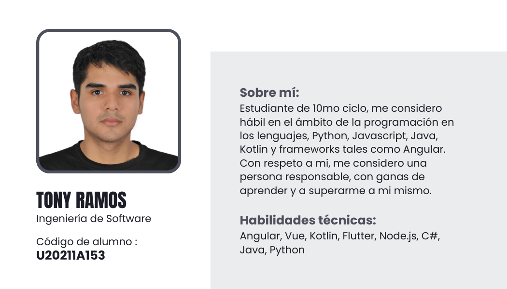
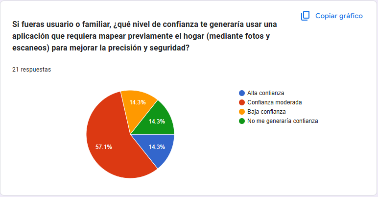
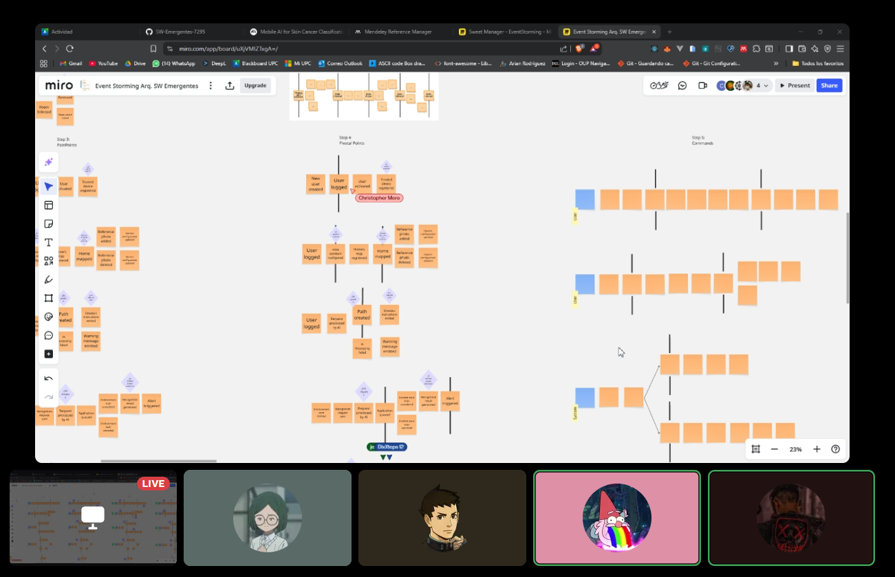

# 
Informe del Trabajo Final

    </img> 
    <strong>Universidad Peruana de Ciencias Aplicadas</strong> 
    <strong>Ingeniería de Software</strong> 
    <strong>1ASI0728 - Arquitecturas de Software Emergentes - 7295</strong> 
    <strong>Profesor: Royer Edelwer Rojas Malasquez</strong> 
     INFORME FINAL

#### Startup: **HomeSense**
#### Product: **VisualGuide**

## Team  Members:

|               Member                |    Code    |
| :---------------------------------: | :--------: |
| More Rondon, Christopher Sebastian  | U202212199 |
| Perez Pizarro, Pedro Jeremy  | U202022237 |
| Ramos Najar, Tony Alexander  | U20211A153 |
| Rodriguez Vargas, Arian Martín  | U202212096 |

# Registro de Versiones del Informe

<table>
  <thead>
    <tr>
      <th>Versión</th>
      <th>Fecha</th>
      <th>Autor</th>
      <th>Descripción de modificación</th>
    </tr>
  </thead>
  <tbody>
    <tr>
      <td rowspan="6">V1</td>
      <td>20/09/2025</td>
      <td>Ramos Najar, Tony Alexander</td>
      <td>
        <ul>
          <li>Startup Profile</li>
          <li>Solution Profile</li>
          <li>Antecedentes y problemática</li>
          <li>Lean UX Process</li>
          <li>Segmentos objetivo</li>
          <li>Competidores</li>
          <li>EventStorming</li>
          <li>User Stories</li>
        </ul>
      </td>
    </tr>
    <tr>
      <td>20/09/2025</td>
      <td>More Rondon, Christopher Sebastian</td>
      <td>
        <ul>
          <li>To-Be Scenario Mapping</li>
          <li>Impact Mapping</li>
          <li>Product Backlog</li>
          <li>Ubiquitous Language</li>
          <li>NeedFinding</li>
          <li>EventStorming</li>
          <li>User Stories</li>
        </ul>
      </td>
    </tr>
    <tr>
      <td>20/09/2025</td>
      <td>Perez Pizarro, Pedro Jeremy </td>
      <td>
        <ul>
          <li>Strategic-Level Attribute-Driven Design</li>
          <li>Design Purpose</li>
          <li>Attribute-Driven Design Inputs</li>
          <li>Architectural Drivers Backlog</li>
          <li>Architectural Design Decisions</li>
          <li>Quality Attribute Scenario Refinements</li>
          <li>EventStorming</li>
          <li>User Stories</li>
        </ul>
      </td>
    </tr>
    <tr>
      <td>20/09/2025</td>
      <td>Arian Martín Rodriguez Vargas</td>
      <td>
        <ul>
          <li>Context Mapping</li>
          <li>Software Architecture System Landscape Diagram</li>
          <li>Software Architecture Context Level Diagrams</li>
          <li>Software Architecture Container Diagrams</li>
          <li>Software Architecture Deployment Diagrams</li>
          <li>EventStorming</li>
          <li>User Stories</li>
        </ul>
      </td>
    </tr>
  </tbody>
</table>
  </tbody>
</table>

# Project Report Collaboration Insights

En esta sección, registraremos los cambios y logros que se completaron en cada entrega del reporte.

TB1
La entrega TB1 finalizó con éxito y están documentadas en el siguiente repositorio de Github perteneciente a la organización del equipo: https://github.com/SW-Emergentes-7295/project-report Durante el desarrollo del informe se tuvieron en cuenta los siguientes aspectos:

- Se definió la startup y el producto a desarrollar.
- Se establecieron los segmentos objetivo.
- Se aplicó el proceso de Lean UX para definir problem statements, assumptions e hipótesis.
- Se realizó un análisis competitivo de los principales competidores en el mercado.
- Se diseñaron entrevistas semiestructuradas para recolectar datos cualitativos.
- Se llevaron a cabo entrevistas con personas no videntes y sus cuidadores.
- Se crearon user personas para representar a los segmentos objetivo.
- Se desarrollaron user task matrix, empathy maps y as-is scenario maps para comprender mejor a los usuarios.
- Mediante el eventstorming se definió el ubiquitous language del dominio.
- Se establecieron las primeras versiones de la arquitectura del sistema.
- Se documentaron todas las actividades y hallazgos en el repositorio de Github.

Imagen 1: Gráfico general de commits y contribuciones hechas por cada miembros del equipo de VisualGuide. Incluye tambien los pull requests activos y aceptados. 

# Contenido

- [Registro de Versiones del Informe](#registro-de-versiones-del-informe)
- [Project Report Collaboration Insights](#project-report-collaboration-insights)
- [Capítulo I: Introducción](#capítulo-i-introducción)
   * [1.1. Startup Profile](#11-startup-profile)
      + [1.1.1. Descripción de la Startup](#111-descripción-de-la-startup)
      + [1.1.2. Perfiles de integrantes del equipo](#112-perfiles-de-integrantes-del-equipo)
   * [1.2. Solution Profile](#12-solution-profile)
      + [1.2.1. Antecedentes y problemática](#121-antecedentes-y-problemática)
      + [1.2.2. Lean UX Process](#122-lean-ux-process)
         - [1.2.2.1. Lean UX Problem Statements](#1221-lean-ux-problem-statements)
         - [1.2.2.2. Lean UX Assumptions](#1222-lean-ux-assumptions)
         - [1.2.2.3. Lean UX Hypothesis Statements.](#1223-lean-ux-hypothesis-statements)
         - [1.2.2.4. Lean UX Canvas](#1224-lean-ux-canvas)
   * [1.3. Segmentos objetivo](#13-segmentos-objetivo)
- [Capítulo II: Requirements Elicitation & Analysis](#capítulo-ii-requirements-elicitation-analysis)
   * [2.1. Competidores](#21-competidores)
      + [2.1.1. Análisis competitivo](#211-análisis-competitivo)
      + [2.1.2. Estrategias y tácticas frente a competidores](#212-estrategias-y-tácticas-frente-a-competidores)
   * [2.2. Entrevistas](#22-entrevistas)
      + [2.2.1. Diseño de entrevistas](#221-diseño-de-entrevistas)
      + [2.2.2. Registro de entrevistas](#222-registro-de-entrevistas)
      + [2.2.3. Análisis de entrevistas](#223-análisis-de-entrevistas)
   * [2.3. Needfinding](#23-needfinding)
      + [2.3.1. User Personas](#231-user-personas)
      + [2.3.2. User Task Matrix](#232-user-task-matrix)
      + [2.3.3. User Journey Mapping](#233-user-journey-mapping)
      + [2.3.4. Empathy Mapping](#234-empathy-mapping)
      + [2.3.5. As-is Scenario Mapping](#235-as-is-scenario-mapping)
   * [2.4. Ubiquitous Language](#24-ubiquitous-language)
- [Capítulo III: Requirements Specification](#capítulo-iii-requirements-specification)
   * [3.1. To-Be Scenario Mapping](#31-to-be-scenario-mapping)
   * [3.2. User Stories](#32-user-stories)
   * [3.3. Impact Mapping](#33-impact-mapping)
   * [3.4. Product Backlog](#34-product-backlog)
- [Capítulo IV: Strategic-Level Domain-Driven Design](#capítulo-iv-strategic-level-domain-driven-design)
   * [4.1. Strategic-Level Attribute-Driven Design](#41-strategic-level-attribute-driven-design)
      + [4.1.1. Design Purpose](#411-design-purpose)
      + [4.1.2. Attribute-Driven Design Inputs](#412-attribute-driven-design-inputs)
         - [4.1.2.1. Primary Functionality (Primary User Stories)](#4121-primary-functionality-primary-user-stories)
         - [4.1.2.2. Quality attribute Scenarios](#4122-quality-attribute-scenarios)
         - [4.1.2.3. Constraints](#4123-constraints)
      + [4.1.3. Architectural Drivers Backlog](#413-architectural-drivers-backlog)
      + [4.1.4. Architectural Design Decisions](#414-architectural-design-decisions)
      + [4.1.5. Quality Attribute Scenario Refinements](#415-quality-attribute-scenario-refinements)
   * [4.2. Strategic-Level Domain-Driven Design](#42-strategic-level-domain-driven-design)
      + [4.2.1. EventStorming](#421-eventstorming)
      + [4.2.2. Candidate Context Discovery](#422-candidate-context-discovery)
      + [4.2.3. Domain Message Flows Modeling](#423-domain-message-flows-modeling)
      + [4.2.4. Bounded Context Canvases](#424-bounded-context-canvas)
      + [4.2.5. Context Mapping](#425-context-mapping)
   * [4.3. Software Architecture](#43-software-architecture)
      + [4.3.1. Software Architecture System Landscape Diagram](#431-software-architecture-system-landscape-diagram)
      + [4.3.2. Software Architecture Context Level Diagrams](#432-software-architecture-context-level-diagrams)
      + [4.3.3. Software Architecture Container Level Diagrams](#433-software-architecture-container-level-diagrams)
      + [4.3.4. Software Architecture Deployment Diagrams](#434-software-architecture-deployment-diagrams)
- [Conclusiones](#conclusiones)
- [Referencias](#referencias)

# Student Outcome
En Ingeniería de Software, el logro de curso contribuye a alcanzar el:

ABET – EAC - Student Outcome 3: Capacidad de comunicarse efectivamente con un rango de audiencias.
En el siguiente cuadro se describe las acciones realizadas y enunciados de
conclusiones por parte del grupo, que permiten sustentar el haber alcanzado el logro
del ABET – EAC - Student Outcome 3.

<table>
  <tr>
    <th>Criterio Especifico</th>
    <th>Acciones Realizadas</th>
    <th>Conclusiones</th>
  </tr>
  <tr>
    <td>Comunica oralmente sus ideas
y/o resultados con objetividad a
público de diferentes
especialidades y niveles
jerarquicos, en el marco del
desarrollo de un proyecto en
ingeniería.</td>
    <td>
      
<b>TB1 - More Rondon, Christopher Sebastian:</b> Expuse con claridad conceptos técnicos y esto me ayudará a ganar confianza en futuras presentaciones profesionales.

      
<b>TB1 - Perez Pizarro, Pedro Jeremy:</b> Compartí ideas con ejemplos comprensibles y esto me permitirá desenvolverme mejor frente a audiencias diversas.

      
<b>TB1 - Ramos Najar, Tony Alexander:</b> Participé en discusiones transmitiendo resultados de manera precisa y esto reforzará mi comunicación en el ámbito laboral.

      
<b>TB1 - Rodriguez Vargas, Arian Martín:</b> Lideré la exposición de hallazgos y con ello perfeccioné mi capacidad de persuadir en entornos de ingeniería.

    </td>
    <td>
      
<b>TB1:</b> Como equipo demostramos nuestra capacidad de comunicar oralmente ideas y resultados de manera objetiva, alcanzando un nivel de claridad y efectividad aplicable en nuestra futura carrera profesional.

    </td>
  </tr>

  <tr>
    <td>Comunica en forma escrita ideas
y/o resultados con objetividad a
público de diferentes
especialidades y niveles
jerarquicos, en el marco del
desarrollo de un proyecto en
ingeniería..</td>
    <td>
      
<b>TB1 - More Rondon, Christopher Sebastian:</b> Redacté reportes técnicos concisos y esto fortalecerá mi competencia para elaborar documentación profesional.

      
<b>TB1 - Perez Pizarro, Pedro Jeremy:</b> Elaboré resúmenes claros y estructurados y esto mejorará mi comunicación escrita hacia distintos públicos.

      
<b>TB1 - Ramos Najar, Tony Alexander:</b> Contribuí con informes analíticos bien organizados y esto me permitirá aplicar una mejor documentación en mi vida académica y laboral.

      
<b>TB1 - Rodriguez Vargas, Arian Martín:</b> Preparé documentos con lenguaje técnico adaptado y esto me ayudará a desarrollar competencias para la escritura en proyectos de ingeniería.

    </td>
    <td>
      
<b>TB1:</b> Como equipo alcanzamos una comunicación escrita objetiva y clara, adaptada a diversos niveles jerárquicos y especialidades, consolidando una competencia esencial en nuestra formación y ejercicio profesional.

    </td>
  </tr>
</table>

# Capítulo I: Introducción
## 1.1. Startup Profile

A continuación, presentamos la startup <strong>“HomeSense”</strong>, dedicada a desarrollar soluciones tecnológicas de asistencia para personas con discapacidad visual, así como el equipo de desarrollo del producto, software presentado anteriormente, <strong>“VisualGuide”</strong>.

### 1.1.1. Descripción de la Startup

 
      <strong>HomeSense</strong> es una startup tecnológica enfocada en crear soluciones inteligentes para mejorar la autonomía y seguridad de personas no videntes dentro del hogar. Nuestra misión es proporcionar herramientas que permitan a los usuarios interactuar con su entorno de manera segura y eficiente mediante el uso       de tecnologías avanzadas de inteligencia artificial. 
    
 
    
 
      El primer producto de HomeSense es <strong>"VisualGuide"</strong>, una aplicación móvil que funciona como un asistente visual inteligente para personas no videntes. La aplicación interpreta el entorno del hogar mediante IA, reconoce objetos, muebles, electrodomésticos, personas, textos y colores, y guía al usuario           en tiempo real según sus necesidades específicas. Para garantizar seguridad, la aplicación opera sobre un mapeo previo del hogar, realizado mediante fotografías y escaneos en un ambiente controlado, evitando riesgos asociados al uso en espacios públicos. 
    
 
      <h4><strong>Misión</strong></h4> 
      
 Facilitar la autonomía y seguridad de personas no videntes dentro del hogar mediante soluciones inteligentes basadas en inteligencia artificial, que interpreten su entorno y guíen sus movimientos de forma precisa y confiable.
    

      <h4><strong>Visión</strong></h4>
      
 Ser líderes en América Latina en soluciones tecnológicas de asistencia para personas con discapacidad visual, ofreciendo productos innovadores que promuevan la independencia y seguridad dentro del hogar.
    

### 1.1.2. Perfiles de integrantes del equipo

## 1.2. Solution Profile
### 1.2.1 Antecedentes y problemática

<h3>Antecedente</h3>
  

    Hoy en día, las personas con discapacidad visual tienen muchos retos para moverse con seguridad y autonomía dentro de su propia casa. Aunque existen algunas herramientas de ayuda, muchas requieren contacto directo con el entorno o no están diseñadas para reconocer los detalles específicos de un hogar. Esto limita la independencia de los usuarios y aumenta el riesgo de accidentes domésticos.
  

<h3>Problemática – Enfoque con las 5W + 2H</h3>
<ul>
    <li><strong>What?</strong> Las personas no videntes tienen problemas para reconocer y desplazarse dentro de su hogar de manera segura, lo que afecta su autonomía diaria.</li>   
    <li><strong>Why?</strong> Porque no cuentan con un asistente inteligente capaz de interpretar el entorno, identificar muebles, electrodomésticos, objetos o personas, y guiarlos de forma clara y en tiempo real según sus necesidades.</li> 
    <li><strong>Who?</strong> Personas con discapacidad visual que desean tener más independencia y sentirse seguras dentro de su casa.</li>
    <li><strong>When?</strong> En su vida cotidiana, al moverse entre habitaciones, usar electrodomésticos, o identificar personas y objetos en su hogar.</li>
    <li><strong>Where?</strong> Dentro del hogar, especialmente en casas con espacios complejos o muebles que puedan representar algún riesgo.</li>  
    <li><strong>How?</strong> Actualmente dependen de bastones, ayuda de otras personas o aplicaciones básicas que no ofrecen orientación contextualizada ni reconocimiento completo del entorno.</li>    
    <li><strong>How Much?</strong> La falta de herramientas adecuadas genera dependencia, riesgo de accidentes, estrés y sensación de inseguridad, afectando directamente su calidad de vida y la tranquilidad de sus familias.</li>
</ul>

### 1.2.2 Lean UX Process.
#### 1.2.2.1. Lean UX Problem Statements.

**Domain:**  
Asistencia para personas no videntes dentro del hogar, proporcionando autonomía y seguridad mediante tecnología de reconocimiento del entorno.  

**Customer Segments:**  
- Personas no videntes que desean moverse con independencia dentro de su hogar.  
- Familias y cuidadores que buscan seguridad y tranquilidad para sus seres queridos no videntes.  

**Pain Points:**  
- Dificultad para desplazarse de forma segura y autónoma dentro del hogar.  
- Dependencia de terceros para realizar tareas cotidianas.  
- Riesgo de accidentes domésticos debido a obstáculos o falta de orientación.  
- Las soluciones existentes no ofrecen reconocimiento contextualizado del entorno.  

**Gap:**  
Actualmente no existen muchas aplicaciones funcionales que combinen mapeo previo del hogar, reconocimiento de objetos y muebles, y guía en tiempo real adaptada a personas no videntes.  

**Visión / Strategy:**  
Proveer una solución basada en inteligencia artificial que permita a las personas no videntes moverse con seguridad y autonomía dentro de su hogar, reduciendo riesgos y dependencia de terceros.  

**Initial Segment:**  
Personas no videntes con acceso a smartphones y hogares con espacios complejos que requieren asistencia para navegar de manera segura.  

**Problem Statements:**  
1. Las personas no videntes necesitan moverse dentro de su hogar con seguridad, pero las herramientas actuales no reconocen objetos ni guían de manera contextualizada.  
2. Los cuidadores buscan tranquilidad y control, pero no tienen manera de supervisar de forma segura la movilidad de sus familiares dentro del hogar.  

---

#### 1.2.2.2. Lean UX Assumptions.

**Supuestos de negocio**  
- Las personas con discapacidad visual buscan soluciones que les permitan mayor autonomía y seguridad en su hogar.  
- Una aplicación móvil con inteligencia artificial que mapee previamente el hogar y reconozca objetos, muebles, electrodomésticos y personas puede satisfacer esta necesidad.  
- Los usuarios estarán dispuestos a interactuar mediante indicaciones de voz y recibir feedback en tiempo real.  
- El entrenamiento de la IA en un entorno controlado permitirá minimizar errores y garantizar precisión en el reconocimiento de objetos y espacios.  
- La mayoría de los usuarios valorará la confiabilidad, facilidad de uso y la capacidad de la aplicación de integrarse con otros dispositivos domésticos, si los tuviera.  

**Supuestos de usuario**  
- Los usuarios desean moverse con seguridad y sin depender de terceros dentro de su hogar.  
- Valoran la privacidad y la protección de sus datos personales.   
- Esperan que la aplicación sea fácil de usar, intuitiva y que proporcione opciones claras para recibir orientación y feedback.  
- Desean alternativas de acceso seguro ante posibles fallos, como indicaciones redundantes o modos de ayuda remota.  

---

#### 1.2.2.3. Lean UX Hypothesis Statements.

1. **Hipótesis de seguridad y autonomía:**  
Si desarrollamos una aplicación que mapee previamente el hogar y use IA para reconocer objetos, muebles y personas, entonces los usuarios podrán moverse con mayor seguridad y autonomía.  

2. **Hipótesis de interacción:**  
Si la aplicación proporciona indicaciones de voz claras y feedback en tiempo real, los usuarios podrán interactuar con su entorno de manera confiable y sin depender de terceros.  

3. **Hipótesis de confianza y respaldo:**  
Si la aplicación ofrece reconocimiento preciso del entorno y alternativas ante fallos, los usuarios se sentirán más seguros y confiados, mejorando su calidad de vida.  

4. **Hipótesis de privacidad:**  
Si aseguramos la seguridad y privacidad de los datos mediante encriptación y auditorías, los usuarios confiarán en la tecnología y la adoptarán de forma sostenida.  

5. **Hipótesis de integración domótica:**  
Si la aplicación se integra con otros dispositivos inteligentes del hogar, los usuarios podrán optimizar la seguridad y comodidad, obteniendo una experiencia más completa y satisfactoria.  

---

#### 1.2.2.4. Lean UX Canvas.

## 1.3. Segmentos objetivo.

<section id="segmentos-usuarios">

  <article>
    <h4>Personas No Videntes</h4>
    

Este segmento está compuesto por individuos con discapacidad visual que desean moverse con seguridad y autonomía dentro de su hogar. Buscan soluciones que les permitan reconocer objetos, muebles, electrodomésticos y personas, y recibir guía en tiempo real para evitar riesgos y accidentes domésticos.
    

    <h4>Características clave:</h4>
    <ul>
      <li> Necesidad de mayor autonomía dentro del hogar.</li>
      <li> Preocupación por la seguridad y la reducción de accidentes.</li>
      <li> Interés en soluciones tecnológicas intuitivas y confiables.</li>
      <li> Usan smartphones o dispositivos que les permitan interactuar con aplicaciones de asistencia.</li>
    </ul>
  </article>

  <article>
    <h4>Familias y Cuidadores</h4>
    

Este segmento incluye a familiares o cuidadores de personas no videntes que desean garantizar la seguridad de sus seres queridos dentro del hogar. Buscan soluciones que les permitan supervisar y apoyar de manera indirecta, sin invadir la independencia del usuario.
    

    <h4>Características clave:</h4>
    <ul>
      <li> Necesidad de tranquilidad y control del usuario sobre la seguridad del hogar.</li>
      <li> Valoran herramientas que ayuden a prevenir accidentes o incidentes domésticos.</li>
      <li> Buscan soluciones confiables, fáciles de usar y que no interfieran con la autonomía del usuario principal.</li>
      <li> Interés en sistemas que ofrezcan notificaciones o feedback sobre la actividad dentro del hogar.</li>
    </ul>
  </article>
</section>

# Capítulo II: Requirements Elicitation & Analysis
## 2.1. Competidores.

<table> <thead> 
    <tr> <th>Nombre del Competidor</th> <th>Descripción</th> </tr> </thead> <tbody> <tr> <td rowspan="2" align="center">   Be My Eyes </td> <td>Be My Eyes conecta a personas ciegas o con baja visión con voluntarios a través de videollamadas en tiempo real. También cuenta con la función AI “Be My AI” para describir imágenes automáticamente mediante inteligencia artificial.</td> </tr> <tr> <td>Página web: <a href="https://www.bemyeyes.com/" target="_blank">https://www.bemyeyes.com/</a></td> </tr> <tr> <td rowspan="2" align="center">   Envision AI </td> <td>Envision AI es una app basada en inteligencia artificial que convierte texto y objetos capturados por la cámara del móvil en descripciones habladas. Reconoce texto en más de 60 idiomas y permite interacción por voz.</td> </tr> <tr> <td>Página web: <a href="https://www.letsenvision.com/" target="_blank">https://www.letsenvision.com/</a></td> </tr> 
    <tr> <td rowspan="2" align="center">   Lookout by Google</td> <td>Lookout es una app diseñada por Google para personas con discapacidad visual. Utiliza IA y la cámara del dispositivo para leer texto, identificar objetos, detectar monedas y proporcionar descripciones audibles del entorno.</td> </tr> <tr> <td>Página web: <a href="https://play.google.com/store/apps/details?id=com.google.android.apps.accessibility.reveal&hl=es_PE" target="_blank"> Disponible en Google Play (app Lookout by Google)</a></td> </tr> </tbody> </table>

### 2.1.1. Análisis competitivo.

<table style="width: 100%;">
  <tr>
    <th colspan="6" style="padding: 8px; text-align: center;"> Competitive Analysis Landscape</th>
  </tr>
  <tr>
    <td>¿Por qué llevar a cabo este análisis?</td>
    <td colspan="5">Este análisis permite identificar fortalezas, debilidades, oportunidades y amenazas de HomeSense frente a competidores establecidos, con el fin de diferenciar a VisualGuide, definir su propuesta de valor única y diseñar estrategias de crecimiento sostenibles.</td>
</td>
  </tr>
  <tr>
    <td colspan="2"></td>
  <td align="center"> </td>
  <td align="center"> </td>
  <td align="center"> </td>
  <td align="center"> </td>
  </tr>
<tr>
  <td rowspan="2" align="center">Perfil</td>
  <td align="center">Overview</td>
    <td>Conecta a personas ciegas con voluntarios o IA para asistencia visual en tiempo real.</td>
    <td>Convierte texto y objetos en descripciones habladas con IA.</td>
    <td>App de Google que identifica objetos, lee texto, detecta billetes y describe entornos.</td>
    <td>Asistente visual para el hogar: mapeo del entorno y guía segura en tiempo real.</td>
  </tr>
<tr>
  <td>Ventaja competitiva ¿Qué valor ofrece a los clientes?</td>
    <td>Gran comunidad global de voluntarios + soporte IA gratuito.</td>
    <td>OCR en más de 60 idiomas e interacción por voz.</td>
    <td>Respaldo de Google, confiabilidad y gratuidad.</td>
    <td>Enfoque exclusivo en seguridad doméstica, personalización y autonomía.</td>
  </tr>
 <tr>
  <td rowspan="2" align="center">Perfil de Marketing</td>
  <td>Mercado objetivo</td>
    <td>Personas con discapacidad visual que requieren ayuda inmediata en todo el mundo.</td>
    <td>Usuarios con discapacidad visual que necesitan leer texto o identificar objetos en múltiples contextos.</td>
    <td>Usuarios ciegos o con baja visión que utilizan Android en entornos cotidianos.</td>
    <td>Personas no videntes en América Latina que buscan independencia y seguridad dentro del hogar.</td>
  </tr>
<tr>
  <td>Estrategias de marketing</td>
    <td>Comunidad global + alianzas con ONGs.</td>
    <td>Promoción en comunidades inclusivas; enfoque multilingüe.</td>
    <td>Distribución masiva vía Google Play.</td>
    <td>Alianzas locales con asociaciones, campañas inclusivas en LATAM.</td>
  </tr>

<tr>
  <td rowspan="3" align="center">Perfil del Producto</td>
  <td>Productos & Servicios</td>
    <td>Videollamadas con voluntarios y soporte IA (Be My AI).</td>
    <td>Lectura de texto, reconocimiento de objetos y escenas.</td>
    <td>Lectura de texto, identificación de objetos, reconocimiento de billetes.</td>
    <td>Asistente de guía en el hogar con mapeo y navegación segura.</td>
  </tr>
<tr>
  <td>Precios & Costos</td>
    <td>Gratuito.</td>
    <td>Freemium: funciones básicas gratis, versión premium de pago.</td>
    <td>Gratuito.</td>
    <td>Freemium: acceso básico gratis, premium con funciones avanzadas (mapas personalizados, alertas).</td>
  </tr>
<tr>
  <td>Canales de distribución (Web y/o Móvil)</td>
    <td>App móvil (iOS/Android).</td>
    <td>App móvil (iOS/Android).</td>
    <td>App móvil (Android).</td>
    <td>App móvil (iOS/Android) + integración IoT en el hogar.</td>
  </tr>

<tr>
  <td rowspan="4" align="center">Análisis SWOT</td>
  <td>Fortalezas</td>
    <td>Gran base de usuarios y comunidad activa.</td>
    <td>OCR potente, multilingüe y versátil.</td>
    <td>Respaldo de Google, alta confiabilidad.</td>
    <td>Propuesta diferenciada enfocada en el hogar; seguridad y personalización.</td>
  </tr>
<tr>
  <td>Debilidades</td>
    <td>Dependencia de voluntarios; requiere internet estable.</td>
    <td>Suscripción de pago limita accesibilidad.</td>
    <td>Solo Android; enfoque genérico.</td>
    <td>Baja visibilidad inicial de marca como startup emergente.</td>
  </tr>
<tr>
  <td>Oportunidades</td>
    <td>Expandir funciones de IA.</td>
    <td>Alianzas con wearables y dispositivos accesibles.</td>
    <td>Mayor integración con ecosistema Google.</td>
    <td>Alta necesidad en LATAM; integración con hogares inteligentes.</td>
  </tr>
<tr>
  <td>Amenazas</td>
    <td>Competencia con soluciones IA más avanzadas.</td>
    <td>Riesgo por presencia de Google y Be My Eyes.</td>
    <td>Competidores especializados con mayor personalización.</td>
    <td>Entrada de grandes empresas en accesibilidad doméstica.</td>
  </tr>
<table>

### 2.1.2. Estrategias y tácticas frente a competidores.

**Estrategias:**

- **Diferenciación por enfoque en el hogar:** Mientras los competidores se centran en espacios públicos o funciones generales de accesibilidad, VisualGuide se especializa en seguridad y autonomía dentro del hogar, ofreciendo mapeo personalizado y navegación segura.
- **Segmentación regional en LATAM:** Enfocarse en un mercado poco atendido por gigantes como Google y Envision, adaptando las soluciones a las necesidades reales y específicas de los hogares en América Latina (precio accesible, fácil instalación y soporte local).
- **Propuesta de valor inclusiva y escalable:** Ofrecer un modelo freemium que garantice accesibilidad básica gratuita, con funciones premium adaptadas a necesidades avanzadas, asegurando inclusión y sostenibilidad del negocio.
- **Innovación constante con feedback de usuarios:** Mantener un ciclo de mejoras basadas en la retroalimentación directa de usuarios no videntes y sus familias, generando una solución más empática y adaptada que la de grandes corporaciones.

**Tácticas:**

- **Pruebas piloto en hogares de confianza:** Implementar VisualGuide en casas de familiares o conocidos con discapacidad visual para recoger feedback real, documentar casos de éxito y generar testimonios iniciales.
- **Campañas educativas en redes sociales propias:** Usar TikTok, Instagram y Facebook con videos cortos y testimonios que muestren cómo VisualGuide resuelve problemas cotidianos, diferenciándose de apps genéricas.
- **Convenios con universidades y ONGs locales:** Contactar a la UPC, PUCP u ONGs pequeñas que trabajen con personas con discapacidad para validar el producto y sumar usuarios iniciales sin grandes costos.
- **Integración básica con dispositivos IoT accesibles:** Conectar VisualGuide con dispositivos económicos como Alexa o Google Home (que ya existen en muchos hogares) para demostrar su valor agregado frente a competidores.

## 2.2. Entrevistas.
### 2.2.1. Diseño de entrevistas.
Para la recolección de datos cualitativos, se diseñaron entrevistas semiestructuradas dirigidas a personas no videntes y sus cuidadores. Las entrevistas se enfocaron en comprender las necesidades, desafíos y expectativas de los usuarios en relación con la movilidad dentro del hogar y el uso de tecnologías de asistencia. Se elaboraron preguntas abiertas para fomentar la expresión libre y detallada de experiencias personales, así como preguntas específicas para obtener información sobre el uso actual de herramientas tecnológicas y las características deseadas en una solución ideal.

**Segmento objetivo 1**: Personas no videntes.
##### Preguntas básicas
1. ¿Cuál es su nombre?
2. ¿Dónde reside actualmente? (ciudad/distrito)
3. ¿Cuál es su edad?
4. ¿Desde cuándo es no vidente? (nacimiento o adquirido, y desde qué año)
5. ¿Vive solo/a o con familiares?

##### Preguntas principales

1. ¿Qué actividades dentro de su hogar le resultan más complicadas o riesgosas actualmente?
2. ¿Cómo suele identificar y ubicar objetos o muebles dentro de su casa?
3. ¿Qué nivel de confianza siente con las soluciones tecnológicas que usa hoy en día?
4. ¿En qué situaciones del hogar cree que una aplicación como VisualGuide podría ayudarle más?
5. ¿Cuáles son sus principales preocupaciones en cuanto a su seguridad dentro del hogar?
6. ¿Qué características considera indispensables en una aplicación de asistencia visual?
7. ¿Le resultaría cómodo realizar un mapeo previo de su hogar con ayuda de un familiar o tercero?
8. ¿Prefiere recibir la guía en formato de audio, vibración u otro medio? ¿Por qué?
9. ¿Qué tanto valora la privacidad de su información y del mapeo de su hogar?
10. ¿Qué barreras ha tenido al usar otras tecnologías o aplicaciones de accesibilidad?
11. ¿Qué situaciones le generan más independencia actualmente y cómo cree que se podrían mejorar?
12. ¿Le gustaría que la aplicación también reconociera personas cercanas o solo objetos?
13. ¿Cuánto tiempo estaría dispuesto a invertir en aprender a usar una nueva aplicación?
14. ¿Qué emociones le genera la idea de contar con un asistente visual inteligente en casa?
15. ¿Qué expectativas tendría del soporte técnico o acompañamiento de la aplicación?

**Segmento objetivo 2**: Familiares o cuidadores de personas no videntes.
##### Preguntas básicas

1. ¿Cuál es su nombre?
2. ¿Dónde reside actualmente? (ciudad/distrito)
3. ¿Cuál es su edad?
4. ¿Quién es la persona no vidente en su familia? (ejemplo: hijo/a, padre/madre, hermano/a)
5. ¿Convive actualmente con su familiar no vidente?

##### Preguntas principales

1. ¿Qué situaciones en el hogar le generan más preocupación respecto a la seguridad de su familiar no vidente?
2. ¿Qué medidas actuales utiliza para ayudarle a desenvolverse de forma independiente?
3. ¿Qué tan cómodo/a se siente con el uso de tecnología como apoyo en la vida diaria de su familiar?
4. ¿Qué expectativas tendría de una aplicación como VisualGuide en términos de seguridad?
5. ¿Cuáles cree que serían los principales beneficios para su familiar al usar esta solución?
6. ¿Qué nivel de supervisión o acompañamiento cree que sería necesario al usar la aplicación?
7. ¿Cómo se sentiría respecto al mapeo digital del hogar? ¿Le genera confianza o preocupación?
8. ¿Qué importancia le da a que la aplicación mantenga la privacidad de los datos del hogar?
9. ¿Qué dificultades cree que su familiar podría tener al usar la aplicación?
10. ¿Le gustaría recibir notificaciones o alertas sobre el uso de la app para monitorear la seguridad?
11. ¿Qué tipo de soporte técnico esperaría como familiar (ej. capacitación, tutoriales, soporte remoto)?
12. ¿Qué situaciones específicas cree que deberían priorizarse en la asistencia (ej. evitar tropiezos, ubicar electrodomésticos, leer etiquetas)?
13. ¿Qué tanto valora que su familiar gane autonomía frente a depender de su ayuda constante?
14. ¿Cómo describiría el balance ideal entre autonomía y supervisión para su ser querido?
15. ¿Qué mejoras o funciones adicionales le gustaría ver en una aplicación como esta?

### 2.2.2. Registro de entrevistas.
Las entrevistas han sido consolidadas en un solo video registrado en la sección de Anexos, donde se pueden observar las respuestas y reacciones de los entrevistados. A continuación, se presenta un resumen de las entrevistas individualmente realizadas a cada segmento objetivo.

**Entrevista 1: Persona no vidente - Juan Navarro**
- Nombre: Juan José Navarro Chacón
- Edad: 21 años
- Residencia: Los Olivos, Lima, Perú

**URL de la entrevista:** [https://acortar.link/cIuMmt](https://acortar.link/cIuMmt)

**Resumen de la entrevista:**
Juan Navarro, de 21 años, es una persona no vidente y reside en Los Olivos, Lima. Tenía muchas dificultades al inicio como persona no vidente pero luego se aocstumbró a muchas actividades diarias pero no de forma efectiva. Juan mencionó que sus principales problemas son al momento de buscar objetos específicos dentro de su hogar y moverse entre él. Actualmente, se ayuda de sus familiares para diversas acciones pero no le gusta incomodarlos todo el tiempo.

Mencionó que una aplicación como VisualGuide podría ser muy beneficiosa, ya que le permitiría buscar objetos o ubicarse dentro de su hogar de una manera más independiente. Juan también expresó mucho interés en un asistente inteligente con voz para su propia hogar.

**Entrevista 2: Persona no vidente**
- Nombre: Sandy Baez
- Edad: 26 años
- Residencia: Lima, Ate - Perú
- Desde cuándo es no vidente: Perdió la visión a los 20 años
- Vive con familiares

**Resumen de la entrevista:**
Sandy, una joven de 26 años residente en Ate–Lima que perdió la visión moderadamente a los 20 años, vive con su madre y hermana y enfrenta mayores riesgos en la cocina y al desplazarse cuando cambian los muebles. Actualmente se apoya en memoria, tacto y algunas apps poco confiables. Considera indispensable que una aplicación de asistencia visual reconozca objetos y personas con precisión, brinde instrucciones claras por audio, funcione sin internet y garantice la privacidad del mapeo de su hogar. Está dispuesta a invertir tiempo inicial en aprender y realizar un mapeo con ayuda de su hermana. Para ella, contar con un asistente visual inteligente significaría más independencia, seguridad y tranquilidad en su día a día.

**URL de la entrevista:** [https://acortar.link/apfTsV](https://acortar.link/apfTsV)

**Segmento objetivo 2: Familiares o cuidadores de personas no videntes**

**Entrevista 1: Familiar de persona no vidente - Carlos Chavez**
- Nombre: Carlos Sebastián Chavez Morales
- Edad: 21 años
- Residencia: La Perla, Callao, Perú
- Familiar no vidente: Primo
- Convive con su familiar no vidente: No, pero lo visita frecuentemente.

**URL de la entrevista:** [https://acortar.link/c6DJAQ](https://acortar.link/c6DJAQ)

**Resumen de la entrevista:**
Carlos Chávez, de 21 años, es primo de una persona no vidente y reside en La Perla, Callao. Aunque no convive con su primo, lo visita frecuentemente y se preocupa por su seguridad dentro del hogar. Carlos mencionó que las principales preocupaciones incluyen la posibilidad de accidentes domésticos y la dependencia constante de ayuda para moverse y realizar tareas básicas. Actualmente, su familia utiliza un bastón y la ayuda de otros familiares para asistir a su primo.

Mencionó que una aplicación como VisualGuide podría ser muy beneficiosa, ya que permitiría a su primo ganar más autonomía y reducir la necesidad de supervisión constante. Carlos también expresó interés en recibir notificaciones sobre el uso de la aplicación para monitorear la seguridad de su primo.

**Entrevista 2: Familiar de persona no vidente - Harold Elias**
- Nombre: Harold Elias
- Edad: 21 años
- Residencia: Los Olivos, Perú
- Familiar no vidente: Primo
- Convive con su familiar no vidente: Si

**URL de la entrevista:** [https://acortar.link/hiRi0l](https://acortar.link/hiRi0l)

**Resumen de la entrevista:**
Harol Elias de 21 años, expresó su deseo de poder usar la aplicación para darle más independencia a su primo, así como también expresó su actual preocupacio por la posibilidad de que se lastime. Si bien espera que la aplicación sea de ayuda, también cree que seguirá teniendo que ayudar a su primo en taeas más complejas como subir escaleras.

El entrevistado expresó no sentirse preocupado por el hecho de que se mapee su casa en la aplicación, sin embargo mencionó que no desea que esa información sea compartida con terceros, considerandola altamente sensible.

### 2.2.3. Análisis de entrevistas.

Para esta sección, el equipo elaboró un análisis detallado de las entrevistas realizadas a personas no videntes y sus familiares o cuidadores, a partir de un formulario creado en Google Forms y entrevistas grabadas en video.
**Formulario de encuesta**: [https://forms.gle/rkaVKpQX8PGiSA1W7](https://forms.gle/rkaVKpQX8PGiSA1W7)

Para esta pregunta, se observa que la mayoría de personas cuentan con alguna persona no vidente su entorno cercano, lo que indica una alta relevancia del problema en la sociedad.
  

En esta pregunta, se evidencia la relevancia de contar con herramientas de asistencia para personas no videntes, ya que la mayoría de encuestados considera que es muy importante.
  

En esta pregunta se observa cuáles son los mayores beneficios que los usuarios esperan de una aplicación como VisualGuide, destacando la seguridad y la autonomía.
  

En esta pregunta, se evidencia que la mayoría de usuarios tendrían una confianza moderada a alta en una aplicación como VisualGuide, lo que indica una buena disposición hacia la tecnología.
  

En esta pregunta, se observa que la mayoría de encuestados prefieren que la aplicación se utilice en un dispositivo móvil, lo que sugiere la importancia de la portabilidad y accesibilidad.
  

En esta pregunta, se evidencia la gran aprobación de la idea de VisualGuide, ya que la mayoría de encuestados considera que es una solución muy buena y la recomendarían pero con pruebas previas de seguridad.
  

## 2.3. Needfinding.
### 2.3.1. User Personas.

Los user personas son usados para definir los segmentos objetivos, asignando cualidades a cada uno de ellos y representandolos como personas

##### Personas no videntes:

##### Familias y cuidadores:

### 2.3.2. User Task Matrix.

El user task matrix muestra las acciones realizadas por los usuarios, junto con su importancia y frecuencia realizada

| Tarea           | Importancia No Videntes | Frecuencia No Videntes | Importancia Familiares y Cuidadores | Frecuencia Familiares y Cuidadores |
| :---------------------------------: | :--------: |:--------: |:--------: |:--------: |
| Moverse por su casa | alta | media | alta | alta |
| Hablar con sus familiares | alta | alta | alta | alta |
| Ayudar a otras personas en su dia a dias | alta | baja | alta | alta |
| Cocinar | alta | baja | alta | alta |
| Limpiar la casa | media | baja | alta | alta |
| Sacar la basura | alta | baja | alta | alta |

### 2.3.3. Empathy Mapping.
El empathy map esta diseñado para mostrar las opiniones de nuestros usuarios ante el problema

**Perosnas no videntes:**

**Familiares y cuidadores:**

### 2.3.4. As-is Scenario Mapping.

El As-Is map es usado para mostrar la situación actual del usuario, evidenciando sus problemas sin usar nuestra aplicación

**Perosnas no videntes:**

**Familiares y cuidadores:**

## 2.4. Ubiquitous Language.

**Source Data:** Datos almacenados por el modelo de object detection usado por la aplicación, sirven para definir el tipo de objeto.

**House Map:** Mapa del hogar del usuario, usado por la aplicación para recordar la distribución de la casa.

**Home path:** Camino trazado en el mapa, el cual el usuario deberá seguir para llegar a su destino.

**Home obstacle:** Obstáculo en el camino que puede provocar que el usuario se tropiece, la aplicación advierte cuando hay uno en el suelo.

**Object data:** Datos sobre los objetos detectados, usados por la aplicación para determinar la zona en la que se encuentra y si los objetos son peligrosos.

**Helpers:** Familiares o cuidadores inscritos para recibir notificaciones de su familiar cuando necesita ayuda.

**Help Notification:** Notificación enviada cuando el usuario no vidente necesita ayuda de una persona.

**Visual Model:** Modelo de inteligencia artificial centrado en la detección de objetos, usa la Source Data para clasificar objetos.

**Visual Voice:** Voz creada por inteligencia artificial para comunicarse con el usuario, puede personalizarse según sus necesidades.

# Capítulo III: Requirements Specification
## 3.1. To-Be Scenario Mapping.

El To-Be map es usado para mostrar la situación futura del usuario, evidenciando los cambios tras usar nuestra aplcación

**Perosnas no videntes:**

**Familiares y cuidadores:**

## 3.2. User Stories.
Redactamos las historias de usuario para el sistema de "VisualGuide", basándonos en las necesidades y expectativas de los usuarios no videntes y sus cuidadores. Estas historias reflejan las funcionalidades clave que el sistema debe ofrecer para mejorar la autonomía y seguridad dentro del hogar.

<!-- Tabla de épicas -->
<table>
   <thead>
      <tr>
         <th>Epic ID</th>
         <th>Título</th>
         <th>Descripción</th>
      </tr>
   </thead>
   <tbody>
      <tr>
         <td>EP01</td>
         <td>Reconocimiento de objetos y muebles</td>
         <td>Implementar un sistema de reconocimiento de objetos y muebles en la aplicación para ayudar a los usuarios no videntes a identificar su entorno.</td>
      </tr>
      <tr>
         <td>EP02</td>
         <td>Mapeo del hogar</td>
         <td>Desarrollar una funcionalidad que permita a los usuarios mapear su hogar mediante fotografías y escaneos en un entorno controlado.</td>
      </tr>
      <tr>
         <td>EP03</td>
         <td>Guía en tiempo real</td>
         <td>Crear un sistema de guía en tiempo real que proporcione indicaciones de voz claras y precisas para que los usuarios puedan moverse con seguridad dentro de su hogar.</td>
      </tr>
      <tr>
         <td>EP04</td>
         <td>Notificaciones a cuidadores</td>
         <td>Implementar una funcionalidad que permita a los cuidadores recibir notificaciones sobre la actividad del usuario no vidente para asegurar su seguridad.</td>
      </tr>
      <tr>
         <td>EP05</td>
         <td>Acceso a la información de la aplicación</td>
         <td>Desarrollar una funcionalidad que permita a los usuarios no videntes acceder a la información de la aplicación mediante comandos de voz.</td>
      </tr>
      <tr>
         <td>EP06</td>
         <td>Configuración de preferencias</td>
         <td>Crear una sección de configuración que permita a los usuarios no videntes personalizar sus preferencias en la aplicación.</td>
      </tr>
      <tr>
         <td>EP07</td>
         <td>Información de la empresa</td>
         <td>Proporcionar información relevante sobre la empresa a cargo del producto en la sección de HomeSense.</td>
      </tr>
      <tr>
         <td>EP08</td>
         <td>Asociación de usuario no vidente y familiar</td>
         <td>Desarrollar funcionalidad para, como familiar del usuario no vidente, ver alertas y detalles sobre el usuario.</td>
      </tr>
      <tr>
         <td>EP09</td>
         <td>Monitoreo y soporte</td>
         <td>Desarrollar logs, métricas y notificaciones de acuerdo a errores o bugs que pueda presentar el sistema.</td>
      </tr>
      <tr>
         <td>EP10</td>
         <td>Gestión de usuarios y perfiles</td>
         <td>Implementar un registro y gestión de usuarios de forma segura y sencilla.</td>
      </tr>
   </tbody>

<table border="1" cellspacing="0" cellpadding="5">
  <thead>
    <tr>
      <th>Epic / Story ID</th>
      <th>Título</th>
      <th>Descripción</th>
      <th>Criterios de Aceptación</th>
      <th>Relacionado con (Epic ID)</th>
    </tr>
  </thead>
  <tbody>
    <tr>
      <td>HU01</td>
      <td>Obtener información de la empresa</td>
      <td>Como visitante del sitio web, quiero obtener información adicional sobre la empresa a cargo del producto.</td>
      <td>
        <b>Given</b> el visitante se encuentra en la sección de HomeSense. 
        <b>When</b> observa la información relevante sobre la empresa. 
        <b>Then</b> se interesa en saber más sobre el producto. 
        <b>Y</b> se redirecciona a la descarga directa de la aplicación móvil.
      </td>
      <td>EP07</td>
    </tr>
    <tr>
      <td>HU02</td>
      <td>Uso de la aplicación móvil</td>
      <td>Como usuario no vidente, quiero utilizar la aplicación móvil para recibir asistencia en la navegación dentro de mi hogar.</td>
      <td>
        <b>Given</b> el usuario ha descargado e instalado la aplicación móvil. 
        <b>When</b> abre la aplicación y sigue las instrucciones para mapear su hogar. 
        <b>Then</b> puede recibir indicaciones de voz en tiempo real para moverse de manera segura dentro de su casa.  
        <b>Given</b> el usuario está utilizando la aplicación dentro de su hogar. 
        <b>When</b> la aplicación detecta objetos y muebles a través de la cámara. 
        <b>Then</b> proporciona indicaciones de voz claras sobre la ubicación y características de los objetos cercanos.
      </td>
      <td>EP03</td>
    </tr>
    <tr>
      <td>HU03</td>
      <td>Mapeo del hogar</td>
      <td>Como usuario no vidente, quiero mapear mi hogar utilizando la aplicación para que pueda reconocer objetos y muebles.</td>
      <td>
        <b>Given</b> el usuario ha iniciado el proceso de mapeo en la aplicación. 
        <b>When</b> sigue las instrucciones para capturar imágenes y escanear su entorno. 
        <b>Then</b> la aplicación crea un mapa detallado de su hogar que puede utilizar para navegación futura.  
        <b>Given</b> el usuario ha descargado e instalado la aplicación móvil. 
        <b>When</b> abre la aplicación y sigue las instrucciones para mapear su hogar. 
        <b>Then</b> puede recibir indicaciones de voz en tiempo real para moverse de manera segura dentro de su casa.
      </td>
      <td>EP02</td>
    </tr>
    <tr>
      <td>HU04</td>
      <td>Reconocimiento de objetos y muebles</td>
      <td>Como usuario no vidente, quiero que la aplicación reconozca objetos y muebles en mi hogar para recibir indicaciones precisas.</td>
      <td>
        <b>Given</b> el usuario está utilizando la aplicación dentro de su hogar. 
        <b>When</b> la aplicación detecta objetos y muebles a través de la cámara. 
        <b>Then</b> proporciona indicaciones de voz claras sobre la ubicación y características de los objetos cercanos.  
        <b>Given</b> el usuario ha completado el mapeo de su hogar. 
        <b>When</b> utiliza la aplicación para navegar. 
        <b>Then</b> la aplicación reconoce objetos y muebles previamente mapeados y proporciona indicaciones precisas para evitar obstáculos y moverse con seguridad.
      </td>
      <td>EP01</td>
    </tr>
    <tr>
      <td>HU05</td>
      <td>Notificaciones a cuidadores</td>
      <td>Como cuidador, quiero recibir notificaciones sobre la actividad del usuario no vidente para asegurarme de su seguridad.</td>
      <td>
        <b>Given</b> el cuidador ha configurado las notificaciones en la aplicación. 
        <b>When</b> el usuario realiza movimientos significativos o se encuentra en situaciones potencialmente peligrosas. 
        <b>Then</b> el cuidador recibe alertas en tiempo real para tomar las acciones necesarias.  
        <b>Given</b> el cuidador ha configurado las notificaciones en la aplicación. 
        <b>When</b> el usuario no vidente se mueve dentro de su hogar. 
        <b>Then</b> el cuidador recibe notificaciones sobre la actividad del usuario para asegurar su seguridad.
      </td>
      <td>EP04</td>
    </tr>
    <tr>
      <td>HU06</td>
      <td>Acceso a la información de la aplicación</td>
      <td>Como usuario no vidente, quiero acceder a la información de la aplicación a través de comandos de voz para facilitar su uso.</td>
      <td>
        <b>Given</b> el usuario está utilizando la aplicación. 
        <b>When</b> solicita información sobre una función específica mediante un comando de voz. 
        <b>Then</b> la aplicación proporciona una respuesta clara y concisa a través de la síntesis de voz.
      </td>
      <td>EP05</td>
    </tr>
    <tr>
      <td>HU07</td>
      <td>Configuración de preferencias</td>
      <td>Como usuario no vidente, quiero configurar mis preferencias en la aplicación para personalizar mi experiencia.</td>
      <td>
        <b>Given</b> el usuario ha accedido a la sección de configuración en la aplicación. 
        <b>When</b> ajusta las opciones de voz, notificaciones y otros parámetros según sus necesidades. 
        <b>Then</b> la aplicación guarda las preferencias y las aplica durante su uso.
      </td>
      <td>EP06</td>
    </tr>
    <tr>
      <td>HU08</td>
      <td>Reconocimiento de voz</td>
      <td>Como usuario no vidente, quiero que la aplicación registre y reconozca mis comandos de voz para facilitar la interacción.</td>
      <td>
        <b>Given</b> el usuario está utilizando la aplicación. 
        <b>When</b> el usuario configura sus comandos de voz personalizados. 
        <b>Then</b> la aplicación reconoce y responde a estos comandos de manera efectiva durante su uso.  
        <b>Given</b> el usuario está utilizando la aplicación. 
        <b>When</b> emite un comando de voz. 
        <b>Then</b> la aplicación reconoce el comando y responde adecuadamente para facilitar la interacción.
      </td>
      <td>EP03</td>
    </tr>
    <tr>
      <td>HU09</td>
      <td>Reconocer objetos básicos</td>
      <td>Como usuario no vidente, quiero que la app me diga qué objeto tengo enfrente, para orientarme en mi casa.</td>
      <td>
        <b>Given</b> el usuario abre la cámara, 
        <b>When</b> la IA detecta un objeto, 
        <b>Then</b> la app anuncia por voz el nombre del objeto.  
        <b>Given</b> el objeto no se reconoce, 
        <b>When</b> la IA no tiene certeza, 
        <b>Then</b> la app indica “objeto no identificado”.
      </td>
      <td>EP01</td>
    </tr>
    <tr>
      <td>HU10</td>
      <td>Guardar mapa simple del hogar</td>
      <td>Como usuario no vidente, quiero que la app guarde un mapa sencillo de mi casa, para usarlo después en la navegación.</td>
      <td>
        <b>Given</b> el usuario inicia el mapeo, 
        <b>When</b> recorre los espacios y toma fotos, 
        <b>Then</b> la app guarda un mapa básico.  
        <b>Given</b> el usuario ya mapeó antes, 
        <b>When</b> actualiza el mapeo, 
        <b>Then</b> la app reemplaza el mapa antiguo por el nuevo.
      </td>
      <td>EP02</td>
    </tr>
    <tr>
      <td>HU11</td>
      <td>Guía con voz paso a paso</td>
      <td>Como usuario no vidente, quiero que la app me indique con voz hacia dónde moverme, para llegar a un lugar de mi casa.</td>
      <td>
        <b>Given</b> el usuario selecciona un destino, 
        <b>When</b> inicia la navegación, 
        <b>Then</b> la app da instrucciones de voz paso a paso.  
        <b>Given</b> el usuario se equivoca de camino, 
        <b>When</b> la app detecta que salió de la ruta, 
        <b>Then</b> recalcula y actualiza la guía.
      </td>
      <td>EP03</td>
    </tr>
    <tr>
      <td>HU12</td>
      <td>Notificación rápida al cuidador</td>
      <td>Como cuidador, quiero recibir una alerta si el usuario tiene un problema en casa, para poder ayudarlo rápido.</td>
      <td>
        <b>Given</b> el usuario está en casa, 
        <b>When</b> la app detecta falta de movimiento, 
        <b>Then</b> envía una notificación al cuidador.  
        <b>Given</b> la app detecta movimiento brusco, 
        <b>When</b> interpreta posible caída, 
        <b>Then</b> envía una alerta inmediata al cuidador.
      </td>
      <td>EP04</td>
    </tr>
    <tr>
      <td>HU13</td>
      <td>Historial de recorridos</td>
      <td>Como usuario no vidente, quiero que la aplicación guarde un historial de mis recorridos dentro del hogar, para poder revisar rutas frecuentes y optimizar mi movilidad.</td>
      <td>
        <b>Given</b> el usuario ha realizado recorridos guiados en la aplicación, 
        <b>When</b> accede a la sección de historial, 
        <b>Then</b> puede visualizar mediante síntesis de voz las rutas más utilizadas.  
        <b>Given</b> el usuario consulta una ruta del historial, 
        <b>When</b> selecciona “repetir recorrido”, 
        <b>Then</b> la aplicación activa la guía paso a paso de esa ruta específica.
      </td>
      <td>EP05</td>
    </tr>
    <tr>
      <td>HU14</td>
      <td>Ajustar velocidad de voz</td>
      <td>Como usuario no vidente, quiero cambiar la velocidad de la voz de la app, para que me sea más cómodo escucharla.</td>
      <td>
        <b>Given</b> el usuario entra a configuración, 
        <b>When</b> ajusta la velocidad de voz, 
        <b>Then</b> la app guarda la preferencia.  
        <b>Given</b> el usuario cambia entre velocidades rápidas y lentas, 
        <b>When</b> confirma la opción, 
        <b>Then</b> la app aplica el cambio inmediato en las siguientes instrucciones.
      </td>
      <td>EP06</td>
    </tr>
    <tr>
      <td>HU15</td>
      <td>Recordatorio de batería baja</td>
      <td>Como usuario no vidente, quiero que la aplicación me avise cuando la batería de mi dispositivo esté baja, para no quedarme sin asistencia inesperadamente.</td>
      <td>
        <b>Given</b> la batería del dispositivo baja al 20%, 
        <b>When</b> el usuario está utilizando la aplicación, 
        <b>Then</b> la app emite una alerta de voz indicando “batería baja, conecte el cargador”.  
        <b>Given</b> la batería llega al 10%, 
        <b>When</b> la app sigue en uso, 
        <b>Then</b> se activa un recordatorio de voz más insistente cada 2 minutos.
      </td>
      <td>EP06</td>
    </tr>
    <tr>
      <td>HU16</td>
      <td>Perfil de usuario básico</td>
      <td>Como usuario no vidente, quiero tener un perfil sencillo en la app con mi nombre y preferencias de voz, para que la aplicación recuerde mis configuraciones automáticamente.</td>
      <td>
        <b>Given</b> el usuario crea un perfil, 
        <b>When</b> guarda su nombre y preferencias de voz, 
        <b>Then</b> la app aplica esa configuración cada vez que inicia.  
        <b>Given</b> el usuario cambia de dispositivo, 
        <b>When</b> inicia sesión con su perfil, 
        <b>Then</b> la app carga las mismas configuraciones.
      </td>
      <td>EP06</td>
    </tr>
    <tr>
      <td>HU17</td>
      <td>Perfil de usuario básico</td>
      <td>Como usuario no vidente, quiero tener un perfil sencillo en la app con mi nombre y preferencias de voz, para que la aplicación recuerde mis configuraciones automáticamente.</td>
      <td>
        <b>Given</b> el usuario crea un perfil, 
        <b>When</b> guarda su nombre y preferencias de voz, 
        <b>Then</b> la app aplica esa configuración cada vez que inicia.  
        <b>Given</b> el usuario cambia de dispositivo, 
        <b>When</b> inicia sesión con su perfil, 
        <b>Then</b> la app carga las mismas configuraciones.
      </td>
      <td>EP06</td>
    </tr>
    <tr>
      <td>HU18</td>
      <td>Perfil de usuario básico</td>
      <td>Como usuario no vidente, quiero tener un perfil sencillo en la app con mi nombre y preferencias de voz, para que la aplicación recuerde mis configuraciones automáticamente.</td>
      <td>
        <b>Given</b> el usuario crea un perfil, 
        <b>When</b> guarda su nombre y preferencias de voz, 
        <b>Then</b> la app aplica esa configuración cada vez que inicia.  
        <b>Given</b> el usuario cambia de dispositivo, 
        <b>When</b> inicia sesión con su perfil, 
        <b>Then</b> la app carga las mismas configuraciones.
      </td>
      <td>EP06</td>
    </tr>
    <tr>
      <td>HU19</td>
      <td>Cambiar tipo de voz</td>
      <td>Como usuario no vidente, quiero contar con distintas voces, para poder elegir la que enteinda mejor.</td>
      <td>
        <b>Given</b> que el uusario esta configurando la aplicación, 
        <b>When</b> el usuario pida cambiar el tipo de voz, 
        <b>Then</b> la aplicación le mostrará posibles alternativas.  
        <b>Given</b> que el uusario esta configurando la aplicación, 
        <b>When</b> el usuario elija un tipo de voz, 
        <b>Then</b> la aplicación cambiará la voz usada al guiarlo.
      </td>
      <td>EP06</td>
    </tr>
    <tr>
      <td>HU20</td>
      <td>Reconocimiento de obstáculos</td>
      <td>Como usuario no vidente, quiero que la aplicación me advierta de objetos pequeños en el suelo, para evitar tropezarme</td>
      <td>
        <b>Given</b> que el usuario este siendo guiado por la aplicación, 
        <b>When</b> halla un obstáculo en el suelo, 
        <b>Then</b> la aplicación le advertirá que camine con cuidado
      </td>
      <td>EP01</td>
    </tr>
    <tr>
      <td>HU21</td>
      <td>Reconocimiento de escaleras</td>
      <td>Como usuario no vidente, quiero que la aplicación me advierta cuando me acerca a unas escalera, para evitar chocar con ellas</td>
      <td>
        <b>Given</b> que el usuario camina hacia unas escalera, 
        <b>When</b> esté a menos de un metro, 
        <b>Then</b> la aplicación le dirá que hay escaleras enfrente
      </td>
      <td>EP01</td>
    </tr>
    <tr>
      <td>HU22</td>
      <td>Reconocimiento del nivel del suelo</td>
      <td>Como usuario no vidente, quiero que la aplicación me avise ante desniveles, para evitar caerme</td>
      <td>
        <b>Given</b> el usuario camina cerca a un desnivel, 
        <b>When</b> esté a menos de un metro de este, 
        <b>Then</b> la aplicación advertirá que hay un desnivel
      </td>
      <td>EP02</td>
    </tr>
    <tr>
      <td>HU23</td>
      <td>Ajustar volúmen de voz</td>
      <td>Como usuario no vidente, quiero poder elegir distintos volumenes de voz, para poder seleccionar el que escuche mejor</td>
      <td>
        <b>Given</b> que el usuario esté configurando la aplicación, 
        <b>When</b> pida cambiar el volumen, 
        <b>Then</b> la aplicación le indicará si aumentar o subirlo.  
        <b>Given</b> que el usuario esté configurando la aplicación, 
        <b>When</b> pida subir el volumen, 
        <b>Then</b> la aplicación aumentará el volumen de la voz usada para guiarlo.
      </td>
      <td>EP06</td>
    </tr>
    <tr>
      <td>HU24</td>
      <td>Opiniones en la página</td>
      <td>Como visitante de la página web, quiero poder visualizar las opiniones de la aplicación, para saber que opinan los usuarios</td>
      <td>
        <b>Given</b> que el usuario esta en la página web, 
        <b>When</b> avanze hasta la parte inferior, 
        <b>Then</b> podrá ver cards con opiniones de usuario
      </td>
      <td>EP07</td>
    </tr>
    <tr>
      <td>HU25</td>
      <td>Guía en la página</td>
      <td>Como visitante de la página web, quiero poder visualizar una guía de la aplicación móvil, para poder explicarle a mi familiar como funciona</td>
      <td>
        <b>Given</b> que el usuario esta en la página web, 
        <b>When</b> avanze hasta la sección de guía, 
        <b>Then</b> podrá ver ejemplos de la aplicación
      </td>
      <td>EP05</td>
    </tr>
    <tr>
      <td>HU26</td>
      <td>Registro de logs</td>
      <td>Como backend, quiero registrar logs de cada interacción, para detectar fallos y mejorar el sistema.</td>
      <td>
        <b>Given</b> que la aplicación móvil interactúa con el asistente, 
        <b>When</b> se realiza una solicitud (ej. búsqueda de objeto, guía de movimiento), 
        <b>Then</b> el backend debe guardar un log con el detalle de la acción.
      </td>
      <td>EP09</td>
    </tr>
    <tr>
      <td>HU27</td>
      <td>Métricas de uso</td>
      <td>Como administrador, quiero ver métricas de uso del asistente (frecuencia, funciones más usadas), para identificar mejoras necesarias.</td>
      <td>
        <b>Given</b> que el sistema está en funcionamiento, 
        <b>When</b> los usuarios realizan interacciones frecuentes, 
        <b>Then</b> el backend debe generar métricas de uso (ej. cantidad de consultas, funciones más usadas).
      </td>
      <td>EP09</td>
    </tr>
    <tr>
      <td>HU28</td>
      <td>Manejo de errores críticos</td>
      <td>Como backend, quiero manejar notificaciones de errores críticos, para garantizar la estabilidad del servicio.</td>
      <td>
        <b>Given</b> que ocurre un fallo grave en el sistema, 
        <b>When</b> el backend detecta el error, 
        <b>Then</b> debe generar una alerta o notificación al administrador para tomar acción inmediata.
      </td>
      <td>EP09</td>
    </tr>
    <tr>
      <td>HU29</td>
      <td>Inicio de sesión</td>
      <td>Como usuario, quiero poder iniciar sesión de forma segura, para acceder a mis datos y configuraciones.</td>
      <td>
        <b>Given</b> que un usuario ya está registrado en el sistema, 
        <b>When</b> ingresa sus credenciales correctamente, 
        <b>Then</b> el backend valida sus datos y permite el acceso a su información personal.
      </td>
      <td>EP10</td>
    </tr>
    <tr>
      <td>HU30</td>
      <td>Actualización de preferencias</td>
      <td>Como usuario, quiero poder actualizar mis preferencias (ej. idioma, velocidad de voz), para personalizar mi experiencia.</td>
      <td>
        <b>Given</b> que un usuario ya está autenticado, 
        <b>When</b> solicita cambiar configuraciones como idioma o velocidad de voz, 
        <b>Then</b> el backend guarda y aplica esos cambios en su perfil.
      </td>
      <td>EP10</td>
    </tr>
    <tr>
      <td>HU31</td>
      <td>Gestión por administrador</td>
      <td>Como administrador, quiero poder gestionar usuarios (bloquear, desbloquear, soporte), para garantizar el correcto uso de la app.</td>
      <td>
        <b>Given</b> que un administrador necesita dar soporte, 
        <b>When</b> accede a la información de usuarios desde el panel de gestión, 
        <b>Then</b> el backend debe permitir ver, bloquear o desbloquear usuarios según sea necesario.
      </td>
      <td>EP10</td>
    </tr>
    <tr>
      <td>HU32</td>
      <td>Historial de objetos reconocidos</td>
      <td>Como persona relacionada con el usuario no vidente, quiero poder ver un historial de objetos buscados por el usuario, para poder tomar medidas futuras para la comodidad del usuario.</td>
      <td>
        <b>Given</b> que el usuario no vidente pida a la aplicación móvil buscar un objeto, 
        <b>When</b> la aplicación móvil termine con dicha tarea, 
        <b>Then</b> guardará detalles sobre el caso para revisiones futuras.
      </td>
      <td>EP08</td>
    </tr>
    <tr>
      <td>HU33</td>
      <td>Alertas de problemas con el usuario</td>
      <td>Como persona relacionada con el usuario, quiero poder recibir alerrtas de la aplicación móvil, para saber si el usuario tiene algún problema que no pueda solucionar con la aplicación.</td>
      <td>
        <b>Given</b> que el usuario no vidente tenga algún problema grave, 
        <b>When</b> el aplicativo detecte que la situación es crítica, 
        <b>Then</b> mandará una alerta a la persona relacionada con el usuario.
      </td>
      <td>EP08</td>
    </tr>
  </tbody>
</table>
    

## 3.3. Impact Mapping.

El Impact Map nos ayuda a visualizar como el usuario va a verse afectado por nuestra aplicación, descomponiendo el proceso hasta las historias de usuario que más lo afectan.

**No vidente:**

**Familiares o cuidadores:**

## 3.4. Product Backlog.

El produckt backlog es utilizado para reunir las funciones del sistema y darles story points para poder priorizar el desarrollo de estas.

| User Story ID  |                             Titulo                        | Story Points (1 / 2 / 3 / 5 / 8) | Sprint |
| :------------: | :-------------------------------------------------------: |:-------------------------------: |:------:|
| S1-HU01        | Obtener información de la empresa                         | 2                                | 1      |
| S1-HU02        | Uso de la aplicación móvil                                | 5                                | 1      |
| S1-HU05        | Notificaciones a cuidadores                               | 3                                | 1      |
| S1-HU06        | Acceso a la información de la aplicación                  | 2                                | 1      |
| S1-HU09        | Reconocer objetos básicos                                 | 5                                | 1      |
| S1-HU15        | Recordatorio de batería baja                              | 2                                | 1      |
| S1-HU16        | Perfil de usuario básico                                  | 2                                | 1      |
| S1-HU17        | Perfil de usuario básico                                  | 2                                | 1      |
| S1-HU18        | Perfil de usuario básico                                  | 2                                | 1      |
| S1-HU20        | Reconocimiento de obstáculos                              | 3                                | 1      |
| S1-HU21        | Reconocimiento de escaleras                               | 3                                | 1      |
| S1-HU22        | Reconocimiento del nivel del suelo                        | 5                                | 1      |
| S1-HU24        | Opiniones en la página                                    | 2                                | 1      |
| S1-HU25        | Guía en la página                                         | 3                                | 1      |
| S1-HU29        | Inicio de sesión                                          | 3                                | 1      |
| S1-HU33        | Alertas de problemas con el usuario                       | 3                                | 1      |
| S2-HU03        | Mapeo del hogar                                           | 5                                | 2      |
| S2-HU04        | Reconocimiento de objetos y muebles                       | 5                                | 2      |
| S2-HU07        | Configuración de preferencias                             | 2                                | 2      |
| S2-HU08        | Reconocimiento de voz                                     | 3                                | 2      |
| S2-HU10        | Guardar mapa simple del hogar                             | 3                                | 2      |
| S2-HU11        | Guía con voz paso a paso                                  | 5                                | 2      |
| S2-HU12        | Notificación rápida al cuidador                           | 3                                | 2      |
| S2-HU13        | Historial de recorridos                                   | 2                                | 2      |
| S2-HU14        | Ajustar velocidad de voz                                  | 2                                | 2      |
| S2-HU19        | Cambiar tipo de voz                                       | 3                                | 2      |
| S2-HU23        | Ajustar volúmen de voz                                    | 2                                | 2      |
| S2-HU26        | Registro de logs                                          | 3                                | 2      |
| S2-HU27        | Métricas de uso                                           | 3                                | 2      |
| S2-HU28        | Manejo de errores críticos                                | 2                                | 2      |
| S2-HU30        | Actualización de preferencias                             | 2                                | 2      |
| S2-HU31        | Gestión por administrador                                 | 2                                | 2      |
| S2-HU32        | Historial de objetos reconocidos                          | 3                                | 2      |

# Capítulo IV: Strategic-Level Software Design.
## 4.1. Strategic-Level Attribute-Driven Design.
En esta sección se presenta el proceso de Attribute-Driven Design (ADD) aplicado al proyecto de la aplicación móvil asistente visual inteligente para personas no videntes. El enfoque estratégico de ADD permite transformar los requisitos funcionales y no funcionales en decisiones arquitectónicas que guiarán el diseño del sistema.

El objetivo es evidenciar cómo los atributos de calidad más relevantes —como la seguridad física del usuario, privacidad, latencia de respuesta, precisión de la detección, robustez y mantenibilidad— influyen directamente en la arquitectura propuesta.
### 4.1.1. Design Purpose.
El propósito del proceso de diseño de la solución es garantizar que la arquitectura del sistema responda de forma efectiva a la problemática identificada: la necesidad de las personas no videntes de desenvolverse de manera segura y autónoma en su entorno doméstico.
La aplicación móvil se concibe como un asistente visual inteligente, capaz de interpretar el entorno del hogar mediante técnicas de inteligencia artificial y visión por computadora, reconociendo objetos, muebles, electrodomésticos, personas, textos y colores, para guiar al usuario en tiempo real.

El diseño estratégico busca:

- Satisfacer las necesidades de los segmentos objetivo (usuarios no videntes y sus cuidadores), priorizando la seguridad, privacidad y accesibilidad.
- Ofrecer valor al negocio al posicionarse como una solución innovadora de transformación digital orientada a la inclusión, con potencial de escalar hacia diferentes hogares y dispositivos móviles.
- Asegurar la viabilidad tecnológica mediante decisiones arquitectónicas que permitan baja latencia, procesamiento local de datos sensibles, actualizaciones seguras de modelos de IA y facilidad de mantenimiento.

De esta manera, el proceso de diseño no solo se enfoca en los requerimientos técnicos, sino también en la experiencia del usuario final y en la creación de una solución confiable, sostenible y alineada con los objetivos de accesibilidad e inclusión social.
A continuación, en la sección 4.1.2 Attribute-Driven Design Inputs, se presentan los insumos principales que guían el diseño estratégico, incluyendo la funcionalidad prioritaria, los escenarios de atributos de calidad y las restricciones del sistema.
### 4.1.2. Attribute-Driven Design Inputs.
El proceso de Attribute-Driven Design (ADD) requiere identificar de manera explícita los inputs fundamentales que orientan la arquitectura de la solución. Estos insumos permiten transformar los objetivos del proyecto y las necesidades del usuario en decisiones arquitectónicas claras y justificadas.

En el caso de la aplicación móvil asistente visual inteligente para personas no videntes, los inputs iniciales reflejan tanto la funcionalidad prioritaria del sistema, como los atributos de calidad críticos que deben garantizarse (seguridad, privacidad, latencia, precisión y robustez), además de las restricciones técnicas y contextuales que condicionan el diseño.

De este modo, la definición temprana y sistemática de los inputs asegura que la arquitectura resultante esté alineada con la problemática identificada, las expectativas de los usuarios y los objetivos del negocio.
#### 4.1.2.1. Primary Functionality (Primary User Stories).
En esta sección se especifican los Epics y User Stories que poseen mayor relevancia en términos de requisitos funcionales, dado que impactan de manera directa en las decisiones arquitectónicas de la solución. Estas funcionalidades constituyen la base del sistema, ya que aseguran que la aplicación cumpla con su propósito principal: asistir a personas no videntes en la navegación y comprensión de su entorno doméstico de forma segura y accesible.

| Epic / User Story ID | Título | Descripción | Criterios de Aceptación | Relacionado con (Epic ID) |
| -------------------- | ---------------------------------------- | ----------------------------------------------------------------------------------------------------------------------------- | ------------------------------------------------------------------------------------------------------------------------------------------------------------------------------------------------------------------------------------------------------------------------------------------------------------------------------------------------------------------------------------------------------------------------------------------------------- | ------------------------- |
| HU01                 | Obtener información de la empresa        | Como visitante del sitio web, quiero obtener información adicional sobre la empresa a cargo del producto.                     | **Given** el visitante se encuentra en la sección de HomeSense. **When** observa la información relevante sobre la empresa. **Then** se interesa en saber más sobre el producto. **Y** se redirecciona a la descarga directa de la aplicación móvil.                                                                                                                                                                                           | EP07                      |
| HU02                 | Uso de la aplicación móvil               | Como usuario no vidente, quiero utilizar la aplicación móvil para recibir asistencia en la navegación dentro de mi hogar.     | **Given** el usuario ha descargado e instalado la aplicación móvil. **When** abre la aplicación y sigue las instrucciones para mapear su hogar. **Then** puede recibir indicaciones de voz en tiempo real para moverse de manera segura dentro de su casa.  **Given** el usuario está utilizando la aplicación dentro de su hogar. **When** la aplicación detecta objetos y muebles. **Then** proporciona indicaciones de voz claras. | EP03                      |
| HU03                 | Mapeo del hogar                          | Como usuario no vidente, quiero mapear mi hogar utilizando la aplicación para que pueda reconocer objetos y muebles.          | **Given** el usuario ha iniciado el proceso de mapeo. **When** captura imágenes y escanea su entorno. **Then** la aplicación crea un mapa detallado.  **Given** el usuario ha descargado la aplicación. **When** realiza el mapeo. **Then** puede recibir indicaciones de voz en tiempo real.                                                                                                                                         | EP02                      |
| HU04                 | Reconocimiento de objetos y muebles      | Como usuario no vidente, quiero que la aplicación reconozca objetos y muebles en mi hogar para recibir indicaciones precisas. | **Given** el usuario utiliza la aplicación. **When** la aplicación detecta objetos y muebles. **Then** proporciona indicaciones de voz claras.  **Given** el usuario ha completado el mapeo. **When** navega con la aplicación. **Then** reconoce objetos previamente mapeados y guía al usuario para evitar obstáculos.                                                                                                              | EP01                      |
| HU05                 | Notificaciones a cuidadores              | Como cuidador, quiero recibir notificaciones sobre la actividad del usuario no vidente para asegurarme de su seguridad.       | **Given** el cuidador configuró las notificaciones. **When** el usuario realiza movimientos significativos o riesgosos. **Then** recibe alertas en tiempo real.  **Given** el cuidador configuró notificaciones. **When** el usuario se desplaza. **Then** recibe información de su actividad para garantizar su seguridad.                                                                                                           | EP04                      |
| HU06                 | Acceso a la información de la aplicación | Como usuario no vidente, quiero acceder a la información de la aplicación a través de comandos de voz.                        | **Given** el usuario está en la aplicación. **When** solicita información con un comando de voz. **Then** la aplicación responde con voz de manera clara y concisa.                                                                                                                                                                                                                                                                               | EP05                      |
| HU07                 | Configuración de preferencias            | Como usuario no vidente, quiero configurar mis preferencias en la aplicación para personalizar mi experiencia.                | **Given** el usuario accede a la configuración. **When** ajusta voz, notificaciones y parámetros. **Then** la aplicación guarda y aplica las preferencias.                                                                                                                                                                                                                                                                                        | EP06                      |
| HU08                 | Reconocimiento de voz                    | Como usuario no vidente, quiero que la aplicación registre y reconozca mis comandos de voz para facilitar la interacción.     | **Given** el usuario configura comandos de voz personalizados. **When** los utiliza. **Then** la aplicación los reconoce y responde.  **Given** el usuario emite un comando. **When** la aplicación lo recibe. **Then** lo interpreta y responde adecuadamente.                                                                                                                                                                       | EP03                      |

#### 4.1.2.2. Quality attribute Scenarios.
En esta sección se describen los escenarios de atributos de calidad que impactan directamente en la arquitectura de la aplicación. Se priorizan aquellos que aseguran que el asistente visual inteligente cumpla con su propósito principal: brindar asistencia confiable, en tiempo real y accesible a personas no videntes dentro de un entorno controlado (el hogar).

Los atributos considerados en esta primera versión son:
- Precisión / Exactitud, para garantizar que el reconocimiento de objetos y muebles sea confiable.
- Latencia / Rendimiento, para que las respuestas de la aplicación se produzcan en tiempo real y sin retrasos.
- Usabilidad / Accesibilidad, para asegurar que la interacción con el sistema sea clara, sencilla y efectiva mediante comandos y retroalimentación por voz.

| Atributo | Fuente | Estímulo | Artefacto | Entorno | Respuesta | Medida |
| -------------------------- | ------------------ | ---------------------------------------------------------------------------- | ----------------------------------- | ----------------------------------------------------------------------- | ---------------------------------------------------------------------------------------- | --------------------------------------------------------------- |
| Precisión / Exactitud      | Usuario no vidente | El usuario solicita identificar un objeto o mueble en el entorno.            | Módulo de reconocimiento de objetos | El sistema está operando en el hogar con mapeo previamente configurado. | El sistema procesa la imagen y emite una identificación de objeto clara y correcta.      | ≥ 90% de acierto en la detección de objetos mapeados.           |
| Latencia / Rendimiento     | Usuario no vidente | El usuario solicita indicaciones para moverse dentro del hogar.              | Módulo de guía en tiempo real       | El usuario está desplazándose en una habitación del hogar.              | El sistema genera y comunica la instrucción de voz en menos de un segundo.               | Tiempo de respuesta ≤ 1 segundo desde la solicitud del usuario. |
| Usabilidad / Accesibilidad | Usuario no vidente | El usuario da un comando de voz para acceder a información de la aplicación. | Módulo de interacción por voz       | El sistema está en uso normal, en ambiente hogareño.                    | El sistema reconoce el comando y responde con una instrucción de voz clara y entendible. | ≥ 95% de comandos de voz reconocidos correctamente.             |

#### 4.1.2.3. Constraints.
En esta sección se especifican las restricciones que no pueden ser negociadas en el diseño de la solución. Estas restricciones son impuestas por la naturaleza del proyecto y las necesidades del negocio, y deben cumplirse obligatoriamente en la implementación de la aplicación. En particular, se consideran los siguientes aspectos: el uso exclusivo en entornos controlados como el hogar, la obligatoriedad del mapeo previo del entorno, la accesibilidad completa mediante voz, la compatibilidad multiplataforma (Android e iOS) y la protección de los datos sensibles de los usuarios.

| Technical Story ID | Título | Descripción | Criterios de Aceptación | Relacionado con (Epic ID) |
| ------------------ | ------------------------------------- | ------------------------------------------------------------------------------------------------------------------------------------------- | ------------------------------------------------------------------------------------------------------------------------------------------------------------------------------------- | ------------------------- |
| C01                | Uso exclusivo en entornos controlados | La aplicación solo debe funcionar en espacios previamente mapeados del hogar y no en espacios públicos, garantizando seguridad del usuario. | **Given** que el usuario intente usar la app fuera del hogar, **When** no existe un mapa validado, **Then** la aplicación bloquea el uso y muestra un mensaje de advertencia por voz. | EP02, EP03                |
| C02                | Mapeo previo obligatorio              | Para habilitar la guía en tiempo real, es necesario realizar un mapeo previo del hogar mediante fotos y escaneos controlados.               | **Given** que el usuario no ha completado el mapeo, **When** intente activar la guía, **Then** la aplicación le solicita completar el proceso de mapeo antes de continuar.            | EP02, EP03                |
| C03                | Accesibilidad 100% por voz            | Toda la interacción debe estar disponible mediante comandos de voz, sin depender de la visión del usuario.                                  | **Given** que el usuario emite un comando de voz, **When** el sistema lo procesa, **Then** la aplicación responde de forma clara por voz, sin requerir acciones visuales.             | EP05, EP06                |
| C04                | Compatibilidad multiplataforma        | La aplicación debe funcionar en dispositivos móviles Android e iOS para asegurar la cobertura de usuarios.                                  | **Given** un dispositivo con Android o iOS, **When** el usuario descarga la aplicación, **Then** esta debe instalarse y ejecutarse correctamente en ambas plataformas.                | EP03, EP05                |
| C05                | Seguridad y privacidad de datos       | Los datos de mapeo, imágenes y voz deben ser procesados localmente o en entornos seguros, sin ser compartidos sin autorización del usuario. | **Given** que el sistema captura imágenes o voz, **When** se procesa la información, **Then** la aplicación garantiza que no se comparte sin consentimiento explícito del usuario.    | EP02, EP05                |

### 4.1.3. Architectural Drivers Backlog.
El conjunto de Architectural Drivers fue definido a partir del proceso iterativo realizado durante el Quality Attribute Workshop (QAW). En este proceso, nuestro equipo identificó y priorizó los requerimientos funcionales clave (Functional Drivers), los escenarios de atributos de calidad de mayor impacto (Quality Attribute Drivers) y las restricciones no negociables (Constraints). El resultado es un backlog que orienta directamente las decisiones de arquitectura, priorizando aquellos drivers de mayor importancia para los stakeholders y mayor impacto en la complejidad técnica de la solución.

| Driver ID | Título de Driver | Descripción | Importancia para Stakeholders | Impacto en Architecture Technical Complexity |
| --------- | ------------------------------------- | ----------------------------------------------------------------------------------------------------------------------------- | ----------------------------- | -------------------------------------------- |
| FD01      | Guía en tiempo real                   | Permitir que el usuario reciba indicaciones de voz en tiempo real para moverse de manera segura en su hogar.                  | High                          | High                                         |
| FD02      | Mapeo del hogar                       | Crear un mapa del hogar a partir de fotografías y escaneos, base para el reconocimiento y la navegación.                      | High                          | High                                         |
| FD03      | Reconocimiento de objetos y muebles   | Detectar e identificar con precisión objetos y muebles en el entorno del usuario.                                             | High                          | Medium                                       |
| QAD01     | Precisión / Exactitud                 | El sistema debe reconocer objetos y muebles con al menos 90% de acierto en entornos controlados.                              | High                          | High                                         |
| QAD02     | Latencia / Rendimiento                | El sistema debe emitir respuestas en menos de 1 segundo para garantizar asistencia en tiempo real.                            | High                          | High                                         |
| QAD03     | Usabilidad / Accesibilidad            | La aplicación debe reconocer ≥95% de comandos de voz y responder de manera clara, sin requerir acciones visuales.             | High                          | Medium                                       |
| C01       | Uso exclusivo en entornos controlados | La aplicación no puede usarse en espacios públicos, solo en el hogar mapeado.                                                 | High                          | Medium                                       |
| C02       | Mapeo previo obligatorio              | El usuario debe completar el mapeo antes de acceder a la guía en tiempo real.                                                 | High                          | Medium                                       |
| C03       | Accesibilidad 100% por voz            | Toda la interacción debe realizarse mediante comandos y respuestas por voz.                                                   | High                          | Medium                                       |
| C04       | Compatibilidad multiplataforma        | La aplicación debe funcionar tanto en Android como en iOS.                                                                    | Medium                        | High                                         |
| C05       | Seguridad y privacidad de datos       | Los datos de imágenes, voz y mapeo deben procesarse localmente o de manera segura, evitando su exposición sin consentimiento. | High                          | High                                         |

### 4.1.4. Architectural Design Decisions.
El proceso de diseño arquitectónico se realizó siguiendo los stages del Quality Attribute Workshop (QAW). Para cada iteración, nuestro equipo revisó los drivers más relevantes, analizó posibles tácticas y patrones de diseño, y finalmente se seleccionó las alternativas más adecuadas considerando los criterios de precisión, rendimiento, seguridad y accesibilidad.

A continuación, se resumen las decisiones de diseño para los drivers priorizados, incluyendo la evaluación de patrones candidatos:

| Driver ID | Título de Driver | Pattern 1: **Event-Driven Architecture (EDA)** | | Pattern 2: **Microservices** | | Pattern 3: **Layered Architecture** | |
| --------- | ------------------------------- | ---------------------------------------------------------------------- | -------------------------------------------------------- | ------------------------------------------------------------------ | ------------------------------------------------------------ | ------------------------------------------------------------- | -------------------------------------------------------------- |
| | | **Pro** | **Con** | **Pro** | **Con** | **Pro** | **Con** |
| FD01      | Guía en tiempo real             | Bajo acoplamiento, adecuado para manejar eventos en tiempo real.       | Mayor complejidad en el manejo de eventos concurrentes.  | Escalabilidad por servicios independientes.                        | Mayor esfuerzo de despliegue y comunicación entre servicios. | Simplicidad en la organización por capas.                     | Latencia más alta por pasos adicionales entre capas.           |
| QAD01     | Precisión / Exactitud           | Integración fácil de motores de IA como microservicios independientes. | Puede requerir más recursos y procesamiento distribuido. | Permite aislar el módulo de IA y escalarlo según demanda.          | Incrementa la complejidad de la arquitectura.                | Arquitectura conocida y simple de implementar.                | Riesgo de poca flexibilidad ante cambios en los modelos de IA. |
| QAD02     | Latencia / Rendimiento          | Procesamiento rápido de eventos en tiempo real.                        | Requiere infraestructura optimizada.                     | Microservicios especializados pueden reducir carga en cada módulo. | Sobrecarga de comunicación inter-servicios.                  | Simplicidad al procesar en capas secuenciales.                | Tiempo de respuesta mayor a lo esperado.                       |
| C05       | Seguridad y privacidad de datos | Control granular de flujos de datos mediante eventos seguros.          | Complejidad en encriptar y auditar eventos.              | Servicios aislados con control de acceso independiente.            | Necesidad de mayor gestión de seguridad distribuida.         | Claridad en manejo de datos en una capa dedicada a seguridad. | Difícil escalar seguridad en sistemas distribuidos.            |

### 4.1.5. Quality Attribute Scenario Refinements.
Al concluir el Quality Attribute Workshop, nuestro equipo priorizó los escenarios relacionados con la precisión en la detección de distracciones de los taxistas, la latencia y rendimiento en la respuesta en tiempo real y la usabilidad/accesibilidad de la aplicación móvil. Estos atributos fueron refinados en detalle para asegurar su alineación con los objetivos de negocio y guiar el diseño arquitectónico de la solución.

A continuación se presentan los escenarios refinados en orden de prioridad:

| Scenario Refinement for Scenario 1                                                                                             |
| ------------------------------------------------------------------------------------------------------------------------------ |
| **Scenario(s):** El sistema reconoce un objeto (ej. una silla o un electrodoméstico) en el hogar.                              |
| **Business Goals:** Asegurar que el asistente guíe al usuario sin dar indicaciones erróneas que pongan en riesgo su seguridad. |
| **Relevant Quality Attributes:** Precisión / Exactitud                                                                         |
| **Stimulus:** El usuario pregunta “¿Qué objeto está frente a mí?”                                                              |
| **Stimulus Source:** Usuario no vidente                                                                                        |
| **Environment:** El hogar previamente mapeado con fotos y escaneo                                                              |
| **Artifact (if Known):** Módulo de visión por computadora                                                                      |
| **Response:** El sistema identifica el objeto y responde por voz con su nombre y ubicación                                     |
| **Response Measure:** Exactitud ≥ 90% en la identificación de objetos en condiciones de iluminación estándar                   |
| **Questions:** ¿Cómo mantener la precisión si cambia la iluminación del ambiente?                                              |
| **Issues:** Posibles falsos positivos si hay objetos nuevos no registrados en el mapeo                                         |

| Scenario Refinement for Scenario 2                                                                        |
| --------------------------------------------------------------------------------------------------------- |
| **Scenario(s):** El sistema procesa imágenes en tiempo real para guiar al usuario en su desplazamiento.   |
| **Business Goals:** Brindar asistencia inmediata para evitar accidentes al caminar dentro del hogar.      |
| **Relevant Quality Attributes:** Latencia / Rendimiento                                                   |
| **Stimulus:** El usuario inicia desplazamiento y solicita guía hacia un objeto (ej. “Llévame al sillón”). |
| **Stimulus Source:** Usuario no vidente                                                                   |
| **Environment:** Ejecución en dispositivo móvil con conectividad limitada                                 |
| **Artifact (if Known):** Módulo de procesamiento en tiempo real                                           |
| **Response:** El sistema genera instrucciones por voz en menos de 2 segundos desde la captura de imagen   |
| **Response Measure:** Latencia máxima aceptable: 2 segundos por instrucción                               |
| **Questions:** ¿Qué sucede si el procesamiento requiere conexión a la nube?                               |
| **Issues:** Dependencia de la capacidad del dispositivo móvil (Android/iOS)                               |

| Scenario Refinement for Scenario 3                                                                            |
| ------------------------------------------------------------------------------------------------------------- |
| **Scenario(s):** El usuario interactúa con la aplicación usando únicamente comandos de voz.                   |
| **Business Goals:** Garantizar que personas no videntes puedan usar la aplicación sin apoyo externo.          |
| **Relevant Quality Attributes:** Usabilidad / Accesibilidad                                                   |
| **Stimulus:** El usuario dice “¿Qué colores hay aquí?” o “¿Quién está frente a mí?”                           |
| **Stimulus Source:** Usuario no vidente                                                                       |
| **Environment:** Uso doméstico en situación cotidiana                                                         |
| **Artifact (if Known):** Interfaz de interacción por voz                                                      |
| **Response:** El sistema responde claramente en lenguaje natural, con volumen y claridad adecuados            |
| **Response Measure:** 95% de los comandos de voz reconocidos correctamente; respuestas en menos de 3 segundos |
| **Questions:** ¿Cómo manejar diferentes acentos o variaciones de voz del usuario?                             |
| **Issues:** Posibles problemas si hay ruido de fondo en el hogar                                              |

## 4.2. Strategic-Level Domain-Driven Design.
### 4.2.1. EventStorming.
Para esta sección, se ha utilizado la técnica de EventStorming para modelar el dominio de la aplicación "VisualGuide". A través de talleres colaborativos, se han identificado los eventos clave, comandos, agregados y actores involucrados en el sistema. El resultado es un mapa visual que representa las interacciones y flujos de información dentro del dominio, facilitando la comprensión y comunicación entre los miembros del equipo.

El equipo se reunió en sesiones de Discord y utilizó Miro como herramienta colaborativa para plasmar las ideas y conceptos. A continuación, se presentan los pasos seguidos en el proceso de EventStorming: https://acortar.link/RPXn2V

Imagen 1: EventStorming - Paso 1
En este paso, se inició con la identificación de los eventos principales mediante el Brainstorming. Se utilizaron notas adhesivas de color naranja para representar los eventos que ocurren en el sistema, como "Usuario inicia mapeo", "Objeto detectado", "Alerta enviada", entre otros. Estos eventos fueron organizados cronológicamente para visualizar el flujo de acciones dentro del dominio.

  

Imagen 2: EventStorming - Paso 2
En el segundo paso, se ordenaron los eventos identificados en una línea de tiempo, lo que permitió observar las relaciones causales entre ellos.

  

Imagen 3: EventStorming - Paso 3
En este paso, se añadieron los pain points (puntos de dolor) y las oportunidades de mejora al mapa. Se utilizaron notas adhesivas con forma de rombo morado para los pain points, como "Falta de precisión en detección" o "Latencia en respuestas", y notas de color verde para las oportunidades, como "Mejorar modelo IA" o "Optimizar flujo de datos".

  

Imagen 4: EventStorming - Paso 4
En el cuarto paso, se identificaron los pivotal points (eventos pivote) que son cruciales para el funcionamiento del sistema. Estos eventos fueron destacados con notas adhesivas de color amarillo, como "Mapa creado" o "Alerta crítica enviada".

  

Imagen 5: EventStorming - Paso 5
En este paso, se añadieron los comandos que desencadenan los eventos. Se utilizaron notas adhesivas de color azul para representar los comandos, como "Iniciar mapeo", "Detectar objeto" o "Enviar alerta". Estos comandos fueron vinculados a los eventos correspondientes para mostrar la relación entre ellos.

  

Imagen 6: EventStorming - Paso 6
En el sexto paso, se identificaron los policies (o políticas) que regulan el comportamiento del sistema. Se utilizaron notas adhesivas de color morado para representar las políticas.

  

Imagen 7: EventStorming - Paso 7
En este paso, se añadieron los read model (consultas) que permiten obtener información del sistema. Se utilizaron notas adhesivas de color verde para representar las consultas, como "Obtener estado del mapeo" o "Consultar historial de alertas".

  

Imagen 8: EventStorming - Paso 8
En el octavo paso, se identificaron los external systems (sistemas externos) que interactúan con el dominio. Se utilizaron notas adhesivas de color rosa para representar estos sistemas, como "Servicio de email" o "Servicio de pagos".

  

Imagen 9: EventStorming - Paso 9
En este paso, se añadieron los agregados que representan las entidades principales del dominio. Se utilizaron notas adhesivas de color amarillo

  

Imagen 10: EventStorming - Paso 10
Finalmente, se obtuvieron 4 bounded contexts (contextos limitados) que representan las áreas funcionales del dominio. "Gestión de usuarios y autenticación (IAM)", "Configuración del hogar (mapa del espacio, fotos de referencia)", "Procesamiento de solicitudes de reconocimiento (Envío a modelo IA)" y "Notificaciones Bounded Context".

### 4.2.2. Candidate Context Discovery.

**Paso 1: Unstructured Exploration:** En el primer paso del EventStorming, se inicia con una sesión de lluvia de ideas enfocada en definir eventos o "cosas interesantes que sucedieron en el negocio". Es importante destacar que los eventos siempre son escritos en pasado. Para lograrlo, nos reunimos en grupo y empezamos a hacer una lluvia de ideas en la herramienta de Miro, con ayuda de post-its, los cuales reflejan un mapeo inicial de todos los posibles eventos que el sistema debería manejar para brindar una solución integral. 
**Imagen ejemplo:**  

**Paso 2: Timelines:** En este segundo paso, organizamos los eventos en el orden en el que ocurren dentro del dominio. En algunos casos, se dividen los eventos en ramificaciones, dependiendo de si se pueden generar diferentes resultados vinculados a un mismo evento. Para elaborarlas, primero debemos empezar con un happy path, o sea un escenario en el que todo resultó de forma exitosa. Después de ello, se pueden crear otras alternativas, que abarquen tanto fallos como otros resultados alternativos. Para conseguirlo, cada miembro seleccionó ciertos eventos y empezó a desarrollar una sucesión entre ellos. En este proceso, también definimos más eventos, así como happy paths. Este paso permite visualizar todas las posibles trayectorias que seguiría el sistema en respuesta a cada evento, estableciendo la base para desarrollar un flujo de trabajo eficiente y cohesivo que garantice una respuesta rápida y adecuada a cada situación monitorizada.  
**Imagen ejemplo:**  

**Paso 3: Pain Points:** Aprovechamos este paso para establecer algunos puntos de interés, incluidos cuellos de botella, falta de documentación y carencias de conocimiento.
**Imagen ejemplo:**

**Paso 4: Pivotal Points:** Una vez que tenemos nuestras líneas de eventos al completo e incluimos los pain points, debemos definir eventos que marquen un cambio, ya sea en el contexto o en el proceso. Estos eventos se denominan eventos principales.  
**Imagen ejemplo:**

**Paso 5: Commands:** En este paso introducimos los comandos, los cuales describen las acciones o causas que desencadenan eventos. Estos son escritos en imperativo y describen las operaciones que se ejecutan en el sistema.
**Imagen de ejemplo:**

**Paso 6: Policies:** En este sexto paso, aquellos comandos no vinculados con ningún usuario pueden ser vinculados con políticas de automatización que los ejecutan. Básicamente, hace que un comando se ejecute automáticamente cuando ciertos eventos ocurren.  
**Imagen de ejemplo:**  

**Paso 7: Read Models:** Introducimos los modelos de lectura, que abarcan desde reportes, vistas del frontend y queries. Permite definir una vista de datos para cada comando.  
**Imagen de ejemplo:**  

**Paso 8: External Systems:** Incluimos los sistemas externos que no pertenecen al dominio en el que estamos trabajando. Estos sistemas pueden recibir eventos o ejecutar comandos.  
**Imagen ejemplo:**  

**Paso 9: Aggregates:** Organizamos conceptos relacionados en Aggregates, encargados de recibir comandos y producir eventos.  
**Imagen ejemplo:** 

**Paso 10: Bounded Context:** Identificamos los aggregates relacionados entre sí y agrupamos aquellos que representen funciones estrechamente relacionadas. Estos grupos de agregados sirven como unidades de funcionalidad coherente dentro del sistema.  
**Imagen ejemplo:** 

### 4.2.3. Domain Message Flows Modeling.
En este apartado, se ha modelado el flujo de mensajes dentro del dominio utilizando la herramienta Miro. Este modelo permite visualizar cómo los diferentes componentes del sistema interactúan entre sí a través del intercambio de mensajes, facilitando la comprensión de las dependencias y la comunicación entre los distintos bounded contexts identificados en el EventStorming.

#### **IAM Bounded Context**
**Escenario 1:** Un usuario nuevo se registra en la aplicación proporcionando su información personal. La aplicación envía esta información al sistema de gestión de usuarios, que crea una nueva cuenta y envía una confirmación al usuario.

 

**Escenario 2:** Un usuario existente inicia sesión en la aplicación. La aplicación envía las credenciales del usuario al sistema de autenticación, que verifica la información y concede acceso si las credenciales son correctas.

 

**Escenario 3:** Un usuario registra su dispositivo de confianza. De esta manera, la aplicación envía la información del dispositivo al sistema de gestión de usuarios, que asocia el dispositivo con la cuenta del usuario y envía una confirmación.

 

#### **Home Configuration Bounded Context**
**Escenario 1:** Un usuario invidente utiliza el comando por voz para iniciar el mapeo de su hogar. La aplicación envía una solicitud al sistema de configuración del hogar, que inicia el proceso de mapeo y guía al usuario a través de las instrucciones por voz.

 

**Escenario 2:** Un usuario familiar o cuidador toma fotos de referencia del hogar. La aplicación envía estas fotos al sistema de configuración del hogar, que las almacena y las utiliza para mejorar el mapeo y el reconocimiento de objetos.

 

**Escenario 3:** Un usuario invidente solicita el mapeo de su hogar. La aplicación envía una solicitud al sistema de configuración del hogar, que procesa la solicitud y devuelve el estado del mapeo, incluyendo cualquier error o confirmación de éxito.

 

#### **AI Recognition Bounded Context**
**Escenario 1:** Un usuario invidente utiliza el comando por voz, de este modo, la aplicación envía una solicitud al modelo de IA para reconocer un objeto en el entorno. El modelo procesa la imagen y devuelve la información del objeto reconocido, que luego es comunicada al usuario mediante una indicación de voz.

 

**Escenario 2:** Un usuario familiar o cuidador configura el modelo a utilizar para el reconocimiento de objetos. La aplicación envía esta configuración al modelo de IA, que la almacena y utiliza para futuras solicitudes de reconocimiento. Cuando el usuario invidente solicita el reconocimiento de un objeto, el modelo utiliza la configuración previamente establecida para procesar la imagen y devolver la información correspondiente.

 

**Escenario 3:** El familiar del usuario invidente realiza el mapeo del hogar mediante la aplicación. La aplicación envía las imágenes y datos del entorno al modelo de IA, que procesa esta información para crear un mapa detallado del hogar. Este mapa es almacenado y utilizado para mejorar la precisión del reconocimiento de objetos y la navegación dentro del hogar.

 

**Escenario 4:** Reconocimiento de objeto con feedback inmediato, donde el usuario invidente solicita el reconocimiento de un objeto en su entorno. La aplicación envía la imagen al modelo de IA, que procesa la solicitud y devuelve la información del objeto reconocido. Esta información es comunicada al usuario mediante una indicación de voz, proporcionando feedback inmediato sobre el objeto identificado.

 

**Escenario 5:** Alerta de objeto no identificado, donde el usuario invidente solicita el reconocimiento de un objeto que no está en la base de datos del modelo de IA. La aplicación envía la imagen al modelo, que procesa la solicitud y determina que el objeto no puede ser identificado. La aplicación entonces notifica al usuario mediante una indicación de voz, informándole que el objeto no ha sido reconocido y sugiriendo posibles acciones a seguir.

 

#### **Notifications Bounded Context**
**Escenario 1:** Un usuario invidente recibe una alerta de advertencia sobre un objeto peligroso en su entorno. La aplicación envía una notificación al sistema de notificaciones, que procesa la alerta y envía un mensaje al usuario mediante una indicación de voz, informándole sobre el peligro y sugiriendo precauciones.

 

**Escenario 2:** Un usuario invidente recibe una notificación de éxito después de completar el mapeo de su hogar. La aplicación envía una notificación al sistema de notificaciones, que procesa la información y envía un mensaje al usuario mediante una indicación de voz, confirmando que el mapeo ha sido exitoso y está listo para su uso.

 

**Escenario 3:** Un usuario familiar o cuidador recibe una notificación de escalamiento cuando el usuario invidente no responde a una alerta crítica. La aplicación envía una notificación al sistema de notificaciones, que procesa la información y envía un mensaje al familiar o cuidador mediante una indicación de voz o un mensaje de texto, informándole sobre la situación y sugiriendo que tome medidas para asistir al usuario invidente.

 

### 4.2.4. Bounded Context Canvases.

A continuación, se presentan los Bounded Context Canvases para cada uno de los contextos limitados identificados en el EventStorming. Estos canvases proporcionan una visión detallada de cada contexto, incluyendo sus responsabilidades, actores, entidades y relaciones con otros contextos.

#### **IAM Bounded Context**

#### **Home Configuration Bounded Context**

#### **AI Recognition Bounded Context**

#### **Notifications Bounded Context**

### 4.2.5. Context Mapping.

#### Proceso para Crear el Context Mapping y Análisis de Alternativas

##### 1. Pasos para Crear el Context Mapping

###### 1.1. Identificación de los Bounded Contexts
- **IAM Bounded Context:** Gestión de usuarios y autenticación.
- **Home Configuration Bounded Context:** Configuración del hogar, incluyendo el mapeo del espacio y fotos de referencia.
- **AI Recognition Bounded Context:** Procesamiento de solicitudes de reconocimiento mediante el modelo de IA.
- **Notifications Bounded Context:** Gestión de notificaciones y alertas para los usuarios.

###### 1.2. Identificación de Relaciones Iniciales
- **IAM ↔ Home Configuration:** Los usuarios autenticados pueden configurar su hogar.
- **Home Configuration ↔ AI Recognition:** La configuración del hogar proporciona datos para el reconocimiento de objetos.
- **AI Recognition ↔ Notifications:** Las alertas de reconocimiento se envían a través del sistema de notificaciones.
- **IAM ↔ Notifications:** Los usuarios reciben notificaciones relacionadas con su cuenta y actividades.

##### 2. Análisis de Alternativas y Preguntas Clave

###### 2.1. ¿Qué pasaría si movemos este capability a otro bounded context?
Si movemos este capability a otro bounded context, tendríamos que considerar cómo afectaría a las interacciones y dependencias existentes. Podría simplificar el contexto original, pero también podría introducir nuevas complejidades en el contexto al que se mueve.

###### 2.2. ¿Qué pasaría si descomponemos este capability y movemos uno de los sub-capabilities a otro bounded context?
Descomponer el capability podría permitir una mayor especialización y enfoque en cada bounded context. Sin embargo, también podría aumentar la complejidad de la comunicación entre los contextos y requerir una mayor coordinación para mantener la coherencia del sistema.

###### 2.3. ¿Qué pasaría si partimos el bounded context en múltiples bounded contexts?
Partir el bounded context en múltiples bounded contexts podría facilitar la gestión y el desarrollo independiente de cada parte. Sin embargo, también podría generar desafíos en la integración y la comunicación entre los nuevos contextos, así como en la gestión de transacciones y consistencia de datos.

###### 2.4. ¿Qué pasaría si tomamos este capability de estos 3 contexts y lo usamos para formar un nuevo context?
Crear un nuevo bounded context a partir de capabilities existentes podría permitir una mayor claridad y enfoque en esa área específica. Sin embargo, también podría requerir una reestructuración significativa del sistema y la redefinición de las relaciones entre los contextos originales.

###### 2.5. ¿Qué pasaría si duplicamos una funcionalidad para romper la dependencia?
Duplicar una funcionalidad podría reducir las dependencias entre bounded contexts, permitiendo que cada uno opere de manera más independiente. Sin embargo, esto también podría llevar a problemas de mantenimiento y sincronización, ya que cualquier cambio en la funcionalidad duplicada tendría que ser replicado en ambos contextos.

###### 2.6. ¿Qué pasaría si creamos un shared service para reducir la duplicación entre múltiples bounded contexts?
Crear un servicio compartido podría ayudar a centralizar la funcionalidad duplicada y reducir la redundancia. Sin embargo, esto también podría introducir un nuevo punto de fallo y aumentar la complejidad de la arquitectura, ya que los contextos tendrían que depender de este servicio compartido.

###### 2.7. ¿Qué pasaría si aislamos los core capabilities y movemos los otros a un context aparte?
Aislar los core capabilities podría permitir un enfoque más claro en las funcionalidades principales del sistema, mientras que las funcionalidades secundarias podrían ser gestionadas de manera independiente. Sin embargo, esto también podría generar desafíos en la integración y la comunicación entre los contextos, así como en la gestión de transacciones y consistencia de datos.

##### 3. Alternativa Recomendada de Context Mapping
- **IAM Bounded Context:** Mantener la gestión de usuarios y autenticación en un contexto separado para asegurar la seguridad y la integridad de los datos de los usuarios.
- **Home Configuration Bounded Context:** Mantener la configuración del hogar en un contexto separado para facilitar la gestión y el desarrollo independiente de esta funcionalidad.

- **AI Recognition Bounded Context:** Mantener el procesamiento de solicitudes de reconocimiento en un contexto separado para permitir la especialización y el enfoque en esta área crítica.
- **Notifications Bounded Context:** Mantener la gestión de notificaciones en un contexto separado para asegurar una comunicación efectiva y oportuna con los usuarios.

##### 4. Patrones de Relaciones Sugeridos
- **Anti-corruption Layer (ACL):** Para proteger el contexto *Home configuration* de cambios en *IAM*.
- **Open/Host Service:** Para que *AI Recognition* reciba los datos de *Home Configuration*.

## 4.3. Software Architecture.
Los diagramas de arquitectura de software se han creado utilizando el enfoque C4 Model, que proporciona una manera clara y estructurada de representar la arquitectura del sistema en diferentes niveles de detalle. A continuación, se presentan los diagramas correspondientes a cada nivel del modelo C4 para la aplicación "VisualGuide".
URL Structurizr: https://structurizr.com/workspace/101375

### 4.3.1. Software Architecture System Landscape Diagram.
A continuación se demuestra el System Landscape Diagram de la solución propuesta "VisualGuide", una aplicación móvil diseñada para asistir a personas no videntes en la navegación segura dentro de sus hogares mediante el uso de inteligencia artificial y reconocimiento de objetos.

En este diagrama, se ilustran los principales componentes y su interacción dentro del ecosistema de la aplicación:
- **Usuario (Persona No Vidente):** El usuario principal de la aplicación, que interactúa con la interfaz móvil para recibir indicaciones y feedback en tiempo real.
- **Familiar o Cuidador:** Un usuario secundario que puede supervisar y apoyar al usuario principal, recibiendo notificaciones sobre su actividad.
- **Sistema de VisualGuide:** La aplicación móvil que utiliza inteligencia artificial para mapear el hogar, reconocer objetos y proporcionar guía en tiempo real.
- **Servicios externos:** Incluye servicios de email y pagos para la gestión de cuentas y suscripciones.

### 4.3.1. Software Architecture Context Level Diagrams.

Nuestro diagrama de contexto de la arquitectura de software para la aplicación "VisualGuide" muestra cómo interactúa el sistema con sus usuarios y otros sistemas externos. En el centro del diagrama se encuentra el sistema principal, "VisualGuide", que es una aplicación móvil diseñada para asistir a personas no videntes en la navegación segura dentro de sus hogares mediante inteligencia artificial y reconocimiento de objetos.

### 4.3.2. Software Architecture Container Level Diagrams.

A continuación, se presenta el diagrama de nivel de contenedores para la aplicación "VisualGuide". Este diagrama detalla los principales contenedores que componen el sistema y cómo interactúan entre sí para proporcionar la funcionalidad necesaria a los usuarios.

Como protagonistas de este sistema se encuentran los usuarios no videntes y sus cuidadores, quienes interactúan principalmente con la aplicación móvil "VisualGuide". Esta aplicación es el contenedor principal que ofrece la interfaz de usuario y la lógica de negocio para mapear el hogar, reconocer objetos y proporcionar guía en tiempo real.

VisualGuide estará servida en el dispositivo móvil del usuario, bajo el framework de Flutter, que permite una experiencia de usuario fluida y accesible. La aplicación se comunica con varios servicios backend a través de APIs RESTful para gestionar datos, autenticación y procesamiento de inteligencia artificial.

Nuestro backend está construido con Python 3.11 y Flask, alojado en un servidor Linux Ubuntu 22.04 LTS. Este backend maneja la lógica de negocio, el procesamiento de datos y la integración con servicios externos como bases de datos y servicios de pago. Asimismo, nuestro modelo de inteligencia artificial, desarrollado con Pytorch, YOLOv8 y OpenCV, se encarga del reconocimiento de objetos y la interpretación del entorno del hogar, proporcionando la información necesaria para guiar al usuario, comunicándose con el backend a través de APIs RESTful.

Nuestro sistema utiliza una base de datos MySQL 8.0 para almacenar información del usuario, configuraciones y datos de mapeo del hogar. Además, se integra una base de datos de objetos S3 Bucket para almacenar imágenes y datos relacionados con el reconocimiento de objetos.

### 4.3.3. Software Architecture Deployment Diagrams.

A continuación, se presenta el diagrama de despliegue para la aplicación "VisualGuide". Este diagrama ilustra cómo los diferentes componentes del sistema están distribuidos en el entorno de producción y cómo interactúan entre sí para ofrecer una experiencia fluida y segura a los usuarios.

La aplicación móvil "VisualGuide" se ejecuta en dispositivos móviles de los usuarios, quienes son principalmente personas no videntes y sus cuidadores. Se encuentra desplegado mediante Firebase App Distribution, lo que facilita la distribución y actualización de la aplicación en los dispositivos de los usuarios.

Nuestra landing page se encuentra servido en Vercel, proporcionando información sobre la aplicación y facilitando el acceso a la descarga de la misma. Esta página web está diseñada para ser accesible y fácil de navegar, asegurando que los usuarios puedan encontrar rápidamente la información que necesitan.

El backend de la aplicación está alojado en un servidor Linux Ubuntu 22.04 LTS, utilizando EC2 Instance AWS como servidor de aplicaciones y Docker containers como servidor web. Este backend maneja la lógica de negocio, la gestión de datos y la integración con servicios externos, asegurando una comunicación eficiente y segura con la aplicación móvil a través de APIs RESTful. Nuestro modelo entrenado de inteligencia artificial, desarrollado con Pytorch, YOLOv8 y OpenCV, está desplegado en un servidor local con Windows 10, Ryzen 7 5700G / Intel I7 y 16GB / 32GB RAM, y se comunica con el backend para proporcionar capacidades de reconocimiento de objetos y análisis del entorno.

La base de datos MySQL 8.0 está alojada como contenedor dentro del servidor backend, gestionando la información del usuario, configuraciones y datos de mapeo del hogar. Además, utilizamos un S3 Bucket AWS para almacenar imágenes y datos relacionados con el reconocimiento de objetos, asegurando un acceso rápido y seguro a estos recursos.

# Capítulo V: Tactical-Level Software Design
## 5.1. Bounded Context: IAM Bounded Context
### 5.1.1. Domain Layer
### 5.1.2. Interface Layer
### 5.1.3. Application Layer
### 5.1.4. Infrastructure Layer

### 5.1.5. Bounded Context Software Architecture Component Level Diagrams
### 5.1.6. Bounded Context Software Architecture Code Level Diagrams
#### 5.1.6.1. Bounded Context Domain Layer Class Diagrams
#### 5.1.6.2. Bounded Context Database Design Diagram

## 5.2. Bounded Context: Home Configuration Bounded Context
### 5.2.1. Domain Layer

### `Home` 

Representa el hogar del usuario. 

#### Atributos principales:

| Atributo     | Tipo                  | Descripción |
|--------------|-----------------------|-------------|
| `Id`         | `int`                 | Identificador único de la casa |
| `Date`    | `Date?`                | Fecha de creación o ultima actualización |
| `OwnerId`      | `int`             | Id del usuario dueño |
| `Map`   | `String?`| String usado para mostrar el mapa de la casa |
| `Rooms`   | `List<int>?`           | Lista de ids de habitaciones en la casa |

#### Constructores:

- Por parámetros individuales
- A partir de `CreateHomeCommand` y `UpdateHomeCommand`

### `Room` 

Representa una habitación del hogar. 

#### Atributos principales:

| Atributo     | Tipo                  | Descripción |
|--------------|-----------------------|-------------|
| `Id`         | `int`                 | Identificador único del cuarto|
| `HomeId`    | `int`                | ID de la casa asociada |
| `Width`      | `int?`             | Ancho de la habitación|
| `Heigth`      | `int?`             | Alto de la habitación|
| `Depth`      | `int?`             | Profundidad de la habitación|

#### Constructores:

- Por parámetros individuales
- A partir de `CreateRoomCommand` y `UpdateRoomCommand`

### `Path` 

Representa un camino que puede seguir el usuario para llegar a su destino. 

#### Atributos principales:

| Atributo     | Tipo                  | Descripción |
|--------------|-----------------------|-------------|
| `Id`         | `int`                 | Identificador único del camino |
| `HomeId`    | `int`                | ID de la casa asociada |
| `Lenght`      | `int?`             | Longitud del camino en metros |

#### Constructores:

- Por parámetros individuales
- A partir de `CreatePathCommand`

---
## Comandos

---

### Home

| Comando                            | Descripción |
|-----------------------------------|-------------|
| `CreateHomeCommand.cs`         | Recibe los datos para crear un (`Home`) incluyendo ownerId, , mapa y lista de cuartos. |
| `UpdateHomeCommand.cs`  | Permite actualizar la información del  (`Home`). |

---

### Room

| Comando                            | Descripción |
|-----------------------------------|-------------|
| `CreateHomeCommand.cs`         | Recibe los datos para crear un (`Home`) incluyendo ownerId, , mapa y lista de cuartos. |
| `UpdateHomeCommand.cs`  | Permite actualizar la información del  (`Home`). |

---

### Path

| Comando                            | Descripción |
|-----------------------------------|-------------|
| `CreateHomeCommand.cs`         | Recibe los datos para crear un (`Home`) incluyendo ownerId, , mapa y lista de cuartos. |
| `UpdateHomeCommand.cs`  | Permite actualizar la información del  (`Home`). |

---
## Queries
| Query                                 | Descripción breve |
|----------------------------------------|--------------------|
| `GetAllHomes`               | Obtiene todos los hogares registrados en el sistema. |
| `GetHomeById`               | Obtiene el hogar segun el id. |
| `GetHomeByOwnerId`               | Obtiene el hogar segun el id del dueño. |
| `GetHomeMapById`               | Obtiene el mapa segun el id del dueño. |
| `...`               | ... |

---
## Repositories (Interfaces)

| Repository                   | Descripción breve |
|--------------------------|--------------------|
| `IHomeRepository`  | Define operaciones: FindHomeByOwnerId |
| `IRoomRepository`  | Define operaciones: FindHomeByOwnerId |
| `IPathRepository`  | Define operaciones: FindHomeByOwnerId |

--- 
### Services
---

###  Home Services

| Service                          | Descripción breve |
|----------------------------------|--------------------|
| `HomeCommandServices.cs`     | Define comandos  |
| `HomeQueryServices.cs`       | Define consultas |

### 5.2.2. Interface Layer

### Resources

Las clases *Resource* funcionan como objetos de transferencia  entre el mundo externo (API REST) y la capa de aplicación. 

| Archivo                           | Función |
|-----------------------------------|---------|
| `HomeResource.cs`        | Devuelve los datos del hogar. |
| `CreateHomeResource.cs`        | Recibe los datos para crear un nuevo Home. |

--- 
### Transform/Assemblers

| Archivo                                                        | Función                                                                 |
|-----------------------------------------------------------------|-------------------------------------------------------------------------|
| `CreateHomeCommandFromResourceAssembler.cs`                 | Transforma `CreateHomeResource` en `CreateHomeCommand`.           |
| `HomeResourceFromEntityAssembler.cs`                 | Transforma una entidad `Home` en `HomeResource`.           |

### Controllers

Cada entidad clave en el Bounded Context `Home Monitoring` cuenta con un **REST Controller**. Estos controladores definen los endpoints públicos de la aplicación y orquestan los flujos de ejecución:

| Controlador           | Ruta base típica        | Responsabilidad principal |
|------------------------|--------------------------|----------------------------|
| `HomeController.cs` | `/api/home`           | Gestiona la creación, actualización, consulta de casas. |

### 5.2.3. Application Layer

## Services
---

###  Home Services

| Service                          | Descripción breve |
|----------------------------------|--------------------|
| `HomeCommandServices.cs`     | Define comandos  |
| `HomeQueryServices.cs`       | Define consultas |

## Capabilities del Bounded Context `Home Monitoring`

Extraído del Bounded Context Canvas y el Event Storming elaborado: 

| Capability (Funcionalidad)                    | Tipo          | Handler Responsable                          | Descripción |
|----------------------------------------------|---------------|----------------------------------------------|-------------|
| ✅ **A**    | Query         | `HomeQueryService.FindB(...)`          | Devuelve . |

### 5.2.4. Infrastructure Layer

### Implementación de Repositories

| Clase                     | Interfaz implementada       | Función principal |
|---------------------------|------------------------------|-------------------|
| `HomeRepository.cs`    | `IHomeRepository`         | Implementa operaciones de persistencia y consultas sobre las habitaciones (`Home`) |

### 5.2.5. Bounded Context Software Architecture Component Level Diagrams

### 5.2.6. Bounded Context Software Architecture Code Level Diagrams
#### 5.2.6.1. Bounded Context Domain Layer Class Diagrams

#### 5.2.6.2. Bounded Context Database Design Diagram

## 5.3. Bounded Context: AI Recognition Bounded Context
### 5.3.1. Domain Layer
### 5.3.2. Interface Layer
### 5.3.3. Application Layer
### 5.3.4. Infrastructure Layer

### 5.3.5. Bounded Context Software Architecture Component Level Diagrams
### 5.3.6. Bounded Context Software Architecture Code Level Diagrams
#### 5.3.6.1. Bounded Context Domain Layer Class Diagrams
#### 5.3.6.2. Bounded Context Database Design Diagram

## 5.4. Bounded Context: Notifications Bounded Context
### 5.4.1. Domain Layer
### 5.4.2. Interface Layer
### 5.4.3. Application Layer
### 5.4.4. Infrastructure Layer

### 5.4.5. Bounded Context Software Architecture Component Level Diagrams
### 5.4.6. Bounded Context Software Architecture Code Level Diagrams
#### 5.4.6.1. Bounded Context Domain Layer Class Diagrams
#### 5.4.6.2. Bounded Context Database Design Diagram

# Capítulo VI: Solution UX Design
## 6.1. Style Guidelines
### 6.1.1. General Style Guidelines
### 6.1.2. Web, Mobile & Devices Style Guidelines

## 6.2. Information Architecture
### 6.2.1. Labeling Systems
### 6.2.3. Searching Systems
### 6.2.4. SEO Tags and Meta Tags
### 6.2.5. Navigation Systems

## 6.3. Landing Page UI Design
### 6.3.1. Landing Page Wireframe
### 6.3.2. Landing Page Mock-up

## 6.4. Applications UX/UI Design
### 6.4.1. Applications Wireframes
### 6.4.2. Applications Wireflow Diagrams

# Conclusiones

1. **Accesibilidad e inclusión:** *VisualGuide* contribuye a la autonomía y seguridad de personas no videntes, ofreciendo un entorno doméstico más accesible gracias al reconocimiento inteligente de objetos, textos, colores y personas.  

2. **Innovación tecnológica:** La integración de inteligencia artificial y mapeo controlado del hogar garantiza precisión y reduce riesgos, diferenciándose de aplicaciones orientadas a espacios públicos.  

3. **Relevancia social:** Este proyecto responde a una necesidad real de la comunidad no vidente, alineándose con los principios de diseño inclusivo y fomentando una mayor calidad de vida.  

4. **Proyección de uso:** La escalabilidad de la aplicación permite futuras integraciones con dispositivos como lentes inteligentes o asistentes de voz, aumentando su potencial en el mercado tecnológico asistivo.  

5. **Impacto profesional:** Desarrollar soluciones como *VisualGuide* refuerza la importancia del rol de la ingeniería de software en la creación de tecnologías con propósito social y ético.  

6. **Adopción potencial:** La simplicidad de uso mediante dispositivos móviles comunes facilita que la solución sea adoptada por una gran variedad de usuarios sin requerir costosos equipos adicionales.  

7. **Seguridad en el hogar:** El enfoque en espacios controlados, como el hogar, minimiza riesgos de accidentes y ofrece un entorno confiable para la interacción diaria del usuario.  

8. **Contribución académica y científica:** El proyecto puede servir como base para investigaciones futuras en inteligencia artificial aplicada a accesibilidad, fomentando avances en la intersección de tecnología y discapacidad.  

---

# Referencias

- American Foundation for the Blind. (2020). *Assistive Technology for People Who are Blind or Visually Impaired*. https://www.afb.org/  
- Bai, J., Lian, S., Liu, Z., Wang, K., & Liu, D. (2017). Virtual-Blind-Road Following Based Wearable Navigation Device for Blind People. *IEEE Transactions on Consumer Electronics, 63*(2), 258–266. https://doi.org/10.1109/TCE.2017.014975  
- Hersh, M., & Johnson, M. A. (2010). *Assistive Technology for Visually Impaired and Blind People*. Springer. https://doi.org/10.1007/978-1-84882-181-9  
- Manduchi, R., & Coughlan, J. M. (2012). The Role of Computer Vision in Accessible Technology. *Computer, 45*(3), 65–71. https://doi.org/10.1109/MC.2012.64  
- World Health Organization. (2021). *World Report on Vision*. World Health Organization. https://www.who.int/publications/i/item/9789241516570  

# Anexos
| Título | URL |
|--------|-----|
| **TB1:** Presentación del proyecto | https://acortar.link/V3AnHH |
| **Video entrevistas TB1:** Entrevistas consolidadas en un solo video | https://acortar.link/zDs5b6 |

